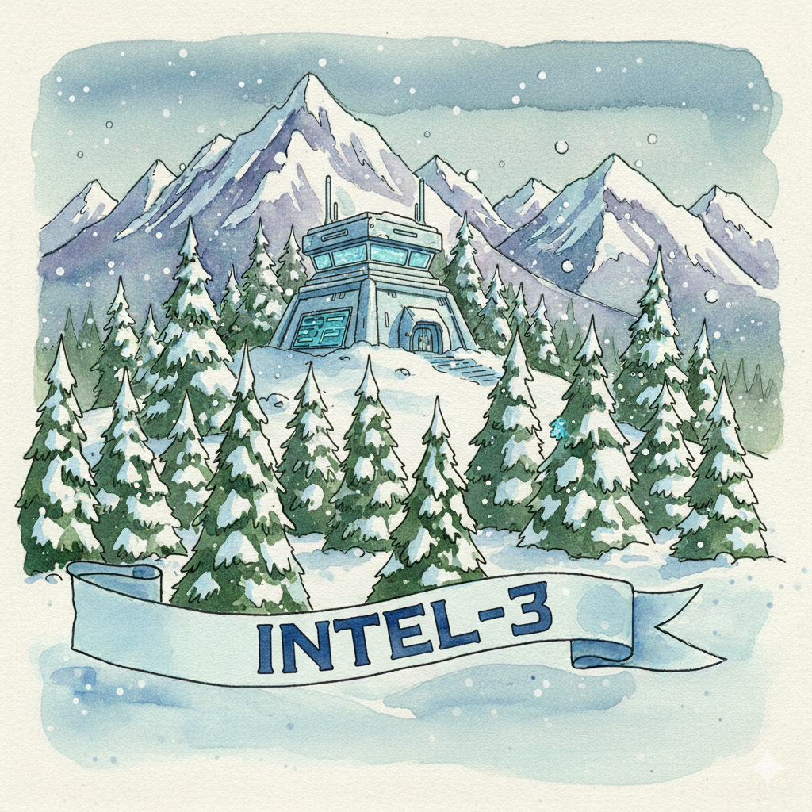

# FIR Risk INTEL-3 — 91,000 Sessions: Threat Actors Are Mapping Your AI Infrastructure

**Type:** `TREND`
**Date:** February 11, 2026
**Platform Source:** CERT-EU Cyber Brief | GreyNoise | MITRE ATT&CK | MITRE ATLAS



---

## The INTEL

GreyNoise documented two coordinated campaigns against global LLM deployments in January 2026. One exploited server-side request forgery (SSRF) vulnerabilities in inference APIs. The other conducted large-scale endpoint enumeration linked to a professional threat actor. Over **91,000 sessions** were recorded — systematic reconnaissance of AI services at scale.

The reconnaissance phase is over for many organizations. Attackers already know where your AI lives.

---

## Why It Matters

Every enterprise is deploying AI endpoints. Most aren't securing them like production infrastructure. But LLMs connected to internal systems — CRM, document stores, analytics — are lateral movement paths that traditional monitoring doesn't cover. One compromised inference API is a pivot point into your enterprise.

---

## What To Do

-> **Audit every exposed AI endpoint** — If it's reachable from the internet without authentication, assume it's already been mapped. Enforce OAuth2, rate limiting, and scoped API keys on all inference APIs.
-> **Segment AI infrastructure** — Isolate LLM servers from sensitive networks. An inference API should never be one hop from your production database.
-> **Monitor for enumeration** — Watch for rapid API calls with varying payloads, SSRF indicators, and anomalous query volumes against model endpoints.

---

## MITRE ATT&CK

| Technique | Name | Relevance |
|-----------|------|-----------|
| T1595 | Active Scanning | 91,000+ sessions enumerating LLM endpoints |
| T1190 | Exploit Public-Facing Application | SSRF against inference APIs |
| T1059 | Command and Scripting Interpreter | Prompt injection to execute commands via LLM integrations |

---

## Learn More

- [CERT-EU Cyber Brief — January 2026](https://cert.europa.eu/publications/threat-intelligence/cb26-02/) (TLP:CLEAR)
- [OWASP Top 10 for LLM Applications](https://owasp.org/www-project-top-10-for-large-language-model-applications/)
- [MITRE ATLAS](https://atlas.mitre.org/) — Adversarial Threat Landscape for AI Systems
- [FIR Risk Intelligence](https://github.com/stikman28/fir-risk-intelligence) — Source prompts, methodology, and all published INTEL

---

*Powered by [FIR Risk Platform](https://firrisk.com) — AI-driven threat intelligence for enterprise risk leaders.*

---

# LINKEDIN POST

```
91,000 sessions.

That's how many times threat actors probed LLM infrastructure in January alone.

GreyNoise documented two coordinated campaigns — one exploiting SSRF vulnerabilities in inference APIs, another systematically mapping AI endpoints at scale.

The reconnaissance phase is over. Attackers already know where your AI lives.

And most AI deployments aren't secured like production infrastructure — even though they're connected to your CRM, your document stores, your analytics platforms.

One compromised inference API is a pivot point into your enterprise.

The single most important thing you can do right now: audit every exposed AI endpoint. If it's reachable without authentication, assume it's been mapped.

Your AI is an asset. It's also an attack surface.

Full INTEL: [link]
Source prompts + methodology: github.com/stikman28/fir-risk-intelligence

Source: CERT-EU January 2026 Cyber Brief (TLP:CLEAR), GreyNoise

#CyberSecurity #AI #LLM #ThreatIntelligence #CISO #AttackSurface
```

---

# SOURCE DATA

**Platform Queries:**
1. "Tell me more about INTEL [TREND]: LLM infrastructure targeting, GreyNoise research, SSRF techniques, and MITRE ATT&CK mappings for AI/ML attacks"
2. "Most common vulnerabilities in deployed LLM infrastructure — exposed inference APIs, model serving frameworks, prompt injection?"
3. "How does LLM reconnaissance fit into a broader attack chain — exfiltration, model theft, lateral movement?"
4. "Defensive controls for AI/LLM deployments — API auth, rate limiting, segmentation, OWASP Top 10 for LLM?"

**KB Sources:**
- CERT-EU Cyber Brief — January 2026 (TLP:CLEAR)
- GreyNoise threat intelligence (LLM reconnaissance campaigns)
- MITRE ATT&CK Enterprise Matrix (T1595, T1190, T1059)
- MITRE ATLAS (AML.T0046, AML.T0010, AML.T0029)
- OWASP Top 10 for LLM Applications
- NIST AI Risk Management Framework
