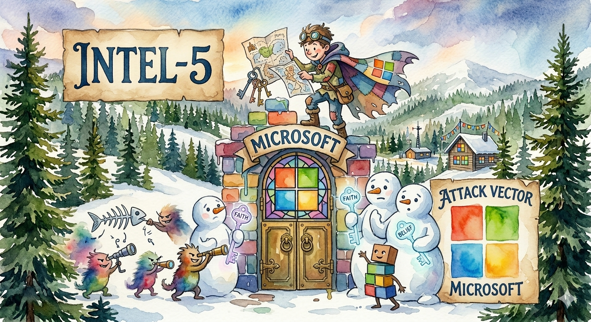

# FIR Risk INTEL-5 — Your Microsoft Login Page Is the Phishing Page

**Type:** `THREAT ALERT`
**Date:** March 11, 2026
**Platform Source:** CrowdStrike 2026 Global Threat Report | MITRE ATT&CK


---

## The INTEL

Nation-state adversaries have turned Microsoft's own authentication infrastructure into the attack platform. Not fake login pages. Not lookalike domains. **The real thing.**

CrowdStrike's 2026 Global Threat Report documents Russia and Iran independently converging on the same strategy: exploit the trust organizations place in Microsoft identity services — Entra ID, OAuth 2.0, and device code authentication — to gain persistent access that traditional security controls cannot detect.

The phishing page your employees land on? It's login.microsoftonline.com. The authentication flow? Legitimate. The domain? Microsoft's. **There is nothing for your URL filter to catch.**

---

## How It Works

**OAuth Device Code Phishing:**
A trusted contact reaches out via messaging — someone the target actually knows (or believes they know). They ask the victim to enter a device code on Microsoft's legitimate authentication portal. The victim authenticates normally. The adversary captures the access and refresh tokens — gaining persistent access without ever needing the password.

**Adversary-in-the-Middle (AiTM):**
Iran-nexus adversaries deployed the EvilGinx2 toolkit against Israeli Microsoft 365 users in November 2025. The phishing kit acts as a real-time reverse proxy — sitting between the victim and Microsoft's actual login page. The victim sees Microsoft's legitimate interface. The adversary intercepts credentials and session tokens in real time, bypassing MFA entirely.

**Conditional Access Bypass:**
In one documented case, a Russian adversary spent **multiple hours across three days** systematically testing an organization's conditional access policies — registering devices with various naming conventions, attempting authentication across different applications, probing for policy weaknesses. They eventually established persistence through Windows Hello for Business and passwordless phone sign-in.

---

## Why It Matters

Every one of these techniques uses **legitimate Microsoft authentication infrastructure**. Your security tools trust Microsoft's login pages. Your conditional access policies assume the authentication flow is secure. Your employees are trained to verify they're on the correct domain — and they are.

**Today, Iran is targeting Israeli M365 users. The technique works against any M365 tenant, anywhere.** There is no technical barrier preventing the same toolkit from being pointed at US organizations tomorrow. The phishing infrastructure is language-agnostic — swap Hebrew lures for English ones, and the same attack chain works against any enterprise running Microsoft 365.

The attack surface extends beyond user identities. Adversaries are increasingly targeting **workload identities** — service accounts, application credentials, and API keys — which often have elevated privileges but weaker security controls than human accounts.

---

## What To Do

- **Deploy phishing-resistant MFA** — FIDO2 security keys or certificate-based authentication. Token-based methods (authenticator apps, SMS) are bypassed by AiTM proxies.
- **Monitor OAuth token activity** — Flag unusual token grants, especially device code flows initiated outside normal business patterns. Alert on refresh token usage from unexpected locations or ASNs.
- **Audit conditional access policies for bypass paths** — Adversaries systematically probe for gaps. Test your own policies the way an attacker would: What happens if someone registers a new device? What applications are excluded? What flows don't require compliant devices?
- **Monitor non-human identities** — Service accounts, app registrations, and API keys with elevated privileges are increasingly targeted. Apply the same scrutiny to workload identities as human ones.
- **Restrict device code authentication** — If your organization doesn't use device code flows for legitimate purposes, disable them. If you do, monitor them aggressively.

---

## MITRE ATT&CK

- **T1621 — Multi-Factor Authentication Request Generation:** Device code phishing via legitimate Microsoft OAuth 2.0 flows
- **T1557 — Adversary-in-the-Middle:** Real-time proxy intercepting credentials and session tokens through Microsoft's actual login pages
- **T1078.004 — Valid Accounts: Cloud Accounts:** Persistent access via captured OAuth tokens — no password needed
- **T1556 — Modify Authentication Process:** Conditional access policy bypass through systematic device registration
- **T1528 — Steal Application Access Token:** Access and refresh token capture enabling lateral movement

---

## Learn More

- [CrowdStrike 2026 Global Threat Report](https://www.crowdstrike.com/resources/reports/global-threat-report/) — Primary source
- [FIR Risk INTEL-4 — Your Cloud APIs Are the Attack Infrastructure](/intel/intel-4-cloud-api-abuse/) — Cloud API exploitation by Scattered Spider
- [FIR Risk Tuesday E82 — Blending In](/tuesday/e82-cloudflare-threat-landscape/) — Cloudflare 2026 Threat Report
- [FIR Risk Intelligence](https://github.com/stikman28/fir-risk-intelligence) — Source prompts, methodology, and all published INTEL

**Coming Friday the 13th:** FIR Risk Tuesday E83 — *The Convergence*. CrowdStrike's full 2026 Global Threat Report breakdown — the 27-second breakout time, the $1.46B supply chain heist, and why three major security vendors are all saying the same thing.

---

*Powered by [FIR Risk Platform](https://firrisk.ai/platform/) — AI-driven threat intelligence for enterprise risk leaders.*

---

# LINKEDIN POST

```
Your Microsoft login page is the phishing page.
Not a lookalike. Not a misspelled domain. The actual login.microsoftonline.com.
CrowdStrike's 2026 Global Threat Report documents nation-state adversaries from Russia and Iran independently converging on the same strategy: weaponize Microsoft's own authentication infrastructure against its users.
How it works: A trusted contact messages you. Asks you to enter a device code on Microsoft's authentication portal. You authenticate normally — on Microsoft's real login page. The adversary captures your tokens. They now have persistent access without your password, bypassing MFA entirely.
In a separate campaign, Iran deployed an adversary-in-the-middle toolkit against Israeli Microsoft 365 users — a real-time proxy sitting between victims and Microsoft's actual login page. Credentials and session tokens intercepted as the victim authenticates normally.
The technique is language-agnostic. Swap Hebrew lures for English ones, and it works against any M365 tenant, anywhere. There's no technical barrier preventing this from targeting US organizations tomorrow.
In one documented case, a Russian adversary spent three days systematically probing an organization's conditional access policies — registering devices, testing authentication flows, looking for gaps — until they found a path to persistent access through Windows Hello.
Your URL filter can't catch this. Your domain reputation check passes. Your employees are on the correct domain.
What to do now: Deploy FIDO2 security keys. Monitor OAuth device code flows. Audit conditional access for bypass paths. And start monitoring non-human identities — service accounts and API keys are increasingly targeted with weaker controls than human accounts.
Full INTEL-5 breakdown below.
Coming Friday the 13th: FIR Risk E83 — The Convergence. The full CrowdStrike 2026 breakdown.
#cybersecurity #identitysecurity #Microsoft365 #fraudprevention #cloudsecurity #CISO #riskmanagement #infosec
```

---

## X POST

Your Microsoft login page is the phishing page. Not a lookalike. Not a misspelled domain. The actual login.microsoftonline.com. That's the finding from CrowdStrike's 2026 Global Threat Report that should fundamentally change how you think about identity security.

Nation-state adversaries from Russia and Iran have independently converged on the same strategy — weaponize Microsoft's own authentication infrastructure against its users. The techniques are different but the outcome is identical: persistent access that bypasses MFA, captured through legitimate authentication flows on Microsoft's real infrastructure.

The first method is OAuth device code phishing. A trusted contact reaches out via messaging and asks the target to enter a device code on Microsoft's legitimate authentication portal. The victim authenticates normally. The adversary captures the access and refresh tokens — persistent access without ever needing the password. The second method is adversary-in-the-middle using the EvilGinx2 toolkit. Iran deployed this against Israeli Microsoft 365 users in November 2025 — a real-time reverse proxy sitting between the victim and Microsoft's actual login page, intercepting credentials and session tokens as the victim authenticates normally through Microsoft's real interface.

What makes this dangerous at a strategic level is the portability. The AiTM toolkit that targeted Israeli M365 users is language-agnostic. Swap Hebrew lures for English ones and the same attack chain works against any enterprise running Microsoft 365, anywhere in the world. There is no technical barrier preventing this from being aimed at US organizations tomorrow. And in one documented case, a Russian adversary spent multiple hours across three days systematically probing an organization's conditional access policies — registering devices with different naming conventions, testing authentication flows across applications — until they found a path to persistence through Windows Hello for Business.

Your URL filter passes because the domain is Microsoft's. Your reputation check passes because it's Microsoft's infrastructure. Your employees verify they're on the correct domain — and they are. Every signal your security stack uses to distinguish legitimate from malicious authentication tells you this is safe.

What organizations need to do right now: deploy FIDO2 security keys or certificate-based authentication — token methods like authenticator apps are bypassed by AiTM proxies. Monitor OAuth device code flows and flag unusual token grants. Audit your conditional access policies by testing them the way an attacker would. And monitor non-human identities — service accounts and API keys with elevated privileges are increasingly targeted with weaker controls.

Coming Friday the 13th: FIR Risk E83 — The Convergence. The full CrowdStrike 2026 Global Threat Report breakdown.

#cybersecurity #identitysecurity

---

# SOURCE DATA

**Platform Queries:**
1. "What does the CrowdStrike 2026 report say about adversaries exploiting Microsoft identity infrastructure — Entra ID, OAuth, device code phishing, conditional access bypass?"
2. "What are the CrowdStrike findings on Iran-nexus adversaries targeting Microsoft 365 users?"

**KB Sources:**
- CrowdStrike 2026 Global Threat Report (February 2026)
- MITRE ATT&CK Enterprise Matrix (T1621, T1557, T1078.004, T1556, T1528)
- FIR Risk INTEL-4 — Your Cloud APIs Are the Attack Infrastructure (March 4, 2026)
- FIR Risk Tuesday E82 — Blending In (March 9, 2026)
- Threat actors: COZY BEAR (Russia), IMPERIAL KITTEN (Iran), ShinyHunters (eCrime)
- Tools: EvilGinx2 (AiTM phishing toolkit)
