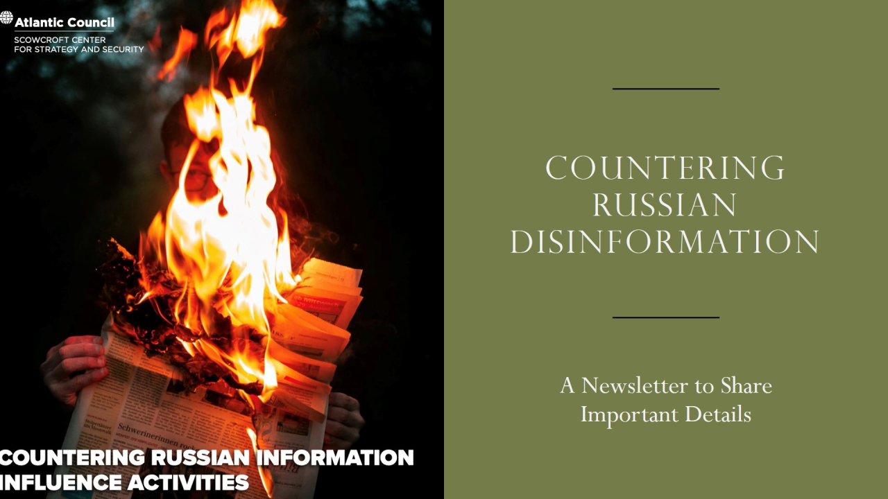

# FIR Risk Tuesday — Best of E23

**Original Publish Date:** October 15, 2024
**Source:** [Atlantic Council Freedom and Prosperity Center — Information Influence Activities](https://www.atlanticcouncil.org/programs/freedom-and-prosperity-center/)
**Analysis:** FIR Risk Platform

---

# FIR Risk — Best of E23: The War You Can't See

By FIR Risk Platform | Cybersecurity Risk Intelligence

---

## What You Need to Know

The Atlantic Council's Freedom and Prosperity Center published research on **Information Influence Activities (IIA)** — the systematic use of disinformation, misinformation, and propaganda to manipulate public perception, destabilize institutions, and undermine trust. The research focuses specifically on Russian IIA tactics, but the frameworks apply across all state-sponsored influence operations.

This isn't a cybersecurity report in the traditional sense. It's a threat intelligence report about **the information layer of conflict** — the domain where nation-states wage campaigns that never trigger a firewall alert but can damage organizations, markets, and democracies just as effectively as a ransomware attack.

For security and risk leaders, IIA represents a blind spot. Your SOC monitors network traffic. Your fraud team monitors transactions. But who monitors the information environment for campaigns designed to damage your brand, manipulate your employees, or undermine trust in your organization?

---

## The IIA Taxonomy: Four Threats, One Objective

The Atlantic Council defines four distinct information threat categories:

| Type | Definition | Intent |
|------|-----------|--------|
| **Disinformation** | False or misleading information deliberately created | Intentional deception to mislead, harm, or manipulate |
| **Misinformation** | False information spread without malicious intent | Unintentional — amplified through sharing and repetition |
| **Malinformation** | Factual information taken out of context | Weaponized truth — real data reframed to mislead |
| **Propaganda** | Biased information promoting a particular viewpoint | Narrative shaping to serve political or strategic objectives |

The distinction between these categories matters for defenders. Disinformation requires different detection and response than misinformation. Malinformation — factual information weaponized through decontextualization — is the hardest to counter because fact-checking alone doesn't address it.

The common objective across all four: **erode trust.** In institutions, in media, in each other. When trust collapses, societies become more vulnerable to manipulation, markets become more volatile, and organizations lose the social license that underpins their operations.

> **INTEL [EMERGING RISK]:** Information Influence Activities represent a threat category that most cybersecurity programs don't monitor. Disinformation, misinformation, malinformation, and propaganda are being deployed by state actors to erode institutional trust, manipulate markets, and damage organizations. Risk frameworks that don't include information integrity are incomplete.

---

## Russia's IIA Playbook

The research documents Russia's systematic approach to information warfare:

**Saturation** — Flooding information spaces with false narratives at volume. The goal isn't to convince everyone — it's to create enough noise that truth becomes indistinguishable from fiction. When every narrative is questioned, the advantage goes to the attacker.

**Amplification of polarization** — Identifying existing social divisions and amplifying them. Russia doesn't need to create new conflicts — it exploits ones that already exist, pushing both sides further apart to weaken social cohesion.

**Election and infrastructure targeting** — Influence operations timed to coincide with elections, policy debates, and critical infrastructure events. The objective is to undermine confidence in democratic processes and institutional decision-making.

**Fake account networks** — Coordinated networks of synthetic personas on social media platforms that amplify narratives, suppress counter-narratives, and create the illusion of organic support for manufactured positions.

These tactics connect directly to what Microsoft documented in the MDDR 2024: nation-state actors using **AI for information manipulation operations** at scale. The Atlantic Council's research provides the strategic framework; Microsoft's data confirms the operational reality.

> **INTEL [THREAT ALERT]:** Russia's IIA playbook — saturation, polarization amplification, election targeting, and fake account networks — is well-documented and actively deployed. With AI enabling synthetic content generation at scale (as documented by Microsoft), these operations are becoming more convincing and harder to detect. Organizations should monitor for coordinated inauthentic behavior targeting their brand, employees, and industry.

---

## Why This Matters for Security and Fraud Teams

IIA isn't just a government problem. It's a business risk:

**Brand manipulation** — Coordinated disinformation campaigns can damage brand reputation, suppress stock prices, and drive customer attrition. A well-executed influence operation against a company can cause more financial damage than a data breach.

**Employee targeting** — Influence operations target employees through social media, creating entry points for social engineering. An employee primed by a disinformation campaign is more susceptible to phishing that aligns with the narrative they've been exposed to.

**Market manipulation** — Malinformation — real data taken out of context — can be used to manipulate markets, trigger sell-offs, or influence M&A activity. When factual information is weaponized, traditional fact-checking isn't a sufficient defense.

**Supply chain influence** — Disinformation targeting suppliers, partners, or regulators can disrupt business relationships and create operational uncertainty.

**Insider radicalization** — Sustained exposure to influence operations can shift employee beliefs and loyalties, creating insider threat vectors that traditional security screening doesn't detect.

---

## The Detection Framework

The Atlantic Council outlines a six-step detection process for identifying IIA:

1. **Identify suspicious content** — Monitor for narratives that appear coordinated, unusually persistent, or timed to coincide with organizational events
2. **Fact-check claims** — Verify specific assertions against primary sources
3. **Trace origins** — Map the distribution network — where did the content originate and how did it spread?
4. **Analyze for manipulation** — Look for signs of synthetic generation, coordinated amplification, or decontextualized data
5. **Consult experts** — Engage threat intelligence providers and platform trust-and-safety teams
6. **Pattern match** — Compare against known IIA campaign patterns and tactics

This six-step process mirrors incident response frameworks in cybersecurity — detect, analyze, attribute, respond. The parallel is intentional. IIA defense requires the same discipline and rigor as cyber defense.

---

## The AI Amplifier

The convergence of IIA and artificial intelligence creates a force multiplier:

- **AI-generated text** produces convincing articles, social media posts, and comments at scale
- **Deepfake video and audio** creates synthetic media of real individuals saying things they never said
- **AI-powered translation** enables campaigns to operate simultaneously across languages and cultures
- **Automated persona management** allows a single operator to maintain hundreds of convincing fake accounts
- **Generative AI for malinformation** can reframe real data into misleading narratives faster than fact-checkers can respond

The Verizon DBIR documented GenAI phishing emails doubling. CrowdStrike found vishing up 442%. Microsoft confirmed nation-state AI manipulation. The Atlantic Council's framework explains why: **the same AI capabilities that enhance cyber attacks also enhance information warfare.** The tools are the same. The targets are different.

> **INTEL [TECHNIQUE]:** AI has become the force multiplier for Information Influence Activities — enabling synthetic content generation, deepfakes, automated persona networks, and multi-language campaign operations at scale. Organizations should extend their AI threat models beyond cybersecurity to include information manipulation targeting their brand, employees, and stakeholders.

---

## CISA Resources

The article highlights CISA's role in countering influence operations:

- **Disinformation toolkits** for organizations to assess their exposure
- **Election security resources** for understanding influence operations targeting democratic processes
- **Infrastructure protection guidance** covering information integrity alongside traditional cybersecurity

CISA's involvement signals that the US government treats IIA as a national security concern on par with traditional cyber threats — reinforcing the ASD's assessment that state-sponsored operations (48% of attacks) now span both cyber and information domains.

---

## What Organizations Should Actually Do

The IIA landscape demands five responses:

1. **Add information monitoring to your threat model** — Monitor social media, news, and dark web for coordinated campaigns targeting your organization, executives, or industry. Brand intelligence tools and threat intelligence providers increasingly cover this domain.

2. **Train employees on information manipulation** — Extend security awareness beyond phishing to include disinformation, deepfakes, and social media manipulation. Employees who can recognize influence techniques are more resilient to both IIA and social engineering.

3. **Build crisis communication capabilities** — When a disinformation campaign hits, response speed matters. Pre-position crisis communication plans that include information warfare scenarios, not just data breaches.

4. **Establish media and fact-checking relationships** — Partnerships with journalists, fact-checking organizations, and platform trust-and-safety teams accelerate response when false narratives emerge.

5. **Monitor for AI-generated content** — Deploy tools that detect synthetic text, deepfake media, and coordinated inauthentic behavior. The same AI detection capabilities that protect against phishing can be applied to influence operations.

---

## What We're Watching

**AI-powered influence at scale.** As generative AI becomes more capable and accessible, the cost of running influence operations drops while the quality increases. The barrier to entry for state-quality IIA is falling.

**Corporate targeting.** Influence operations have historically focused on governments and elections. Expect increased targeting of corporations — especially around M&A, ESG controversies, and competitive dynamics.

**Deepfake escalation.** Synthetic video and audio of executives could be used for market manipulation, employee deception, or brand damage. The technology is already sufficient; the deployment is accelerating.

**Information-cyber convergence.** The same threat actors running cyber operations are running influence operations. Unified defense requires unified intelligence.

---

## The Bottom Line

Information Influence Activities represent the threat vector that cybersecurity programs aren't built to see. Your firewall won't detect a disinformation campaign. Your SIEM won't alert on a deepfake. Your SOC won't escalate a coordinated narrative designed to erode trust in your organization.

But the damage is real. Brand destruction, market manipulation, employee radicalization, and institutional trust erosion can cost more than a ransomware payment — and there's no decryption key.

The Atlantic Council's research makes the case that IIA defense requires the same rigor, investment, and organizational attention as cybersecurity. Russia's playbook is documented. AI is amplifying it. And most organizations haven't even started monitoring for it.

The war you can't see is the one you're losing.

---

Find all editions on [FIR Risk Tuesday](https://firriskadvisory.com/tuesday/) | [GitHub](https://github.com/stikman28/fir-risk-intelligence)

---

## LINKEDIN POST

Your firewall won't detect a disinformation campaign. Your SIEM won't alert on a deepfake. Your SOC won't escalate a coordinated narrative designed to erode trust in your organization.

The Atlantic Council's research on Information Influence Activities (IIA) documents the threat vector cybersecurity programs aren't built to see.

Four threat categories:
→ Disinformation — deliberate falsehoods to deceive
→ Misinformation — false information spread unintentionally
→ Malinformation — real data weaponized through decontextualization
→ Propaganda — biased information promoting political objectives

Russia's documented playbook:
→ Saturate information spaces with false narratives
→ Amplify existing social divisions
→ Target elections and infrastructure events
→ Deploy coordinated fake account networks

AI is the force multiplier. The same capabilities enhancing cyber attacks — synthetic content, deepfakes, automated personas — are enhancing information warfare.

Five priorities:
1. Add information monitoring to your threat model
2. Train employees on influence manipulation, not just phishing
3. Build crisis communication for disinformation scenarios
4. Establish media and fact-checking partnerships
5. Deploy AI-generated content detection

The war you can't see is the one you're losing.

Full analysis: [link]

Source: Atlantic Council Freedom and Prosperity Center

#CyberSecurity #Disinformation #ThreatIntelligence #CISO #InformationWarfare #AI #NationState

---

## NOTES

- Single edition: E23 (October 15, 2024)
- Atlantic Council is a respected nonpartisan think tank — carries policy weight
- Key SEO terms: "information influence activities", "disinformation defense", "Russian information warfare", "deepfake threats", "malinformation"
- "The War You Can't See" — captures the invisible nature of IIA for cybersecurity audiences
- Unique lane in Best of collection — information warfare, not traditional cyber
- IIA taxonomy (disinformation/misinformation/malinformation/propaganda) is an educational framework security teams need
- Connects to Microsoft MDDR (nation-state AI manipulation), CrowdStrike (China 150%), ASD (PRC pre-positioning)
- Malinformation concept (weaponized truth) is the most sophisticated and hardest-to-counter IIA type
- Business risk framing (brand, employees, markets, supply chain) makes it relevant beyond government
- Six-step detection process mirrors cyber IR frameworks — familiar structure for security audiences
- CISA resources provide actionable follow-up
- AI amplifier section ties IIA to every AI finding across the Best of collection
- Hero image: Atlantic Council branding or information warfare visual
