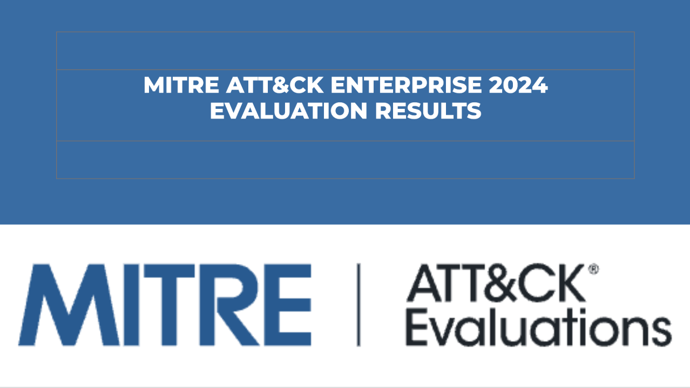

# FIR Risk Tuesday — Best of E32

**Original Publish Date:** December 17, 2024
**Source:** [MITRE ATT&CK Enterprise Evaluation 2024](https://attackevals.mitre-engenuity.org/enterprise/)
**Analysis:** FIR Risk Platform

---

# FIR Risk — Best of E32: 19 Vendors Tested. Most Missed Over Half the Attack.

By FIR Risk Platform | Cybersecurity Risk Intelligence

---

## What You Need to Know

MITRE's Enterprise Evaluation is the closest thing cybersecurity has to an independent product benchmark. No vendor pays to win. No marketing spin survives the data. **19 endpoint protection vendors** submitted their solutions for testing against real-world adversary behaviors — and most couldn't detect more than half the attack steps.

The 2024 evaluation, released December 9, focused on **ransomware defense capabilities** — simulating behaviors from prolific campaigns including **LockBit and CL0P**. It tested abuse of legitimate tools, defense evasion, and the full kill chain from initial access through impact. For the first time, it expanded to include **macOS testing**, **DPRK-inspired adversary behaviors**, and **false positive tracking**.

The results are a reality check for any organization that assumes their endpoint security is working.

---

## What Changed in 2024

This year's evaluation raised the bar significantly:

| Change | Impact |
|--------|--------|
| **Vendor count** | Down from 29 to 19 — fewer vendors willing to be tested |
| **Ransomware focus** | LockBit and CL0P behavioral emulation |
| **macOS testing** | First time — expanded beyond Windows |
| **DPRK adversary behaviors** | North Korean TTP simulation added |
| **False positive tracking** | New metric — penalizes noisy detections |
| **Increased rigor** | Many vendors detected <50% of attack steps |

The drop from 29 to 19 participating vendors tells its own story. As MITRE's evaluations become more rigorous, some vendors opt out rather than have their gaps documented publicly. **Notably absent: CrowdStrike** — one of the market's largest endpoint security vendors chose not to participate.

The addition of false positive tracking is significant. Previous evaluations measured only detection capability — how much you catch. Now they also measure detection quality — whether you're drowning your SOC in noise. A vendor that detects 90% of attacks but generates thousands of false positives isn't actually helping defenders.

> **INTEL [INDUSTRY PATTERN]:** The drop from 29 to 19 participating vendors and the addition of false positive tracking signal that MITRE's evaluation is becoming the benchmark that separates marketing claims from operational reality. Organizations evaluating endpoint security should weight MITRE results heavily — vendors that participate are submitting to the most rigorous independent test available.

---

## The Results: Who Delivered

Two vendors stood out with exceptional performance:

**Cynet** achieved **100% protection** against all attack sequences without requiring configuration changes — the only vendor to deliver 100% visibility and 100% protection simultaneously. In a field where most vendors missed more than half the attack steps, this is a standout result.

**Cortex XDR (Palo Alto Networks)** delivered **100% protection and analytic detection** with zero configuration changes. Analytic detection matters because it means the platform didn't just block the attack — it understood what was happening and why, providing defenders with the context needed for investigation and response.

The "without configuration changes" qualifier is critical. Some vendors can achieve high detection rates — but only after extensive tuning, custom rules, and professional services engagement. A product that works out of the box is fundamentally different from one that requires weeks of configuration to reach its potential.

---

## The Uncomfortable Reality: Most Vendors Failed

The headline finding isn't who won. It's that **many vendors detected fewer than 50% of attack steps** under increased evaluation rigor.

This means that for the majority of participating vendors — products actively marketed as enterprise-grade endpoint protection — more than half of a simulated ransomware attack executed undetected. Not zero-day exploits. Not novel techniques. Behaviors modeled on **known, documented ransomware campaigns** that have been publicly analyzed for years.

The techniques tested — abuse of legitimate tools, defense evasion, lateral movement using native OS utilities — are exactly what real-world attackers use. CrowdStrike reports 79% of attacks are malware-free. Mandiant documents pervasive living-off-the-land. When MITRE simulates these behaviors and most vendors can't see them, it validates what the threat reports have been saying: **signature-based and traditional endpoint detection has a structural blind spot**.

> **INTEL [GLOBAL THREAT]:** Most endpoint security vendors detected fewer than 50% of MITRE's ransomware simulation steps — behaviors modeled on known campaigns like LockBit and CL0P. Organizations should not assume their current endpoint protection provides adequate ransomware defense without validating against MITRE evaluation results or conducting equivalent red team exercises.

---

## Ransomware Emulation: LockBit and CL0P

The evaluation simulated behaviors from two of the most prolific ransomware operations:

**LockBit** — The most active ransomware group by victim count across 2023-2024. Known for:
- Rapid encryption speeds (partial file encryption for speed)
- Abuse of legitimate tools for lateral movement
- Living-off-the-land for defense evasion
- Affiliate model enabling diverse initial access methods

**CL0P** — Known for mass exploitation of file transfer vulnerabilities (MOVEit, GoAnywhere). Characterized by:
- Data theft without encryption (pure extortion model)
- Automated vulnerability exploitation at scale
- Targeting managed file transfer (MFT) platforms
- Campaign-style operations hitting hundreds of organizations simultaneously

By modeling both encryption-focused (LockBit) and theft-focused (CL0P) ransomware behaviors, MITRE tested the full spectrum of modern extortion techniques — not just the ability to stop encryption, but the ability to detect the reconnaissance, lateral movement, and data staging that precede it.

---

## The DPRK Factor

The addition of **North Korean adversary behaviors** aligns with what Mandiant's M-Trends documented: DPRK threat actors now represent 5% of attack vectors, including fraudulent IT worker operations.

MITRE's inclusion of DPRK TTPs in the evaluation reflects a recognition that North Korean operations — from Lazarus Group's financial theft to Contagious Interview's developer targeting — employ distinct techniques that endpoint products must be tested against. These aren't theoretical scenarios. They're active campaigns.

**FIR Risk Platform MITRE ATT&CK Analysis — Evaluated Techniques:**
- Initial Access: T1566 (Phishing), T1190 (Exploit Public-Facing Application)
- Execution: T1059 (Command and Scripting Interpreter) — legitimate tool abuse
- Defense Evasion: T1070 (Indicator Removal), T1036 (Masquerading)
- Lateral Movement: T1021 (Remote Services) — RDP, PsExec
- Collection: T1560 (Archive Collected Data) — data staging
- Exfiltration: T1041 (Exfiltration Over C2 Channel)
- Impact: T1486 (Data Encrypted for Impact) — LockBit behavioral model

---

## What This Means for Your Endpoint Strategy

The MITRE results should inform five decisions:

1. **Validate your current endpoint protection** — If your vendor participated, review their MITRE results against the specific attack steps your organization is most exposed to. If they didn't participate, ask them why.

2. **Prioritize detection quality over quantity** — The new false positive metric matters. A vendor that detects 80% of attacks with low false positives is operationally more valuable than one that detects 90% but buries your SOC in alerts.

3. **Test against living-off-the-land** — Most vendors failed on legitimate tool abuse and defense evasion. Run your own purple team exercises simulating PowerShell, WMI, and native OS utility abuse to validate your detection coverage.

4. **Evaluate out-of-box capability** — "Zero configuration changes" separates products that work from products that can theoretically work. Your security team's time is a finite resource. Factor deployment and tuning costs into the total cost of ownership.

5. **Don't rely on a single layer** — When most vendors miss over half the attack, defense in depth isn't a philosophy — it's a requirement. Endpoint protection is one layer. Network detection, identity monitoring, and behavioral analytics must supplement it.

---

## What We're Watching

**Vendor participation trend.** 29 to 19 is a significant drop. If the number continues to decline, MITRE's evaluation becomes more exclusive — and the vendors who participate earn more credibility by default.

**CrowdStrike's absence.** The market's largest EDR vendor opting out raises questions. Their 79% malware-free finding from the Global Threat Report makes MITRE's living-off-the-land testing directly relevant to their product claims.

**macOS detection maturity.** First-year results will establish a baseline. As Mac adoption grows in enterprise, macOS detection will become a procurement differentiator.

**False positive economics.** Now that MITRE measures detection noise, expect vendors to optimize for precision — which may come at the cost of recall. The tension between catching everything and alerting on everything is now quantified.

---

## The Bottom Line

MITRE's Enterprise Evaluation 2024 is the most rigorous independent assessment of endpoint security available. The results are sobering: most vendors couldn't detect more than half of a simulated ransomware attack based on known, documented adversary behaviors.

Two vendors — Cynet and Cortex XDR — achieved perfect scores without configuration changes. The rest face a gap between their marketing claims and their measured performance.

For security leaders, the message is clear: your endpoint protection may not be protecting as much as you think. Validate against MITRE results. Run your own simulations. And don't assume that the product you bought is the product you're running.

Nineteen vendors tested. Most missed over half. The data is public. Use it.

---

Find all editions on [FIR Risk Tuesday](https://firriskadvisory.com/tuesday/) | [GitHub](https://github.com/stikman28/fir-risk-intelligence)

---

## LINKEDIN POST

MITRE's Enterprise Evaluation 2024 tested 19 endpoint security vendors against ransomware behaviors from LockBit and CL0P.

The headline: most vendors detected fewer than 50% of the attack steps.

Not zero-days. Not novel techniques. Known, documented ransomware behaviors — and most endpoint products missed more than half.

Key findings:
→ Vendor count dropped from 29 to 19 (fewer willing to be tested)
→ CrowdStrike notably absent
→ Cynet achieved 100% protection + 100% visibility — no config changes
→ Cortex XDR achieved 100% protection + analytic detection — no config changes
→ First-ever macOS testing and false positive tracking
→ DPRK adversary behaviors added to the evaluation

What changed:
MITRE raised the rigor. They tested legitimate tool abuse, defense evasion, living-off-the-land — exactly what CrowdStrike says is 79% of attacks and Mandiant says is pervasive.

Most vendors couldn't see it.

Five implications:
1. Review your vendor's MITRE results (if they didn't participate, ask why)
2. Prioritize detection quality — false positives now measured
3. Test against living-off-the-land yourself
4. Evaluate out-of-box capability, not theoretical potential
5. Defense in depth isn't optional when most tools miss >50%

The data is public. Use it.

Full analysis: [link]

Source: MITRE ATT&CK Enterprise Evaluation 2024

#CyberSecurity #MITRE #EndpointSecurity #Ransomware #EDR #CISO #ThreatDetection

---

## NOTES

- Single edition: E32 (December 17, 2024)
- MITRE Evaluations are THE independent benchmark for endpoint security — procurement teams search for these
- Key SEO terms: "MITRE ATT&CK evaluation 2024", "MITRE enterprise evaluation results", "endpoint security comparison 2024", "LockBit detection", "EDR evaluation"
- "Most Missed Over Half the Attack" is the uncomfortable truth that drives engagement
- CrowdStrike's absence is notable given their 79% malware-free claim and market position
- Cynet 100%/100% result is the standout — lesser-known vendor outperforming market leaders
- False positive tracking addition changes the evaluation economics — quality vs quantity
- DPRK addition connects to M-Trends E52 (5% attack vector) and CERT-EU E78 (Contagious Interview)
- LockBit + CL0P emulation covers both encryption-focused and theft-focused ransomware
- "Without configuration changes" qualifier is key — separates real-world from lab performance
- Connects to CrowdStrike (79% malware-free), M-Trends (living-off-the-land), DBIR (ransomware surge)
- MITRE ATT&CK: T1566, T1190, T1059, T1070, T1036, T1021, T1560, T1041, T1486
- Hero image: MITRE ATT&CK branding / evaluation results visual
