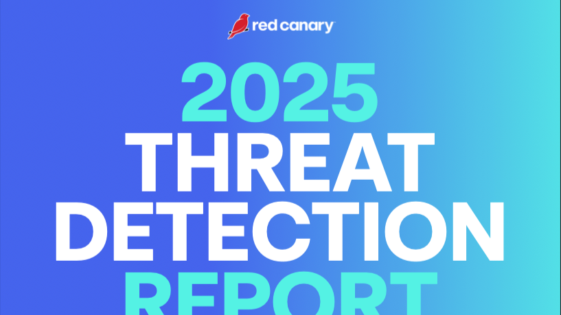

# FIR Risk Tuesday E57 - Red Canary 2025 Threat Detection Report

**Publish Date:** June 3, 2025
**Source:** [Red Canary — 2025 Threat Detection Report](https://redcanary.com/threat-detection-report/)
**Analysis:** FIR Risk Advisory

---

## NEWSLETTER DRAFT

# FIR Risk E57 - 93,000 Threats Across 4 Million Endpoints



By FIR Risk Advisory | Cybersecurity Fraud Intelligence

## Weekly Risk Intelligence Brief

**Source:** [Red Canary — 2025 Threat Detection Report](https://redcanary.com/threat-detection-report/) (66 pages)

### The 30-Second Brief

Red Canary detected **93,000 threats across 4 million endpoints, identities, and cloud resources** in 2024 — a 33% increase from 2023. Identity-based attacks surged 4x. Ransom demands hit a record $75 million. And the initial access techniques are evolving: fake CAPTCHAs, fake browser updates, SEO poisoning, and infostealers that bypass encryption.

This report is the practitioner's view — what's actually hitting endpoints and identities in production environments.

---

## The Threat Landscape: What's Actually Hitting

### 93,000 Threats — 33% Increase

Red Canary's detection data spans 4 million endpoints, identities, and cloud resources. The 33% year-over-year increase in detected threats reflects both expanded coverage and genuine acceleration in attack activity.

> **INTEL [TREND]:** Red Canary detected 93,000 threats across 4 million endpoints in 2024, a 33% increase. This practitioner-level data confirms what strategic reports theorize — attack volume and diversity are accelerating simultaneously.

---

### Identity Attacks: 4x Surge

Identity-based attacks quadrupled. **Cloud Accounts** ranks as the top MITRE ATT&CK technique. Email forwarding rules and email hiding rules both appear in the top 10 — attackers are living inside compromised mailboxes, redirecting messages and hiding evidence.

> **INTEL [ATTACK TECHNIQUE]:** Identity attacks surged 4x in 2024. Cloud account compromise is the #1 ATT&CK technique. Attackers are using email forwarding and hiding rules to maintain persistence in compromised mailboxes. Require phishing-resistant MFA, deploy conditional access policies, and use short-lived tokens. Audit email rules regularly.

---

### Ransomware: $75 Million Demands

New ransomware groups are emerging: **FOG, RansomHub, FunkSec.** Record ransom demands reached **$75 million.** But the actionable insight isn't the ransom amount — it's the precursor activity. Red Canary identifies consistent precursors: **Impacket, Mimikatz, SocGholish, and Gootloader.**

> **INTEL [SECTOR ALERT]:** Ransomware demands hit $75M records with new groups (FOG, RansomHub, FunkSec) entering the market. Focus on detecting precursor tools — Impacket, Mimikatz, SocGholish, Gootloader — rather than the ransomware payload itself. Early detection of precursors is where you stop ransomware.

---

### Initial Access: The New Playbook

Attackers are innovating on initial access:

- **Paste-and-run fake CAPTCHA lures** — tricking users into executing clipboard commands
- **Fake browser updates** — SocGholish and Scarlet Goldfinch delivering NetSupport Manager
- **SEO poisoning and malvertising** — hijacking search results to deliver malware
- **LLMJacking** — hijacking cloud AI services (AWS, Azure) for attacker use

> **INTEL [ATTACK TECHNIQUE]:** Initial access is evolving beyond traditional phishing. Fake CAPTCHAs trick users into pasting malicious commands. Fake browser updates deliver RATs. SEO poisoning redirects search traffic to malware. Train employees on these specific social engineering techniques — generic awareness training doesn't cover them.

---

## Top Threats by Impact

1. **Scarlet Goldfinch** — Fake browser updates delivering NetSupport Manager (3% customer impact)
2. **Amber Albatross** — Pyarmor-obfuscated stealer (2.3% customer impact)
3. **LummaC2** — Leading infostealer using paste-and-run tactics
4. **NetSupport Manager** — Legitimate RMM tool abused for remote access (7th most prevalent)
5. **HijackLoader** — Malware loader delivering multiple payloads (10th ranked)

---

### The macOS Blind Spot

macOS threats are rising: **Atomic Stealer** and **Poseidon** are active infostealers targeting macOS environments. Organizations that assume macOS is inherently safer are carrying unacknowledged risk.

---

## What Leaders Should Do Now

1. **Prioritize ransomware precursor detection** — Impacket, Mimikatz, SocGholish, and Gootloader are the early warning signals. Detect and contain these before ransomware deploys.

2. **Strengthen identity security** — 4x surge demands phishing-resistant MFA, conditional access policies, short-lived tokens, and regular email rule audits.

3. **Patch internet-facing devices** — Use CISA's Known Exploited Vulnerabilities list as your priority queue.

4. **Train on new social engineering** — Fake CAPTCHAs, fake browser updates, and SEO poisoning aren't covered by traditional awareness programs. Update training content.

5. **Deploy EDR with unauthorized tool monitoring** — Legitimate tools like NetSupport Manager are being weaponized. Monitor for unauthorized RMM tools.

6. **Don't ignore macOS** — Infostealers are actively targeting macOS. Extend endpoint protection and monitoring to all platforms.

---

## The Bottom Line

Red Canary's data is the practitioner's ground truth — 93,000 threats across 4 million endpoints. Identity attacks quadrupled. Ransomware demands hit $75 million. And the initial access playbook has evolved beyond email phishing into fake CAPTCHAs, fake updates, and SEO poisoning.

The organizations that detect ransomware precursors early, govern identity rigorously, and train for current social engineering techniques will stay ahead. The ones still running 2023 playbooks won't.

---

Stay tuned for more in future FIR Risk Newsletters!

Find all editions on [FIR Risk Tuesday](https://firriskadvisory.com/tuesday/) | [GitHub](https://github.com/stikman28/fir-risk-intelligence)

---

## LINKEDIN POST

```
FIR Risk Tuesday E57 is out.

Red Canary's 2025 Threat Detection Report.
93,000 threats across 4 million endpoints — here's what's actually hitting:

→ 33% increase in detected threats YoY
→ Identity attacks surged 4x — Cloud Accounts is #1 ATT&CK technique
→ Ransomware demands hit $75M (new groups: FOG, RansomHub, FunkSec)
→ Fake CAPTCHAs, fake browser updates, SEO poisoning — initial access is evolving
→ LummaC2 is the leading infostealer
→ macOS threats rising: Atomic Stealer, Poseidon

Detect the precursors. That's where you stop ransomware.

Full analysis: [link]

#CyberSecurity #ThreatDetection #RedCanary #Ransomware #CISO #Identity
```

---

## NOTES

- Source: Red Canary — 2025 Threat Detection Report (66 pages)
- Content pulled from LinkedIn newsletter via WebFetch for fir-risk-intelligence archive
- Original published June 3, 2025
- Reformatted to match 2026 newsletter template with INTEL callouts added
- Hero image: LinkedIn CDN likely expired, needs manual save from article
- 4x identity attack surge + $75M ransom demands are standout stats
- Ransomware precursor detection framing is strong practitioner guidance
- LLMJacking (cloud AI hijacking) is an emerging technique worth tracking

