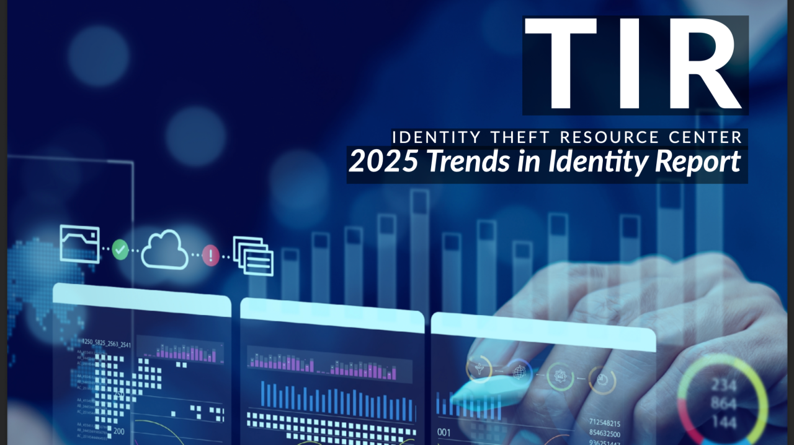

# FIR Risk Tuesday E62 - The Frontline Reality of Identity Crime

**Publish Date:** July 8, 2025
**Source:** [ITRC — 2025 Trends in Identity Report](https://www.idtheftcenter.org/publication/itrc-2025-trends-in-identity-report/)
**Analysis:** FIR Risk Advisory

---

## NEWSLETTER DRAFT

# FIR Risk E62 - Identity Crime Is Now a Mental Health Crisis



By FIR Risk Advisory | Cybersecurity Fraud Intelligence

## Weekly Risk Intelligence Brief

**Source:** [ITRC — 2025 Trends in Identity Report](https://www.idtheftcenter.org/publication/itrc-2025-trends-in-identity-report/)

### The 30-Second Brief

The Identity Theft Resource Center's 2025 Trends in Identity Report shifts the conversation from breach statistics to human impact. Identity misuse isn't a single event — it's a sequence that unfolds over months or years. Victims report feeling abandoned by the systems meant to protect them. And the emotional toll — stress, fear, anxiety, a sense of permanent exposure — is turning identity crime into a mental health crisis.

This report is a reminder: behind every breach statistic is a person whose life was disrupted.

---

## Three Defining Trends

### 1. Identity Misuse Is Expanding

Identity crime is no longer a one-time event. Multiple forms of misuse are occurring simultaneously — stolen information is reused, resold, and exploited across different attack vectors over extended periods.

As the ITRC states: *"Identity misuse is not a single crime — it is a sequence of events, often unfolding over months or even years."*

> **INTEL [TREND]:** Identity misuse has evolved from single-event theft to prolonged, recurring victimization. Stolen identity data is reused and resold across multiple attack vectors. Organizations should design identity protection strategies for the full lifecycle of harm, not just the initial breach event.

---

### 2. Support Systems Aren't Keeping Up

Victims report feeling abandoned or confused after identity crimes. There is no centralized support entity for identity crime victims. Post-breach guidance is fragmented, inconsistent, and often insufficient.

One victim's words capture it: *"I still don't know what happened. I just know someone's using my name."*

> **INTEL [SECTOR ALERT]:** Identity crime victims lack centralized support systems. Post-breach notification without actionable recovery guidance is insufficient. Organizations that experience breaches should provide live support, fraud remediation services, and clear recovery pathways — not just notification letters.

---

### 3. Identity Crime Is Now a Mental Health Crisis

The emotional impact is widespread and severe:

- **Stress, fear, and anxiety** are the dominant emotional responses
- Victims report feeling **violated and permanently exposed**
- Some **reduce online activity** or avoid government services due to fear of re-victimization
- The psychological toll persists long after the financial damage is resolved

> **INTEL [GLOBAL RECOMMENDATION]:** Identity crime is creating measurable mental health consequences — stress, anxiety, avoidance behavior, and a sense of permanent vulnerability. Organizations must include mental health resources in their breach response and victim support programs. The human cost is as real as the financial cost.

---

## What Leaders Should Do Now

1. **Design for the full lifecycle of harm** — Identity misuse spans time and institutions. Protection strategies, monitoring services, and victim support must match that timeline — not just the 12-month credit monitoring standard.

2. **Support beyond notification** — Breach notification alone isn't enough. Provide live support, recovery services, fraud remediation assistance, and mental health resources. The organizations that handle breaches well earn trust back. The ones that send form letters don't.

3. **Invest in cross-sector coordination** — No single organization can solve identity crime. Public-private partnerships, nonprofit collaboration, and information sharing across sectors are essential to building effective support systems.

---

## The Bottom Line

Identity crime has evolved beyond financial theft into something more pervasive and more personal. It's a sequence of events that unfolds over years. Support systems haven't kept pace. And the emotional toll is turning identity crime into a mental health crisis that affects millions.

The organizations that lead in this space won't just prevent breaches — they'll support the people affected by them. That's the new standard.

---

Stay tuned for more in future FIR Risk Newsletters!

Find all editions on [FIR Risk Tuesday](https://firriskadvisory.com/tuesday/) | [GitHub](https://github.com/stikman28/fir-risk-intelligence)

---

## LINKEDIN POST

```
FIR Risk Tuesday E62 is out.

ITRC's 2025 Trends in Identity Report.
Identity crime isn't a statistic. It's a sequence that unfolds over years.

Three defining trends:

→ Identity misuse is expanding — stolen data reused, resold, exploited repeatedly
→ Support systems aren't keeping up — victims feel abandoned and confused
→ Identity crime is now a mental health crisis — stress, fear, permanent exposure

"I still don't know what happened. I just know someone's using my name."

Behind every breach statistic is a person.

Full analysis: [link]

#IdentityTheft #CyberSecurity #FraudPrevention #ITRC #MentalHealth
```

---

## NOTES

- Source: ITRC — 2025 Trends in Identity Report
- Content pulled from LinkedIn newsletter via WebFetch for fir-risk-intelligence archive
- Original published July 8, 2025
- Reformatted to match 2026 newsletter template with INTEL callouts added
- Hero image: LinkedIn CDN likely expired, needs manual save from article
- Unique edition — focuses on human/victim impact rather than technical threat data
- Mental health framing is the standout differentiator

