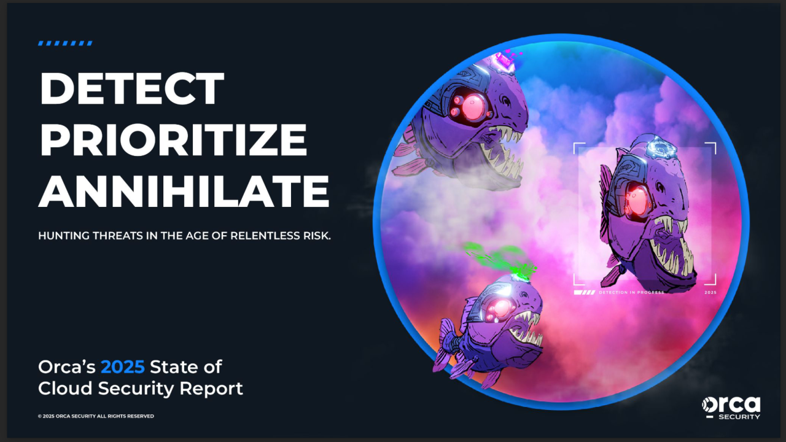

# FIR Risk Tuesday E69 - Orca State of Cloud Security 2025

**Publish Date:** September 9, 2025
**Source:** [Orca Security — 2025 State of Cloud Security Report](https://orca.security/lp/2025-state-of-cloud-security-report/)
**Analysis:** FIR Risk Advisory

---

## NEWSLETTER DRAFT

# FIR Risk E69 - The Cloud Is Now the Battleground



By FIR Risk Advisory | Cybersecurity Fraud Intelligence

## Weekly Risk Intelligence Brief

**Source:** [Orca Security — 2025 State of Cloud Security Report](https://orca.security/lp/2025-state-of-cloud-security-report/)

### The 30-Second Brief

Orca Security analyzed billions of cloud assets across environments from January to May 2025. The findings paint a picture of an attack surface that's growing faster than most organizations realize — and the gaps are fundamental. Unpatched assets, exposed databases, secrets in code, and AI workloads running vulnerable packages.

Cloud adoption fuels innovation. It also widens the battleground.

---

## Six Numbers That Tell the Story

### 1. Multi-Cloud Complexity: 55%

Over half of companies now use 2+ cloud providers. Each additional provider multiplies blind spots — inconsistent policies, fragmented visibility, and configuration drift. Attackers don't care which cloud you're on. They care which one you forgot to lock down.

> **INTEL [TREND]:** Multi-cloud is the norm, not the exception. But 55% of organizations running multiple providers means 55% managing multiple sets of misconfigurations. Unified cloud security posture management (CSPM) isn't optional — it's the minimum viable defense.

---

### 2. AI in the Cloud: 84% Use It, 62% Are Vulnerable

84% of organizations are running AI workloads in the cloud. 62% of those are running **vulnerable AI packages** that enable remote code execution. The rush to deploy AI is outpacing the security controls around it.

> **INTEL [VULNERABILITY]:** Nearly two-thirds of cloud AI deployments contain packages with known RCE vulnerabilities. If your organization is deploying AI in cloud environments, audit your AI dependencies immediately. The attack surface you don't know about is the one that gets exploited.

---

### 3. Neglected Assets: 32%

Nearly a third of cloud assets are outdated or unpatched. These aren't edge cases — they're the targets APT29 and similar threat actors actively hunt. Patching isn't glamorous. But unpatched assets are how sophisticated adversaries get in.

> **INTEL [ATTACK TECHNIQUE]:** APT29 and similar groups specifically target neglected cloud assets. 32% of cloud environments contain outdated, unpatched resources — that's not a vulnerability, it's an open invitation.

---

### 4. Data Exposure: 38%

38% of organizations with sensitive data have **publicly exposed databases**. Not misconfigured access controls. Publicly exposed. This isn't a sophistication problem — it's a hygiene problem.

> **INTEL [SECTOR ALERT]:** Over a third of organizations with sensitive data are exposing databases publicly. This is the lowest-hanging fruit for attackers and the most preventable risk in cloud security. Audit your data exposure today.

---

### 5. Attack Path Explosion: 13%

13% of organizations have a **single asset** that opens 1,000+ routes to critical data. One misconfigured resource becomes a highway to your crown jewels. Attack path analysis isn't theoretical — it's how real breaches unfold.

---

### 6. Secrets in Code: 85%

85% of organizations embed **plaintext secrets** in repositories. API keys, database credentials, service account tokens — sitting in code, waiting to be harvested. Every leaked secret is a credential that doesn't need to be cracked.

> **INTEL [GLOBAL RECOMMENDATION]:** Secret scanning and automated rotation should be mandatory controls. With 85% of organizations embedding plaintext secrets in repos, assume your secrets have been exposed and rotate them proactively.

---

## How Attackers Monetize Cloud Gaps

The business impact is concrete:
- **Data theft** fueling fraud markets
- **Supply chain poisoning** through compromised cloud infrastructure
- **Credential theft** enabling lateral movement across environments
- **Ransomware and extortion** using cloud access as leverage

---

## The Defender's Paradox

Orca frames the core challenge well: attackers need to be right once. Defenders must be right every time.

But "every time" starts with the basics:
1. **Patch your cloud assets** — 32% unpatched is unacceptable
2. **Audit data exposure** — 38% with public databases is preventable
3. **Scan for secrets** — 85% with plaintext credentials is a choice
4. **Secure AI workloads** — 62% with vulnerable packages is the next wave
5. **Map attack paths** — know which single asset opens 1,000 doors

Cloud security isn't an IT problem. It's business strategy.

---

Stay tuned for more in future FIR Risk Newsletters!

Find all editions on [FIR Risk Tuesday](https://firriskadvisory.com/tuesday/) | [GitHub](https://github.com/stikman28/fir-risk-intelligence)

---

## LINKEDIN POST

```
FIR Risk Tuesday E69 is out.

Orca Security analyzed billions of cloud assets.
The numbers speak for themselves:

→ 55% of companies use 2+ cloud providers (and the blind spots multiply)
→ 84% run AI in the cloud — 62% with vulnerable packages
→ 32% of cloud assets are outdated/unpatched
→ 38% with sensitive data have publicly exposed databases
→ 85% embed plaintext secrets in code repos
→ 13% have one asset that opens 1,000+ routes to critical data

Cloud adoption fuels innovation.
It also widens the battleground.

Full analysis: [link]

#CloudSecurity #CyberResilience #CISO #AI #FraudPrevention
```

---

## NOTES

- Source: Orca Security — 2025 State of Cloud Security Report
- Content pulled from LinkedIn newsletter via WebFetch for fir-risk-intelligence archive
- Original published September 9, 2025
- Reformatted to match 2026 newsletter template with INTEL callouts added
- Hero image downloaded from LinkedIn CDN
- Structured around "six numbers" framing for executive readability
