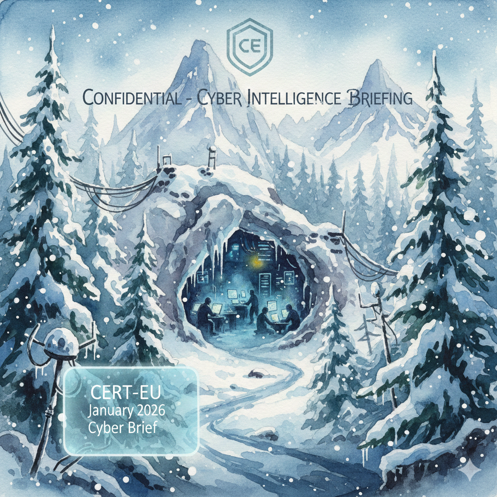

# FIR Risk Tuesday E78

**Publish Date:** February 10, 2026
**Source:** [CERT-EU Cyber Brief — January 2026](https://cert.europa.eu/publications/threat-intelligence/cb26-02/) (TLP:CLEAR)
**Analysis:** FIR Risk Platform

---

# FIR Risk E78 — Three Flags, One Target

By FIR Risk Platform | Cybersecurity Risk Intelligence

---

## What You Need to Know

CERT-EU analyzed 268 open-source reports for their January 2026 Cyber Brief. One pattern jumps off the page: **China, Russia, and North Korea all hit Western critical infrastructure in the same month.**

China-linked Salt Typhoon infiltrated UK telecom networks reaching Downing Street. Russia-linked Sandworm deployed a data wiper against Polish energy operators. North Korea-linked Contagious Interview weaponized Visual Studio Code to compromise developers worldwide.

Three nations. Three sectors. One month. And they brought six actively exploited zero-days with them.

This isn't a forecast. This already happened.

---

## Salt Typhoon: Two Governments, One Campaign

Salt Typhoon had the most consequential January of any threat actor — running parallel espionage operations against two Western governments simultaneously.

**United Kingdom:** Salt Typhoon allegedly compromised phones of senior Downing Street aides through UK telecom network infiltration — an operation running since 2021. The intrusion exposed sensitive communications and metadata involving figures around former prime ministers. Intelligence sources described it as reaching "the heart of government."

**United States:** Separately, Salt Typhoon compromised email systems of US congressional committee staff. Attributed to China's Ministry of State Security, the operation enabled access to sensitive legislative communications including calls and messages.

And Salt Typhoon wasn't alone. China-linked UAT-8837 was targeting US and Canadian critical infrastructure through zero-day exploitation, while HoneyMyte (Mustang Panda) expanded CoolClient backdoor operations across six countries. January saw at least four distinct Chinese cyber operations running concurrently.

**FIR Risk Platform MITRE ATT&CK Analysis — Salt Typhoon:**
- Initial Access: T1133 (External Remote Services), T1204 (User Execution)
- Persistence: T1098 (Account Manipulation), T1219 (Remote Access Software)
- Exfiltration: T1041 (Exfiltration Over C2 Channel)

> **INTEL [THREAT ALERT]:** Salt Typhoon's simultaneous operations against UK telecoms and US congressional systems confirm a persistent, multi-year campaign targeting Western government communications at the infrastructure level. Telecom and government entities should assume compromise and conduct retroactive threat hunts for indicators dating back to 2021.

---

## Sandworm Returns to the Grid

On December 29, Russia-linked Sandworm targeted Polish renewable energy operators with a new data wiper dubbed DynoWiper by ESET. The attack hit two combined heat and power plants and a renewable energy management system. The national energy supply was not disrupted — but the targeting was unmistakable: energy infrastructure in a NATO member state supporting Ukraine.

If the name Sandworm makes you uneasy, it should. This is the same group behind three of the most consequential cyberattacks in history:

| Year | Operation | Impact |
|------|-----------|--------|
| **2015** | Ukraine power grid (BlackEnergy) | First-ever cyberattack causing a power outage |
| **2016** | Ukraine power grid (Industroyer) | Remote substation shutdowns via ICS protocol exploitation |
| **2017** | NotPetya | $10B+ in global damages (Maersk, Merck, UK NHS) |
| **2025** | DynoWiper — Poland renewables | Data wiper targeting NATO-allied energy infrastructure |

DynoWiper represents an evolution. Unlike Industroyer, which directly manipulated industrial control systems, DynoWiper targets the IT systems supporting energy operations — management platforms, not turbines. The destruction is administrative, not physical. But the message is the same.

**FIR Risk Platform MITRE ATT&CK Analysis — Sandworm:**
- Initial Access: T1190 (Exploit Public-Facing Application)
- Execution: T1059 (Command and Scripting Interpreter)
- Lateral Movement: T1021 (Remote Services)
- Impact: T1485 (Data Destruction)

> **INTEL [THREAT ALERT]:** Sandworm's DynoWiper continues a decade-long pattern of targeting energy infrastructure with destructive malware. European energy operators — especially in Eastern Europe — should validate OT/IT network segmentation, deploy air-gapped backups, and run incident response exercises specifically for wiper scenarios.

---

## The Developer as Attack Surface

North Korea took a different path: target the people who build the software.

The Contagious Interview campaign exploits Visual Studio Code task files to deliver malware during fake recruitment exercises. A developer opens a project, clicks "Trust," and the malicious task file executes silently. No suspicious downloads. No flagged executables. Just a coding exercise that isn't one.

It's social engineering meets supply chain. By compromising developers, attackers can harvest credentials, poison code, and access the systems those developers build for.

The technique works because VS Code tasks are a legitimate feature developers use daily, coding exercises are normal in tech hiring, and the attack requires only that the developer open the project. It's frictionless.

> **INTEL [TECHNIQUE]:** Contagious Interview weaponizes developer workflow tools through fake recruitment pipelines. Development teams should enforce VS Code workspace trust policies, restrict task auto-execution, and treat unsolicited coding exercise projects from unknown sources as hostile.

---

## January's Zero-Day Cluster

The state-sponsored campaigns came with a wave of actively exploited vulnerabilities:

| CVE | Target | Severity | Status |
|-----|--------|----------|--------|
| **CVE-2026-20045** | Cisco Unified Communications / Webex | Critical RCE — root access | Exploited; CISA KEV deadline Feb 11 |
| **CVE-2026-21509** | Microsoft Office (multiple versions) | High — security bypass | Exploited; patches pending for 2016/2019 |
| **CVE-2026-1281** | Ivanti EPMM | Critical | Exploited in the wild |
| **CVE-2025-8088** | WinRAR | Critical | Exploited by Russia AND China actors |
| **CVE-2025-64155** | Fortinet FortiSIEM | Critical — command injection | Exploit code publicly released |
| **CVE-2025-53690** | SiteCore (ViewState deserialization) | Critical | Exploited by UAT-8837 (China) |

Two patterns stand out. First, state actors are exploiting the same vulnerabilities simultaneously — Google documented both Russia- and China-linked groups burning CVE-2025-8088 in WinRAR. Second, Horizon3.ai publicly released exploit code for Fortinet FortiSIEM, and Fortinet is historically one of the most targeted vendors in the wild.

Meanwhile, "PackageGate" disclosed six zero-day flaws in JavaScript package managers (npm, pnpm, vlt, Bun) that bypass supply chain protections. Most vendors patched. **npm declined to fix, telling users to vet packages manually.**

> **INTEL [VULNERABILITY]:** The January zero-day cluster represents an elevated exploitation tempo by both state and criminal actors. Cisco CVE-2026-20045 has a Feb 11 CISA deadline. Fortinet FortiSIEM exploit code is public. Microsoft Office patches are pending for older versions. Prioritize accordingly.

---

## LLM Infrastructure Is Now a Target

One finding in the CERT-EU brief deserves its own spotlight: **threat actors are actively targeting AI infrastructure.**

GreyNoise documented two coordinated campaigns against global LLM deployments in January. One exploited server-side request forgery (SSRF) vulnerabilities. The other conducted large-scale endpoint enumeration linked to a professional threat actor. Over **91,000 sessions** were recorded — systematic reconnaissance of AI services at scale.

This isn't theoretical. It's happening now. As enterprises race to deploy AI endpoints, attackers are mapping them.

> **INTEL [TREND]:** LLM infrastructure is now an active target for reconnaissance and exploitation. Organizations deploying AI services should audit model endpoint exposure, enforce authentication on all inference APIs, and monitor for anomalous SSRF patterns. This attack surface will expand throughout 2026.

---

## Policy Moves Worth Watching

Governments didn't sit idle in January:

- **EU Cybersecurity Package (Jan 20):** Strengthens ICT supply chain security, expands ENISA's role, simplifies NIS2 compliance. Member States get one year to implement after approval.
- **France Cyber Strategy 2026-2030 (Jan 29):** Five pillars — talent, resilience, deterrence, sovereignty, international cooperation.
- **China's Revised Cybersecurity Law (Jan 1):** Expanded extraterritorial reach — Chinese authorities can now penalize foreign entities whose activities abroad threaten China's national security.
- **Law Enforcement:** Microsoft, Europol, and national authorities took down RedVDS, a global cybercrime-as-a-service platform. Spain arrested 34 Black Axe-linked BEC suspects.

The EU and France are building defensive frameworks. China is extending its legal reach internationally. Both sides are preparing for a more contested cyberspace.

---

## What This Means for You

**Telecom and government:** Salt Typhoon has operated since 2021. Retroactive threat hunts aren't optional — they're overdue. Focus on metadata access patterns and lateral movement in core network infrastructure.

**Energy sector:** Sandworm's decade-long track record speaks for itself. Validate OT/IT segmentation. Test wiper-specific incident response. Eastern European operators face elevated risk.

**Development teams:** Lock down VS Code workspace trust settings. Establish policies for evaluating external coding projects. Make hiring teams aware that recruitment pipelines are an active attack vector.

**Everyone:** Cisco CVE-2026-20045 has a February 11 deadline. Fortinet exploit code is public. Microsoft Office patches are pending. Patch now.

---

## What We're Watching

**Salt Typhoon scope.** Two simultaneous government-level operations suggest additional undisclosed compromises. Telecom infrastructure remains the primary vector.

**Wiper proliferation.** Sandworm's DynoWiper targeting NATO-allied energy could be a template for similar operations during periods of geopolitical tension.

**LLM exploitation.** 91,000+ reconnaissance sessions in January. The next phase moves from enumeration to weaponization.

**Kimwolf botnet.** Over two million infected devices — Android TV boxes, digital photo frames, residential proxies — and still growing. The consumer IoT attack surface remains largely undefended.

---

## The Bottom Line

January delivered 268 reports' worth of evidence that we've entered a new phase. Three nation-states targeted Western critical infrastructure simultaneously. Six major vulnerabilities were actively exploited. AI infrastructure became a documented target at scale for the first time.

The question for security leaders isn't whether your sector is targeted. After January, the answer is obvious.

The question is whether you've adapted faster than the threat actors.

---

Find all editions: [firriskadvisory.com/blog](https://firriskadvisory.com/blog/)

All 2026 newsletters and source materials: [github.com/stikman28/fir-risk-intelligence](https://github.com/stikman28/fir-risk-intelligence)

---

## LINKEDIN POST

China. Russia. North Korea. Three nation-states targeted Western critical infrastructure in January — simultaneously.

CERT-EU's January 2026 Cyber Brief analyzed 268 open-source reports. The pattern is clear:

Salt Typhoon (China) infiltrated UK telecom networks reaching Downing Street — while separately compromising US congressional committee email systems. Operating since 2021.

Sandworm (Russia) deployed a data wiper against Polish renewable energy operators. Same group behind the 2015 Ukraine blackout and $10B+ NotPetya.

Contagious Interview (North Korea) weaponized Visual Studio Code to target developers through fake recruitment exercises.

Meanwhile:
- 6 actively exploited zero-days (Cisco, Microsoft Office, Ivanti, WinRAR, Fortinet, SiteCore)
- 91,000+ reconnaissance sessions targeting LLM infrastructure
- 500GB exfiltrated from the European Space Agency
- npm declined to patch 6 supply chain zero-days

Three flags. One target. This is January 2026.

Full analysis in this week's FIR Risk Tuesday: [link]

Source: CERT-EU Cyber Brief — January 2026 (TLP:CLEAR)

#CyberSecurity #ThreatIntelligence #CERTEU #NationState #CISO #CriticalInfrastructure

---

## PROMPTS USED

**Prompt 1:** "Tell me about 'Latest publications of type Threat Intelligence' from the CERT-EU"

**Prompt 2:** "Hi FIR, can you provide a summary of the EU Cyber Brief, including the three major adversary nations who hit western critical infrastructure in January?"

**Prompt 3:** "Dig deeper into Salt Typhoon and let me know if you find any interesting INTEL to share."

**Prompt 4:** "The CERT-EU January 2026 brief highlights several actively exploited vulnerabilities including CVE-2026-20045 (Cisco), CVE-2026-21509 (Microsoft Office), CVE-2025-8088 (WinRAR), and CVE-2025-64155 (Fortinet FortiSIEM). What can you tell me about these vulnerabilities? Are any in the CISA KEV catalog? Any INTEL for our readers?"

**Prompt 5:** "Tell me about Sandworm and their history of targeting energy infrastructure. The CERT-EU brief mentions a new data wiper called DynoWiper used against Polish renewable energy in December 2025. What connections do you see to their past operations? Any INTEL for energy sector leaders?"

---

## NOTES

- Lead angle: "Three flags, one target" — convergence of China/Russia/NK against Western critical infrastructure in January
- Salt Typhoon MITRE mappings from FIR Risk Platform Agent: T1133, T1098, T1041, T1204, T1219
- Sandworm MITRE mappings from Agent: T1190, T1059, T1021, T1485 + historical context (BlackEnergy, Industroyer, NotPetya)
- Agent correctly identified Salt Typhoon MSS attribution and 2021 timeline
- Agent acknowledged CVE data gap honestly (2026 CVEs not yet in KB) — good platform behavior
- Agent hallucinated some details (Lazarus instead of Contagious Interview for NK, ALPHV for Russia ClickFix) — corrected against CERT-EU source
- Zero-day table format for scanability (6 CVEs)
- LLM infrastructure targeting is the forward-looking differentiator
- ESA 500GB breach kept in LinkedIn post for impact, not deep-dived (would dilute state-actor narrative)
- CERT-EU source is TLP:CLEAR — no handling restrictions
- Hero image: three-flag convergence / critical infrastructure visual
- Sandworm history table (2015-2025) gives executives quick context without requiring prior knowledge
