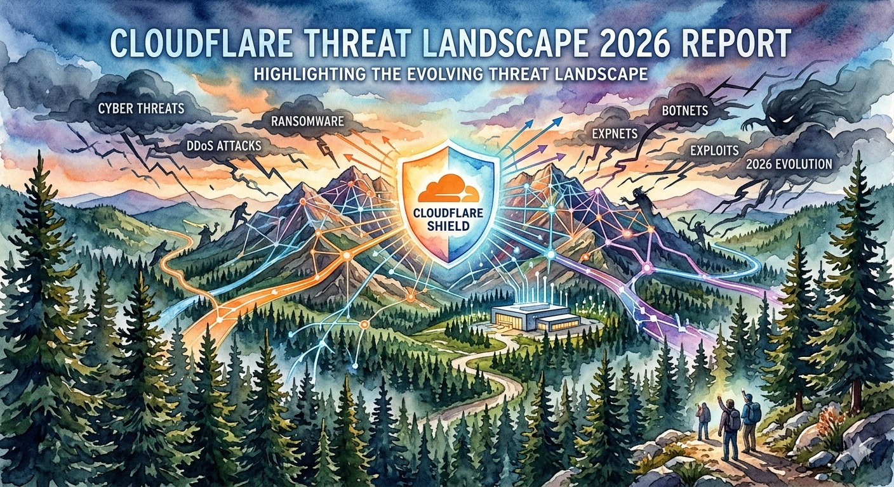

# FIR Risk Tuesday E82

**Publish Date:** March 9, 2026
**Source:** [2026 Cloudflare Threat Report](https://www.cloudflare.com/lp/threat-report-2026/) (March 3, 2026)
**Analysis:** FIR Risk Platform

---

# FIR Risk E82 — Blending In

By FIR Risk Platform | Cybersecurity Risk Intelligence

---

## What You Need to Know

Cloudflare processes over 20% of global internet traffic. They block 230 billion threats daily. Their inaugural threat report isn't based on surveys or projections — it's based on what they actually see hitting the wire.

**The core finding: Attackers have stopped breaking in. They're blending in.** They weaponize your cloud services, your SaaS integrations, your legitimate credentials. Traditional perimeter security is defending against an attack model that no longer exists.

This is Cloudflare's view from the front lines. Here's what matters.

> **INTEL [GLOBAL] [TREND]:** The 2026 threat landscape is defined by three converging shifts — the weaponization of identity, the industrialization of SaaS supply chain exploitation, and hyper-volumetric DDoS strikes that outpace human response.

---

## Living off Your Cloud

Cloudflare introduces **Living off XaaS (LotX)** — the evolution of "living off the land" for cloud environments. Attackers no longer need malware. They use your infrastructure.

- **Paste site dead drops** — C2 coordination through public platforms like teletype.in and rentry.co
- **SaaS-hosted phishing** — Credential harvesting hosted on Azure Web Apps, trusted by default
- **PaaS-ing the perimeter** — Payloads delivered via Google Drive, Dropbox, GitHub
- **Encrypted tunneling** — Developer tools weaponized to bypass egress filtering

The result: malicious activity that looks identical to normal business operations. Your security tools trust these services. So does your firewall. So do your employees.

**When attackers operate as authorized users within your own platforms, the threat isn't external anymore. It's architectural.**

> **INTEL [GLOBAL] [TECHNIQUE]:** Living off XaaS (LotX) transforms cloud infrastructure from attack target to attack platform. Threat actors weaponize trusted SaaS services for C2, phishing, and data exfiltration — invisible to traditional perimeter defenses.

---

## One Integration, Hundreds of Victims

The **GRUB1 campaign** is this report's case study in SaaS supply chain exploitation. The attack chain:

1. Automated credential scanning using TruffleHog against code repositories
2. AI-assisted navigation — LLMs used in real-time to explore unfamiliar SaaS environments
3. Pivot from Salesloft Drift into Salesforce through a trusted integration
4. One compromised connection → hundreds of corporate tenants exposed

This isn't a sophisticated nation-state operation. GRUB1 actors were relatively unsophisticated. They didn't need to be. Over-privileged SaaS integrations did the work for them.

**Your security is now defined by your weakest third-party integration, not your perimeter.**

> **INTEL [GLOBAL] [THREAT ALERT]:** GRUB1 campaign demonstrates AI-assisted SaaS supply chain exploitation at scale. Single compromised integration cascaded through hundreds of downstream tenants via legitimate connection channels.

---

## The Insider Factory

North Korea has industrialized insider placement. Not espionage. Employment.

**The operation:**
- AI-generated deepfakes to pass video interviews
- US-based "laptop farms" with facilitators hosting corporate hardware
- Remote access via RMM software — working from abroad while appearing domestic
- Fabricated LinkedIn and GitHub profiles to establish credibility
- Rented credentials from complicit US citizens for identity verification

**The detection signatures:**
- Impossible travel alerts (US login followed by foreign IP)
- Mouse-jiggling software maintaining session activity
- Video metadata artifacts from real-time deepfake rendering

The goal isn't intelligence collection. It's revenue — hundreds of millions funneled to the North Korean regime through legitimate paychecks.

Cloudflare's conclusion: **Accounting for human risk is now just as vital as patching software vulnerabilities.**

> **INTEL [GLOBAL] [THREAT ALERT]:** North Korean IT worker infiltration represents industrialized insider threat at nation-state scale. AI deepfakes, laptop farm infrastructure, and fabricated digital identities enable persistent access through legitimate employment channels.

---

## By the Numbers

| Metric | Value |
|--------|-------|
| DDoS attacks in 2025 | **47.1 million** (doubled YoY) |
| Largest DDoS attack ever | **31.4 Tbps** (6x the 2024 record) |
| World record DDoS attacks in 2025 | **19** |
| DDoS attacks mitigated per hour | **5,376** |
| Bot traffic share of all HTTP | **30%** |
| Login attempts from bots | **94%** |
| Human logins using compromised credentials | **63%** |
| BEC attempts intercepted | **$123 million** |
| Mean BEC theft per attempt | **$49,225** |
| Emails failing SPF | **43%** |
| Emails lacking DKIM | **44%** |
| Emails failing DMARC | **46%** |
| Ransomware cases traced to infostealers | **54%** |
| PhaaS kit cost | **$355/month** |

Three numbers tell the whole story: **30% of traffic is bots. 94% of login attempts are bots. 63% of human logins use already-compromised credentials.** Traditional authentication is operating on borrowed time.

> **INTEL [GLOBAL] [BENCHMARK]:** Credential integrity has collapsed — 94% of login attempts are automated, and 63% of human logins involve previously compromised credentials. Organizations relying on password-based authentication face systemic exposure.

---

## Nation-State Landscape

Cloudflare uses an **adjective + animal** naming convention that maps to nation-state origin:

| Nation | Animal | Key Actors |
|--------|--------|------------|
| **Russia** | Shrew / Duck | NastyShrew, SleezyShrew (APT29), CallowDuck (Scattered Spider) |
| **China** | Toad | DazedToad (Volt Typhoon), FrumpyToad (APT41), ClumsyToad (Mustang Panda) |
| **North Korea** | Slug | PutridSlug, PatheticSlug (Kimsuky), FoolishSlug |
| **Iran** | Krill | MuddyKrill (MuddyWater), CloyingKrill (APT33), CrustyKrill |

**What's shifted:**
- **Russia** — Cyber operations integrated with kinetic military campaigns. Wiper malware and hacktivism as force multipliers.
- **China** — DazedToad (Volt Typhoon) pre-positioning in US critical infrastructure. Not stealing data — preparing for disruption.
- **North Korea** — AI-enhanced social engineering targeting policy cycles. Industrial-scale financial theft via crypto and IT worker placement.
- **Iran** — Cyber reconnaissance coordinated with kinetic operations. Targeting aerospace, defense, and energy sectors.

The Americas remain the most targeted region globally. Manufacturing and critical infrastructure account for over 50% of targeted attacks.

---

## What Risk Leaders Must Do

**1. Move past MFA to identity-first zero trust.**
Infostealers like LummaC2 harvest session tokens after MFA completes. Deploy FIDO2/passkeys. Implement continuous session monitoring. Invalidate sessions on impossible travel or suspicious device fingerprints.

**2. Audit every SaaS integration this week.**
GRUB1 proved that one over-privileged API connection can expose your entire tenant ecosystem. Apply least privilege to every integration. Focus on Salesforce, Slack, and GitHub — the tools with the broadest blast radius.

**3. Secure AI usage before it secures your exit.**
Employees using generative AI tools create data leakage vectors your DLP wasn't designed for. Deploy browser isolation for AI tools. Monitor AI prompts for sensitive data. This is the new insider threat — accidental, constant, and invisible.

**4. Accept that humans can't respond fast enough.**
Most 2025 DDoS attacks lasted under 10 minutes. The 31.4 Tbps record was a UDP flood. Deploy autonomous, edge-based mitigation. Legacy scrubbing centers are too slow for multi-terabit attacks that peak and conclude before a human picks up the phone.

---

## What This Means for You

**If you're a CEO or Board Director:** Cloudflare's data confirms the threat landscape has industrialized. Ask two questions: *How fast can we contain a credential compromise?* and *Do we know every SaaS integration with admin access?* If nobody can answer both, your risk posture has blind spots at the architectural level.

**If you're a CISO:** The LotX framework changes your detection model. You can't block Google Drive or Azure Web Apps — your business runs on them. Shift investment from perimeter tools to behavioral analytics that distinguish normal usage from weaponization. And audit your SaaS integrations before GRUB1's successors do it for you.

**If you lead a SOC team:** The bot traffic statistics are your new baseline reality. When 94% of login attempts are automated, your alert queue is mostly noise. Invest in credential intelligence feeds and session anomaly detection. Focus on the 63% of human logins using compromised credentials — that's where the real intrusions hide.

**If you're in risk or compliance:** The email authentication stats (43-46% failure rates across SPF/DKIM/DMARC) are a governance gap, not just a technical one. If nearly half your inbound email lacks basic authentication, your phishing exposure is structural. Add email authentication posture to your next board risk report.

---

## What We're Watching

**SaaS supply chain regulation.** GRUB1 will accelerate demand for integration audit standards. Expect frameworks requiring continuous monitoring of third-party API permissions, not just annual vendor assessments.

**Infostealer-to-ransomware pipeline.** 54% of ransomware traced to infostealers confirms this is now the primary attack chain. Organizations that block infostealers at the browser and endpoint will materially reduce ransomware exposure.

**DDoS democratization.** With botnets like Aisiru controlling 1-4 million hosts, multi-terabit attacks are no longer nation-state exclusive. Mid-tier threat actors now have the firepower that was once reserved for state-sponsored campaigns.

**North Korean IT worker detection.** Biometric verification, hardware geofencing, and deepfake detection in hiring workflows will become standard. The laptop farm model is too effective to remain niche.

---

## The Bottom Line

Cloudflare sees 20% of the internet. What they're telling us is that the fundamental model of cybersecurity — build walls, detect intrusions, respond to alerts — is being outrun by attackers who don't intrude at all. They log in. They use your tools. They look like you.

The organizations that navigate this shift won't be the ones with the highest walls. They'll be the ones that can tell the difference between a legitimate user and an attacker who looks exactly like one.

The threat isn't at the gate anymore. It's already inside, wearing a badge.

---

Find all editions: [FIR Risk Tuesday](https://firrisk.ai/tuesday/)

Source: [GitHub - FIR Risk Intelligence](https://github.com/stikman28/fir-risk-intelligence)

---

## LINKEDIN POST

94% of login attempts are bots. 63% of human logins use compromised credentials. Your perimeter isn't being breached — it's being bypassed.

Cloudflare published their inaugural threat report this week. They process 20% of global internet traffic and block 230 billion threats daily. This isn't theory — it's what they see hitting the wire.

The core finding: Attackers have stopped breaking in. They're blending in.

The numbers are staggering:
→ 47.1 million DDoS attacks in 2025 (doubled YoY)
→ 31.4 Tbps record-breaking attack (6x the 2024 peak)
→ 94% of all login attempts are bot-generated
→ 63% of human logins use already-compromised credentials
→ $123 million in BEC attempts intercepted
→ 43-46% of emails fail basic authentication (SPF/DKIM/DMARC)

The GRUB1 campaign shows how one compromised SaaS integration can cascade into hundreds of exposed tenants. North Korean IT workers are using AI deepfakes to pass interviews and laptop farms to collect paychecks. And a new framework called Living off XaaS (LotX) describes how attackers weaponize your own cloud infrastructure against you.

The old model — build walls, detect intrusions — is being outrun by attackers who don't intrude at all. They log in with real credentials. They use your tools. They look like your employees.

The question isn't whether you'll be targeted. It's whether you can tell the difference between a legitimate user and an attacker who looks exactly like one.

Full analysis in this week's FIR Risk Tuesday — see below.

#cybersecurity #threatintelligence #cloudflare #identitysecurity #DDoS #supplychainsecurity #riskmanagement #CISO

---

## X POST

Cloudflare processes over 20% of global internet traffic and blocks 230 billion threats daily. They just published their inaugural threat report — not based on surveys or projections, but on what they actually see hitting the wire across 50 countries. The core finding should concern every enterprise leader: attackers have stopped breaking in. They're blending in. They weaponize your cloud services, your SaaS integrations, your legitimate credentials. Traditional perimeter security is defending against an attack model that no longer exists.

Cloudflare introduces a framework called Living off XaaS — the evolution of living off the land for cloud environments. Attackers no longer need malware. They coordinate command-and-control through paste sites like teletype.in. They host credential harvesting on Azure Web Apps, which your security tools trust by default. They deliver payloads via Google Drive and Dropbox. They weaponize developer tools to tunnel through your egress filtering. The result is malicious activity that looks identical to normal business operations. When attackers operate as authorized users within your own platforms, the threat isn't external anymore — it's architectural.

The GRUB1 campaign is the case study that makes this real. Relatively unsophisticated actors used TruffleHog to scan code repositories for credentials, then used LLMs in real-time to navigate unfamiliar SaaS environments. They pivoted from Salesloft Drift into Salesforce through a single trusted integration and exposed hundreds of corporate tenants. They didn't need to be sophisticated — over-privileged SaaS integrations did the work for them. Your security is now defined by your weakest third-party integration, not your perimeter.

Then there's North Korea's insider factory. They've industrialized employment placement, not espionage. AI-generated deepfakes pass video interviews. US-based laptop farms host corporate hardware while operators work from abroad. Fabricated LinkedIn and GitHub profiles establish credibility. Rented credentials from complicit US citizens handle identity verification. The goal isn't intelligence — it's revenue, hundreds of millions funneled to the regime through legitimate paychecks. The detection signatures exist — impossible travel alerts, mouse-jiggling software, deepfake rendering artifacts — but most organizations aren't looking for them.

The numbers tell the rest of the story. 47.1 million DDoS attacks in 2025, doubled from the year before. The largest DDoS attack ever recorded hit 31.4 terabits per second — six times the 2024 record. 30% of all HTTP traffic comes from bots. 94% of login attempts are automated. And here's the number that should keep every security leader awake — 63% of human logins use already-compromised credentials. Traditional authentication is operating on borrowed time. On the email front, 43% fail SPF, 44% lack DKIM, and 46% fail DMARC. Nearly half your inbound email lacks basic authentication. $123 million in business email compromise attempts were intercepted, averaging $49,225 per attempt. And 54% of ransomware cases traced back to infostealers — that's now the primary attack chain.

The nation-state landscape has shifted. Russia integrates cyber operations with kinetic military campaigns — wiper malware and hacktivism as force multipliers. China's DazedToad, which maps to Volt Typhoon, is pre-positioning in US critical infrastructure — not stealing data, preparing for disruption. North Korea combines AI-enhanced social engineering with industrial-scale financial theft. Iran coordinates cyber reconnaissance with kinetic operations targeting aerospace, defense, and energy. The Americas remain the most targeted region globally, with manufacturing and critical infrastructure absorbing over 50% of targeted attacks.

What should organizations do? Move past MFA to identity-first zero trust — infostealers like LummaC2 harvest session tokens after MFA completes. Deploy FIDO2 and passkeys. Audit every SaaS integration this week — GRUB1 proved one over-privileged API connection can expose your entire tenant ecosystem. Secure AI usage before employees create data leakage vectors your DLP wasn't designed for. And accept that humans can't respond fast enough — most 2025 DDoS attacks lasted under 10 minutes. The 31.4 terabit record was over before a human could pick up the phone.

If you're a CEO or board director, ask two questions — how fast can we contain a credential compromise, and do we know every SaaS integration with admin access? If nobody can answer both, your risk posture has blind spots at the architectural level. If you're a CISO, the LotX framework changes your detection model. You can't block Google Drive or Azure Web Apps — your business runs on them. Shift investment from perimeter tools to behavioral analytics that distinguish normal usage from weaponization. If you lead a SOC team, 94% of login attempts being automated means your alert queue is mostly noise. Focus on the 63% of human logins using compromised credentials — that's where the real intrusions hide. If you're in risk or compliance, the email authentication failure rates are a governance gap, not just a technical one.

Looking ahead, GRUB1 will accelerate demand for SaaS integration audit standards. The infostealer-to-ransomware pipeline is now confirmed as the primary attack chain — blocking infostealers at browser and endpoint materially reduces ransomware exposure. DDoS has been democratized with botnets controlling 1-4 million hosts. And North Korean IT worker detection through biometric verification and deepfake detection will become standard in hiring workflows.

Cloudflare sees 20% of the internet. What they're telling us is that the fundamental model of cybersecurity — build walls, detect intrusions, respond to alerts — is being outrun by attackers who don't intrude at all. They log in. They use your tools. They look like you. The organizations that navigate this shift won't be the ones with the highest walls. They'll be the ones that can tell the difference between a legitimate user and an attacker who looks exactly like one. The threat isn't at the gate anymore. It's already inside, wearing a badge.

#cybersecurity #identitysecurity

---

## SOURCE DATA

**Primary Source:**
- 2026 Cloudflare Threat Report, Cloudflare / Cloudforce One (March 3, 2026) — [Full Report](https://www.cloudflare.com/lp/threat-report-2026/) (registration required)

**FIR Risk Platform KB Sources:**
- Document: "Cloudflare Threat Report 2026" (threat_report, ingested 2026-03-09, 84 chunks)
- MITRE ATT&CK techniques referenced: T1102 (Web Service), T1567 (Exfiltration Over Web Service), T1078 (Valid Accounts), T1550 (Use Alternate Authentication Material), T1195 (Supply Chain Compromise)
- Threat actors referenced: GRUB1, DazedToad (Volt Typhoon), FrumpyToad (APT41), CallowDuck (Scattered Spider), PatheticSlug (Kimsuky), CloyingKrill (APT33), Aisiru botnet, Kimwolf botnet, Shai-Hulud 2.0

**FIR Risk Platform Queries:**
1. Key findings — identity attacks, SaaS supply chain, DDoS escalation
2. Nation-state threat actor profiles — Russia, China, North Korea, Iran naming conventions
3. Attack technique evolution — GRUB1, LotX, NK insider pipeline, triple-threat bot chain
4. Quantitative data — DDoS volume, bot traffic, BEC losses, email auth failures
5. Defensive recommendations — identity-first zero trust, AI security, autonomous defense

**Key Statistics:**
- 230 billion threats blocked daily by Cloudflare
- 47.1 million DDoS attacks in 2025 (doubled from 21.3M in 2024)
- 31.4 Tbps record DDoS attack (November 2025, Aisiru botnet)
- 19 new world record DDoS attacks in 2025
- 5,376 DDoS attacks mitigated per hour
- 30% of HTTP traffic from bots
- 94% of login attempts are bot-generated
- 63% of human logins use compromised credentials
- $123 million in BEC attempts intercepted
- Mean BEC theft: $49,224.80 per attempt
- 43% of emails failed SPF, 44% lacked DKIM, 46% failed DMARC
- 54% of ransomware traced to infostealers
- PhaaS kits available from $355/30 days
- Manufacturing + critical infrastructure >50% of targeted attacks
- 450 million phishing emails screened by Cloudforce One
- Aisiru/Kimwolf botnets control 1-4 million infected hosts
- Most 2025 DDoS attacks lasted under 10 minutes
