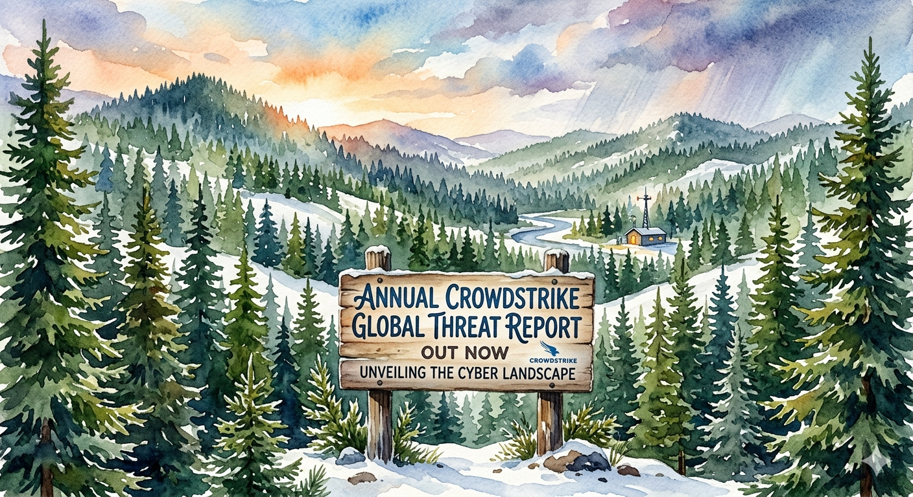

# FIR Risk Tuesday E83

**Publish Date:** March 13, 2026
**Source:** [CrowdStrike 2026 Global Threat Report](https://www.crowdstrike.com/resources/reports/global-threat-report/) (February 2026)
**Analysis:** FIR Risk Platform

---

# FIR Risk E83 — 27 Seconds



By FIR Risk Platform | Cybersecurity Risk Intelligence

---

## What You Need to Know

CrowdStrike's 2026 Global Threat Report tracks 281 adversaries — 26 newly named in 2025 — plus 150 active malicious activity clusters not yet attributed. This is the deepest adversary intelligence dataset in the industry.

**The headline number: 27 seconds.** That's the fastest observed breakout time — from initial access to lateral movement. The average is 29 minutes, down from 48 minutes last year. Five years ago it was 98 minutes. The window to detect and respond has collapsed by 70%.

This is the third major annual threat report we've covered in three weeks. Unit 42 showed us the [72-minute exfiltration timeline](/tuesday/e81-unit42-incident-response-debrief/). Cloudflare showed us [how attackers blend into cloud infrastructure](/tuesday/e82-cloudflare-threat-landscape/). CrowdStrike puts a timer on it — and the timer is running out.

> **INTEL [GLOBAL] [TREND]:** Breakout time has collapsed from 98 minutes (2021) to 29 minutes average / 27 seconds fastest (2025). 82% of intrusions are malware-free. The attack model has fundamentally shifted from deploying tools to abusing access.

---

## The $1.46 Billion Supply Chain Heist

The largest single financial theft in history happened in February 2025. **$1.46 billion in cryptocurrency**, stolen from the Bybit exchange by a North Korean state-sponsored group.

They didn't hack Bybit. They hacked Bybit's software vendor.

**The attack chain:** Compromise a developer at Safe{Wallet} (a cryptocurrency wallet service). Pivot to their cloud infrastructure. Insert malicious JavaScript that triggers only for Bybit transactions. Redirect $1.46B to an attacker-controlled wallet. Then — immediately restore the code to its original version. Evidence destroyed in real time.

E82 covered North Korea's [industrialized employment fraud](/tuesday/e82-cloudflare-threat-landscape/) — generating hundreds of millions through fake tech workers placed in US companies. This is the other side: surgical supply chain attacks generating billions in stolen cryptocurrency. **Both fund the same weapons programs.**

> **INTEL [GLOBAL] [THREAT ALERT]:** The $1.46B Bybit heist — executed through a compromised upstream software vendor, not Bybit itself — represents a new ceiling for supply chain risk. Your vendor's security posture is your security posture.

---

## The Unmanaged Asset Problem

Your EDR covers your endpoints. But what about the decommissioned VMs still sitting in vCenter? The webcam on the conference room wall? The VPN appliance running firmware from 2023?

CrowdStrike documents a technique that should concern every CISO: **attackers are dumping your entire Active Directory — every credential in your organization — by operating exclusively on machines your security tools can't see.**

The method: social-engineer access to VMware vCenter. Mount the domain controller's virtual disk onto a decommissioned VM. Copy the credential database. Total time: **3 hours**. Managed endpoints touched: **1**.

In another case, ransomware was deployed from an **unpatched webcam** on a corporate network — an unmanaged device with no EDR agent, no logging, no visibility.

Meanwhile, one ransomware group used a compromised SSO account to read the victim's **cyber insurance policies** before setting the ransom demand. They also modified **EDR exclusion rules** to create an unmonitored staging directory for their malware.

**Three reports, same conclusion: the attack surface isn't your perimeter. It's your identity layer, your cloud infrastructure, and every unmanaged asset in your environment.**

> **INTEL [GLOBAL] [TECHNIQUE]:** Cross-domain attacks spanning edge devices, identity, cloud, and virtualization infrastructure define the modern ransomware playbook. Adversaries operate exclusively on unmanaged assets to evade detection entirely.

---

## China's 2-Day Exploit Machine

How fast can a nation-state weaponize a published vulnerability? CrowdStrike documented the timelines:

- A file upload vulnerability — exploited **3 days** after disclosure
- A SQL injection flaw enabling remote code execution — **6 days**
- A Next.js deserialization vulnerability (React2Shell) — **2 days**

Unit 42's E81 reported adversaries scanning for new CVEs within [15 minutes of disclosure](/tuesday/e81-unit42-incident-response-debrief/). CrowdStrike shows what happens next — state-sponsored teams turn those scans into operational exploits in 48-144 hours. This isn't opportunistic. It's industrialized.

**The numbers that matter:**

- **38% increase** in China-nexus intrusions year-over-year
- **Edge devices targeted in 40%** of vulnerability exploitation cases — VPN appliances, firewalls, gateways
- **67% of exploited vulnerabilities** enabled remote code execution
- **22-month persistent access** maintained in one documented intrusion — October 2023 through mid-2025, undetected
- Targeting aligns with China's strategic priorities: **telecom** (85% increase), logistics, financial services, technology

**If your patching cycle for internet-facing appliances is measured in weeks, you're already behind.**

> **INTEL [CHINA] [SECTOR ALERT]:** China-nexus adversaries have industrialized exploit weaponization with state-sponsored resources. Edge devices are the preferred initial access vector — 40% of cases, minimal EDR coverage, inconsistent patching. Patch within 72 hours or assume compromise.

---

## Your Login Page Is the Phishing Page

This finding deserved its own [INTEL-5](/intel/intel-5-microsoft-identity-trust-exploitation/) earlier this week: **nation-state adversaries from Russia and Iran have independently converged on the same strategy — weaponize Microsoft's own authentication infrastructure as the attack platform.**

**The Russian campaign:** A 31-day phishing operation against US-based NGOs that eliminated every traditional phishing indicator. The adversary impersonated people the targets already knew, built rapport over days through instant messaging and video calls, then delivered OAuth 2.0 device codes that redirected to **legitimate Microsoft login pages**. No suspicious domains. No urgent deadlines. Victims authenticated on login.microsoftonline.com — and handed over persistent access.

**The Iranian campaign:** In November 2025, Iran deployed an adversary-in-the-middle toolkit (EvilGinx2) against Israeli Microsoft 365 users. The kit acts as a real-time reverse proxy — victims see Microsoft's real login page while the adversary intercepts credentials and session tokens, bypassing MFA entirely.

**The question boards should be asking: if this works against Israeli M365 users today, what stops it from targeting US M365 users tomorrow?** The answer is nothing. The technique is language-agnostic. Swap Hebrew lures for English ones, and the same attack chain works against any M365 tenant in the world.

**This is social engineering at a level most security awareness training doesn't address.** There's no suspicious link. No misspelled domain. Your employees are on the correct website. Your URL filter passes. Everything looks legitimate — because it is.

> **INTEL [GLOBAL] [TECHNIQUE]:** Nation-state adversaries are exploiting Microsoft's own authentication infrastructure — OAuth device codes, AiTM proxies against real login pages, systematic conditional access bypass. Traditional phishing indicators are absent by design. The login page IS the phishing page.

---

## The AI Arms Race Expands

CrowdStrike reports an **89% increase** in AI-generated social engineering content and confirms what Unit 42 and Cloudflare have flagged: AI is compressing the attack lifecycle.

But CrowdStrike adds a dimension the other reports didn't — **threats TO AI systems**, not just threats using AI:

- First observed **LLM-embedded malware** — malicious code hidden inside language model operations
- A **malicious MCP server** impersonating a legitimate email service — targeting developers integrating AI tools
- A **Langflow vulnerability** (CVE-2025-3248) exploited by ransomware operators to target AI development infrastructure
- **Prompt injection** targeting security workflows and AI agents

This is a new attack surface. As organizations embed AI into core business processes, adversaries are targeting the models, the agent frameworks, the developer tools, and the AI supply chain itself. CrowdStrike's conclusion: advanced threat actors will operationalize agentic AI for minimally supervised or autonomous operations.

**If your organization is deploying AI without a security framework around it, you're building on a surface that adversaries are already probing.**

> **INTEL [GLOBAL] [TREND]:** The AI threat has bifurcated — adversaries using AI to accelerate attacks (89% increase in AI social engineering) AND adversaries targeting AI systems directly (LLM malware, malicious MCP servers, prompt injection). Organizations must defend both vectors simultaneously.

---

## The Counterintuitive Finding

Buried in the data: **average ransom demands dropped 80.6% year-over-year.** At the same time, spam volume increased 141%, and cryptocurrency payments rose — Bitcoin +55.1%, Monero +88.5%.

The economics have shifted. Ransomware operators are making more money by hitting more targets at lower price points rather than pursuing large single payouts. It's the Walmart model applied to extortion — volume over margin.

This aligns with the ransomware ecosystem's fragmentation. Law enforcement disrupted several major groups in 2025, but the model proved resilient. New actors filled the gaps immediately.

> **INTEL [GLOBAL] [TREND]:** Ransomware economics have shifted from high-value single targets to high-volume, lower-demand operations. Despite law enforcement disruptions, the ransomware ecosystem remains resilient through rapid actor replacement and diversified revenue models.

---

## Three Reports, One Picture

This is our third consecutive deep dive into a major 2026 annual threat report. The convergence is remarkable:

**Speed is the new weapon:**
- Unit 42: 72-minute exfiltration, 25 minutes AI-assisted
- CrowdStrike: 29-minute average breakout, 27 seconds fastest

**Identity IS the perimeter:**
- Unit 42: 90% of incidents involved identity compromise
- Cloudflare: 63% of human logins use compromised credentials
- CrowdStrike: 35% of cloud intrusions via valid accounts, hybrid identity solutions are primary targets

**Cloud is the battlefield:**
- Unit 42: 23% SaaS data exfiltration (up from 6%)
- Cloudflare: Living off XaaS framework — cloud services weaponized as attack infrastructure
- CrowdStrike: 266% increase in named adversary cloud intrusions

**Supply chain is the multiplier:**
- Unit 42: 60% of cloud vulnerabilities in transitive dependencies
- Cloudflare: GRUB1 — one integration, hundreds of tenants
- CrowdStrike: $1.46B Bybit via Safe{Wallet}, ShaiHulud npm with 2M+ downloads

**AI is accelerating everything:**
- Unit 42: AI compresses timelines from hours to minutes
- Cloudflare: LLMs used for real-time SaaS navigation
- CrowdStrike: 89% increase in AI social engineering, threats TO AI systems emerging

The message from every major security vendor is the same: **traditional security models built around perimeters, signatures, and malware detection are defending against yesterday's threat landscape.** The future is identity-centric, cloud-native, and moving at machine speed.

---

## What To Do

CrowdStrike's seven recommendations, distilled for the board:

1. **Secure AI as an attack surface** — Monitor employee AI tool usage, assess AI vendor security, protect against prompt injection and LLM-embedded malware. This is a new security domain, not an extension of existing controls.

2. **Treat identity and SaaS as primary attack surfaces** — Deploy phishing-resistant MFA (FIDO2 keys). Enforce least-privilege for service accounts and non-human identities. Monitor anomalous OAuth token activity.

3. **Eliminate cross-domain blind spots** — Consolidate telemetry across endpoints, cloud, SaaS, and identity. Fragmented monitoring is the #1 reason cross-domain attacks succeed.

4. **Secure the software supply chain** — Harden CI/CD pipelines, enforce code signing, scan dependencies. One compromised npm package self-propagated to 2M+ downloads before detection.

5. **Patch edge devices within 72 hours** — State-sponsored adversaries weaponize disclosed vulnerabilities in 2-6 days. VPNs, firewalls, and gateways are preferred initial access vectors with minimal EDR coverage.

6. **Invest in proactive threat hunting** — At 27-second breakout times, reactive detection is insufficient. Hunt for unmanaged VMs, adversary-in-the-middle activity, and supply chain anomalies before they escalate.

7. **Train for modern social engineering** — Nation-state campaigns now use legitimate Microsoft login pages, impersonate real trusted contacts, and build rapport over weeks before introducing malicious content. Your training needs to match the adversary's sophistication.

---

## MITRE ATT&CK

- **T1190 — Exploit Public-Facing Application:** State-sponsored 2-6 day weaponization of disclosed CVEs targeting edge devices
- **T1199 — Trusted Relationship:** $1.46B Bybit heist via upstream software vendor; Entra ID partner tenant abuse
- **T1078 — Valid Accounts:** 35% of cloud intrusions use legitimate credentials; social engineering for SSO access
- **T1578.002 — Create Cloud Instance:** Unmanaged VMs used for credential dumping and ransomware staging outside EDR visibility
- **T1557 — Adversary-in-the-Middle:** AiTM phishing kits intercepting M365 credentials through real Microsoft login pages
- **T1195.002 — Compromise Software Supply Chain:** Self-propagating npm malware (2M+ downloads); software update mechanisms compromised
- **T1621 — Multi-Factor Authentication Request Generation:** Device code phishing via legitimate Microsoft OAuth 2.0 flows
- **T1059 — Command and Scripting Interpreter:** 82% malware-free intrusions; adversaries use legitimate tools and scripts

---

## Learn More

- [CrowdStrike 2026 Global Threat Report](https://www.crowdstrike.com/resources/reports/global-threat-report/) — Primary source
- [FIR Risk Tuesday E81 — 72 Minutes](/tuesday/e81-unit42-incident-response-debrief/) — Unit 42 Incident Response Report 2026
- [FIR Risk Tuesday E82 — Blending In](/tuesday/e82-cloudflare-threat-landscape/) — Cloudflare 2026 Threat Report
- [FIR Risk INTEL-4 — Your Cloud APIs Are the Attack Infrastructure](/intel/intel-4-cloud-api-abuse/) — Muddled Libra / Scattered Spider deep dive
- [FIR Risk Intelligence](https://github.com/stikman28/fir-risk-intelligence) — Source prompts, methodology, and all published INTEL

---

*Powered by [FIR Risk Platform](https://firrisk.ai/platform/) — AI-driven threat intelligence for enterprise risk leaders.*

---

# LINKEDIN POST

```
Three reports. Three weeks. One picture.

We just finished our third consecutive deep dive into a 2026 annual threat report — CrowdStrike following Unit 42 and Cloudflare.

The convergence is extraordinary.

27 seconds. That's the fastest observed breakout time from initial access to lateral movement. The average is 29 minutes (down from 98 minutes five years ago). Unit 42 measured 72-minute exfiltration timelines.

The window to detect and respond has collapsed by 70%.

But the speed isn't even the most important finding. Here's what all three reports agree on:

→ Identity IS the perimeter. 90% of incidents involve identity compromise (Unit 42). 63% of human logins use already-compromised credentials (Cloudflare). 35% of cloud intrusions use valid accounts (CrowdStrike).

→ Cloud is the battlefield. 266% increase in named adversary cloud intrusions. Attackers weaponize your own SaaS services, cloud APIs, and hybrid identity solutions as attack infrastructure.

→ Supply chain is the multiplier. The $1.46B Bybit heist — largest single financial theft in history — was a supply chain attack through a compromised developer at Safe{Wallet}. One npm package (ShaiHulud) self-propagated to 2M+ downloads.

→ AI is accelerating everything. 89% increase in AI social engineering. But CrowdStrike adds a dimension the others didn't — threats TO AI systems. LLM-embedded malware. Malicious MCP servers. Prompt injection against security workflows.

What struck me most:

Attackers dumped an organization's entire Active Directory — every credential — by operating exclusively on a decommissioned VM. Three hours. One managed endpoint touched. Your EDR never saw it.

A nation-state ran a 31-day phishing campaign using only legitimate Microsoft login pages. No suspicious domains. No misspelled URLs. Just trusted colleagues asking targets to authenticate on Microsoft's own infrastructure.

Iran deployed the same identity exploitation technique against Israeli M365 users. The toolkit is language-agnostic — swap Hebrew lures for English, and it works against any M365 tenant. There's nothing stopping it from targeting US organizations tomorrow.

This isn't the future. This is now.

Full analysis: [link]

#cybersecurity #threatintelligence
```

---

## X POST

The fastest observed breakout time in 2025 was 27 seconds. Not minutes. Seconds. From initial access to lateral movement. That's the headline from CrowdStrike's 2026 Global Threat Report — the third major annual report we've analyzed in three weeks, following Unit 42 and Cloudflare.

The average breakout time is 29 minutes, down from 98 minutes five years ago. A 70% collapse in the detection window. And 82% of these intrusions are malware-free. There's nothing for your antivirus to catch.

But the speed metric isn't what makes this report essential. It's the convergence with the other two reports. Three major vendors, independently confirming the same fundamental shifts.

Identity is the perimeter. Unit 42 says 90% of incidents involve identity compromise. Cloudflare says 63% of human logins use compromised credentials. CrowdStrike says 35% of cloud intrusions use valid accounts and that hybrid identity solutions — the technologies bridging on-premises and cloud — are the primary targets.

Here's where it gets personal for every M365 customer. A Russian state actor ran a 31-day phishing campaign against US NGOs using legitimate Microsoft login pages. No suspicious domains. No misspelled URLs. Just trusted contacts asking targets to authenticate on Microsoft's own infrastructure. Separately, Iran deployed an adversary-in-the-middle toolkit against Israeli M365 users — a real-time reverse proxy that intercepts credentials and session tokens as victims authenticate normally through Microsoft's real login page. The technique is language-agnostic. Swap Hebrew lures for English, and it works against any M365 tenant, anywhere. There is no technical barrier preventing this from targeting US organizations tomorrow.

The supply chain story is staggering. The largest single financial theft in history — $1.46 billion stolen from Bybit — was executed by compromising an upstream software vendor, not Bybit itself. A developer at Safe{Wallet} was compromised, malicious JavaScript inserted into the frontend that triggered only for Bybit transactions, funds redirected, and the code immediately restored to its original version. Evidence destroyed in real time.

On unmanaged assets: attackers dumped an organization's entire Active Directory — every credential — by mounting the domain controller's disk onto a decommissioned VM. Three hours. One managed endpoint touched. In another case, ransomware was deployed from an unpatched conference room webcam. Your EDR covers your endpoints. But every decommissioned VM, unpatched appliance, and IoT device is a blind spot adversaries are actively exploiting.

CrowdStrike adds a dimension the other reports didn't — threats TO AI systems. LLM-embedded malware. Malicious MCP servers impersonating legitimate developer tools. A Langflow vulnerability exploited by ransomware operators. The 89% increase in AI-generated social engineering is concerning. But the attack surface now includes the AI infrastructure itself — models, agents, developer tools, and AI supply chains.

What to do right now: deploy FIDO2 security keys (authenticator apps are bypassed by AiTM proxies). Patch edge devices within 72 hours — state-sponsored adversaries weaponize disclosed vulnerabilities in 2-6 days. Hunt for unmanaged VMs and anomalous OAuth token activity. And start treating AI security as a distinct domain, because adversaries already are.

Three reports, one picture: the attack model has shifted from malware to access abuse, and organizations still defending perimeters are defending against yesterday's threat landscape.

#cybersecurity #threatintelligence

---

# SOURCE DATA

**Platform Queries:**
1. "What are the key findings from the CrowdStrike 2026 Global Threat Report regarding breakout times, malware-free attacks, and adversary tracking?"
2. "How have China-nexus adversaries evolved their tactics in 2025, particularly around edge device exploitation and vulnerability weaponization speed?"
3. "What does the CrowdStrike report reveal about AI-enabled threats — both adversaries using AI and threats targeting AI systems?"
4. "What are the major ransomware and eCrime trends from 2025 — including SCATTERED SPIDER, BLOCKADE SPIDER, and supply chain attacks?"
5. "How do CrowdStrike's findings on identity, cloud, and supply chain threats correlate with Unit 42 and Cloudflare's 2026 reports?"

**KB Sources:**
- CrowdStrike 2026 Global Threat Report (February 2026)
- Unit 42 Global Incident Response Report 2026, Palo Alto Networks (February 2026)
- 2026 Cloudflare Threat Report (March 3, 2026)
- FIR Risk Tuesday E81 — 72 Minutes (March 3, 2026)
- FIR Risk Tuesday E82 — Blending In (March 9, 2026)
- FIR Risk INTEL-4 — Your Cloud APIs Are the Attack Infrastructure (March 4, 2026)
- MITRE ATT&CK Enterprise Matrix
- Key adversaries referenced: China-nexus (multiple PANDA groups), Russia-nexus (COZY BEAR), North Korea (PRESSURE CHOLLIMA), Iran (IMPERIAL KITTEN), eCrime (SCATTERED SPIDER, BLOCKADE SPIDER, ShinyHunters)
