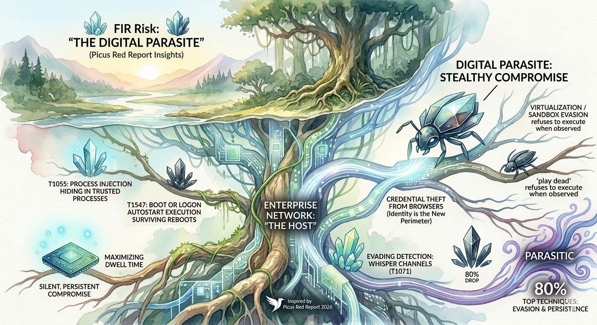

# FIR Risk Tuesday E84

**Publish Date:** March 20, 2026
**Source:** [Picus Red Report 2026](https://www.picussecurity.com/red-report) (March 2026)
**Analysis:** FIR Risk Platform

---

# FIR Risk E84 — The Digital Parasite

FIR Risk Advisory | Enterprise Risk Intelligence

---

## Bottom Line

Adversaries have stopped trying to destroy your environment. They're moving in.

Picus Labs analyzed 1.1 million malicious files and 15.5 million adversarial actions across 2025. The data reveals a strategic pivot: **80% of the top 10 MITRE ATT&CK techniques are now dedicated to evasion and persistence** — not disruption. Ransomware encryption declined 38% in one year. Credential theft is now twice as prevalent as data encryption. The adversary's primary success metric is no longer impact — it's dwell time.

Picus calls this the **"Digital Parasite"** — an adversary that inhabits the host, feeds on its identity systems, weaponizes its own infrastructure, and remains undetected for months. This is our fourth consecutive deep dive into a 2026 annual threat report, following [Unit 42 (E81)](/tuesday/e81-unit42-incident-response-debrief/), [Cloudflare (E82)](/tuesday/e82-cloudflare-threat-landscape/), and [CrowdStrike (E83)](/tuesday/e83-crowdstrike-global-threat-report/). The first three showed us the speed, the infrastructure, and the scale. Picus shows us the technique — exactly how adversaries are hiding inside your environment, and why your defenses may not be seeing them.

---

## Key Judgments

**1. The risk profile has inverted.** The primary threat is no longer business interruption from ransomware. It's undetected long-term access. Ransomware encryption (T1486) dropped 38% while stealth techniques dominate 8 of the top 10 positions. Organizations optimized for ransomware response are fighting yesterday's war. *High confidence — based on 1.1M sample analysis.*

**2. Your security tools may be compromised without alerting.** Adversaries now disable defenses as a standard first step (T1562, Rank #8), and self-aware malware (T1497, Rank #4) refuses to execute when being analyzed. A green dashboard may indicate successful evasion, not the absence of threats. *High confidence — multiple malware families confirmed.*

**3. Identity theft has become the primary objective, not a preliminary step.** Credential theft (T1555) at 23% prevalence is now double ransomware encryption at 13%. Malware like SantaStealer bypasses browser encryption by calling legitimate APIs — no exploit required. *High confidence — consistent across all four 2026 threat reports.*

**4. Cloud APIs are the new command-and-control infrastructure.** The SesameOp backdoor routes C2 through OpenAI's API. Storm-0501 queries AWS Secrets Manager directly. Traditional firewall rules and blocklists are ineffective against C2 channels that use your own trusted services. *High confidence — confirmed by Picus, Cloudflare (E82), and CrowdStrike (E83).*

**5. The attack surface now extends below the operating system.** North Korean operatives deployed IP-KVM hardware for BIOS-level access — invisible to every software-based security control. Software-only visibility is no longer sufficient. *Moderate confidence — limited to DPRK operations, but technique is replicable.*

---

## Evidence

### The Stealth Shift: 80% Evasion, 38% Ransomware Decline

The Top 10 most prevalent MITRE ATT&CK techniques tell the story:

| Rank | Technique | Prevalence | Trend |
|:---:|-----------|:---:|:---:|
| #1 | T1055 Process Injection | 30% | Stable — #1 for 3rd year |
| #2 | T1059 Command & Scripting | 27% | Stable |
| #3 | T1555 Credentials from Password Stores | 23% | Stable |
| #4 | T1497 Sandbox Evasion | 20% | **NEW — explosive growth** |
| #5 | T1071 Application Layer Protocol | 19% | Stable |
| #6 | T1036 Masquerading | 17% | **NEW to Top 10** |
| #7 | T1547 Boot/Logon Autostart | 15% | Rising |
| #8 | T1562 Impair Defenses | 14% | Stable |
| #9 | T1219 Remote Access Tools | 13% | **NEW to Top 10** |
| #10 | T1486 Data Encrypted for Impact | 13% | **↓38% decline** |

**Eight of ten** are evasion, persistence, or stealthy C2 techniques. Only T1059 (execution) and T1486 (encryption) serve direct operational purposes — and T1486 is in freefall. The adversary's playbook is now built around one principle: **don't get caught.**

> **INTEL [GLOBAL] [TREND]:** The 2026 MITRE ATT&CK technique rankings confirm a strategic pivot from disruption to inhabitation. Ransomware encryption (T1486) declined 38% while evasion techniques (T1497 Sandbox Evasion, T1036 Masquerading) surged into the Top 10 for the first time. 80% of the top techniques are now stealth-focused.

---

### Self-Aware Malware: The Trigonometry Test

**LummaC2** calculates the Euclidean distance and angles of mouse cursor paths using trigonometry. A human moves a mouse in curves — small accelerations, natural arcs. An automated sandbox moves in straight lines. LummaC2 measures the difference. If the geometry says "machine," the malware plays dead. It won't detonate, won't connect to C2, won't exhibit any malicious behavior.

Your sandbox passes the file as clean. Your SOC closes the ticket. **The file that executed and did nothing isn't safe. It's waiting.**

This is T1497 (Virtualization/Sandbox Evasion) surging to Rank #4 — the year's most explosive growth. Modern malware has developed survival instincts. It studies its environment before acting and only activates in production, on real machines, with real users.

> **INTEL [GLOBAL] [TECHNIQUE]:** Self-aware malware (T1497) has surged to #4, with LummaC2 using trigonometric analysis of mouse movements to distinguish human users from automated sandboxes. If the threat detects it is being watched, it plays dead. Automated analysis verdicts can no longer be trusted at face value.

---

### The OpenAI C2 Channel

The **SesameOp backdoor** routes all command-and-control traffic through **OpenAI's Assistants API.** Every instruction from the attacker looks like a legitimate AI development request. Every exfiltrated payload looks like an API response. Your firewall sees traffic to api.openai.com and passes it. Your DLP sees JSON formatted like AI prompts and ignores it.

**The malicious traffic is indistinguishable from your AI development workflow because it IS your AI development workflow** — just with a different operator.

Similarly, **Storm-0501** queries **AWS Secrets Manager** directly using stolen cloud credentials — extracting API keys, database passwords, and service tokens without touching an endpoint. No file dropped. No process injected. Just legitimate API calls to a legitimate service.

> **INTEL [GLOBAL] [THREAT ALERT]:** SesameOp routes C2 through OpenAI APIs and Storm-0501 steals secrets directly from AWS, making malicious traffic indistinguishable from legitimate business operations. The perimeter has moved from the firewall to the identity provider.

---

### The Browser Password Heist

**SantaStealer** doesn't crack Chrome's AppBound encryption. It doesn't exploit a vulnerability. It calls Chrome's own internal APIs — the same ones the browser uses — to request decrypted passwords. **It asks the browser nicely, and the browser hands them over.**

Every password your employees have saved in Chrome, Edge, or Firefox — email, SaaS, VPN, banking — is accessible to malware that knows the right API call. No brute force. No cryptographic attack. Just a polite request through the front door.

T1555 (Credentials from Password Stores) is now at 23% prevalence — **double the rate of ransomware encryption.** Meanwhile, noisy credential dumping (T1003, Mimikatz-style) has vanished from the Top 10. The Digital Parasite doesn't need to break down the door when it can simply log in.

> **INTEL [GLOBAL] [TECHNIQUE]:** Credential theft (T1555) at 23% is now double ransomware encryption (T1486) at 13%. SantaStealer bypasses Chrome encryption by calling legitimate browser APIs. Identity theft has become the primary attack objective, not a preliminary step.

---

### Blinding the Watchman

Before the parasite can feed, it must neutralize the immune system.

The **Deadlock ransomware** abuses **SystemSettingsAdminFlows.exe** — a legitimate Windows utility — to quietly disable Defender's real-time protection. No exploit. No admin credential. A trusted Microsoft binary, used as designed, pointed at the wrong target.

More aggressively, **RealBlindingEDR** tools surgically **remove kernel callbacks** — the hooks EDR agents use to monitor system activity. The EDR is still running. The dashboard shows green. But it's blind. Attackers operate in a ghost world, invisible to the tools built to stop them.

**Your EDR showing "no alerts" might be the most dangerous signal of all.**

> **INTEL [GLOBAL] [TECHNIQUE]:** Defense impairment (T1562) is now a standard first step, with Deadlock using legitimate Windows utilities and RealBlindingEDR surgically removing kernel callbacks. A green security dashboard may indicate successful evasion, not the absence of threats.

---

### Below the OS: The Hardware Insider

North Korean operatives deployed **IP-KVM devices** (PiKVM) plugged directly into HDMI and USB ports of corporate laptops. This hardware-level access operates **completely below the operating system.** EDR can't see it. Antivirus can't scan it. The entire visibility stack — every agent, every sensor, every log — runs at the OS level and above.

The attacker is underneath all of it.

E83 documented CrowdStrike's finding about attackers operating from unmanaged VMs. Picus takes this deeper — the unmanaged asset isn't a forgotten VM. It's **hardware physically attached to managed endpoints that software cannot detect.**

> **INTEL [DPRK] [TECHNIQUE]:** DPRK operatives deployed IP-KVM hardware for BIOS-level laptop access, operating entirely below the OS where all software-based security controls are blind. This redefines "insider threat" from a compromised employee to a compromised machine.

---

### The Camouflage Artists

**Masquerading (T1036)** entered the Top 10 for the first time at 17%.

**Ferocious Kitten** used the Right-to-Left Override Unicode character to flip file extensions — a malicious `.exe` appears as a `.pdf`. You see a document. You double-click a document. The OS executes a binary.

**Mustang Panda** deployed malware with invalid or expired digital signatures that still fooled superficial trust checks. The visual indicators humans rely on — "Is it signed? Does it have a certificate?" — are now a vulnerability, not a control.

> **INTEL [GLOBAL] [TECHNIQUE]:** Masquerading (T1036) entered the Top 10 for the first time at 17%. Ferocious Kitten (RTLO extension reversal) and Mustang Panda (invalid signature abuse) demonstrate adversaries mastering the art of looking like the system they've infected.

---

## Convergence: Four Reports, One Picture

This is our fourth consecutive deep dive into a 2026 annual threat report. The convergence is now undeniable:

**Identity is the primary attack vector:**
- Unit 42: 90% of incidents involved identity compromise
- Cloudflare: 63% of human logins use compromised credentials
- CrowdStrike: 35% of cloud intrusions via valid accounts
- **Picus: Credential theft (23%) is now double ransomware encryption (13%)**

**Cloud is the battlefield AND the weapon:**
- Unit 42: 23% SaaS data exfiltration
- Cloudflare: Living off XaaS framework
- CrowdStrike: 266% increase in cloud intrusions
- **Picus: SesameOp C2 via OpenAI API, Storm-0501 via AWS Secrets Manager**

**Your security tools are being outmaneuvered:**
- CrowdStrike: Unmanaged VMs used to evade EDR
- **Picus: LummaC2 fools sandboxes with trigonometry, RealBlindingEDR removes kernel callbacks, Deadlock disables Defender with its own utilities**

**The adversary model has shifted permanently:**

| Old Model | New Model |
|-----------|-----------|
| Break in, encrypt, ransom | Inhabit, persist, extract |
| Deploy malware files | Live off your own tools |
| Target the perimeter | Target identity + cloud |
| Noisy, fast, destructive | Silent, patient, parasitic |
| Success = disruption | Success = dwell time |

---

## Recommended Actions

1. **Validate your defenses against the 2026 Top 10.** Simulate Process Injection, Sandbox Evasion, and Defense Impairment against your actual controls. If LummaC2's trigonometry check can fool your sandbox, you need to know before an adversary does.

2. **Hunt for silence.** A device that stops sending telemetry is not a connectivity issue — it's a potential defense impairment operation. Build detection for EDR agents that go quiet, logs that stop flowing, and dashboards that stay green for too long.

3. **Inspect trusted traffic.** SesameOp and Storm-0501 prove that trusted destinations are now C2 channels. Implement behavioral analysis on API traffic to OpenAI, AWS, Azure, and developer tools. Monitor for anomalous patterns, not just known-bad destinations.

4. **Eliminate browser password stores.** At 23% prevalence and rising, saved browser passwords are a liability. Enforce enterprise password managers. Deploy FIDO2/WebAuthn for privileged access. Disable "Save Password" via group policy.

5. **Secure the hardware layer.** DPRK IP-KVM operations prove software-only visibility is insufficient. Monitor USB/HDMI connections. Enforce BIOS/UEFI passwords and Secure Boot. For high-value remote workers, mandate physical workstation audits.

6. **Treat "nothing happened" as an alert.** If a file executes and shows no behavior, that's not clean — it may be evasion. Investigate processes that check system uptime, calculate mouse geometry, or sleep before executing. Move to hardware-assisted detonation environments that are harder to fingerprint.

7. **Assume the adversary is already inside.** Four reports, four vendors, one conclusion. Build your security program around detecting and containing an adversary who already has valid credentials, already lives in your cloud, and already looks like a legitimate user. Because increasingly, they do.

---

## MITRE ATT&CK Reference

- **T1055 — Process Injection:** #1 at 30% — injecting into trusted processes to evade file-based detection (Tinky Winkey keylogger)
- **T1059 — Command & Scripting Interpreter:** #2 at 27% — PowerShell in-memory execution with zero disk artifacts (DragonForce), AppleScript credential theft (Atomic Stealer)
- **T1555 — Credentials from Password Stores:** #3 at 23% — SantaStealer bypasses Chrome AppBound encryption via legitimate API calls
- **T1497 — Virtualization/Sandbox Evasion:** #4 at 20% (NEW) — LummaC2 trigonometric mouse analysis; malware plays dead when observed
- **T1071 — Application Layer Protocol:** #5 at 19% — SesameOp C2 through OpenAI API; LameHug via cloud function calls
- **T1036 — Masquerading:** #6 at 17% (NEW) — Ferocious Kitten RTLO extension flipping; Mustang Panda invalid signature abuse
- **T1547 — Boot/Logon Autostart Execution:** #7 at 15% — EtherRAT Linux XDG autostart; CABINETRAT Windows registry persistence
- **T1562 — Impair Defenses:** #8 at 14% — Deadlock via SystemSettingsAdminFlows.exe; RealBlindingEDR kernel callback removal
- **T1219 — Remote Access Software:** #9 at 13% (NEW) — DPRK IP-KVM hardware; AnyDesk and VS Code Tunnels weaponized
- **T1486 — Data Encrypted for Impact:** #10 at 13% (↓38%) — Qilin/RansomHub hybrid encryption; ransomware evolves from destruction to professional extortion

---

## Learn More

- [Picus Red Report 2026](https://www.picussecurity.com/red-report) — Primary source
- [FIR Risk Tuesday E81 — 72 Minutes](/tuesday/e81-unit42-incident-response-debrief/) — Unit 42 Incident Response Report 2026
- [FIR Risk Tuesday E82 — Blending In](/tuesday/e82-cloudflare-threat-landscape/) — Cloudflare 2026 Threat Report
- [FIR Risk Tuesday E83 — The Convergence](/tuesday/e83-crowdstrike-global-threat-report/) — CrowdStrike 2026 Global Threat Report
- [FIR Risk INTEL-5 — Your Microsoft Login Page Is the Phishing Page](/intel/intel-5-microsoft-identity-trust-exploitation/) — Identity trust exploitation
- [FIR Risk Intelligence](https://github.com/stikman28/fir-risk-intelligence) — Source prompts, methodology, and all published INTEL

---

*Powered by [FIR Risk Platform](https://firrisk.ai/platform/) — AI-driven threat intelligence for enterprise risk leaders.*
