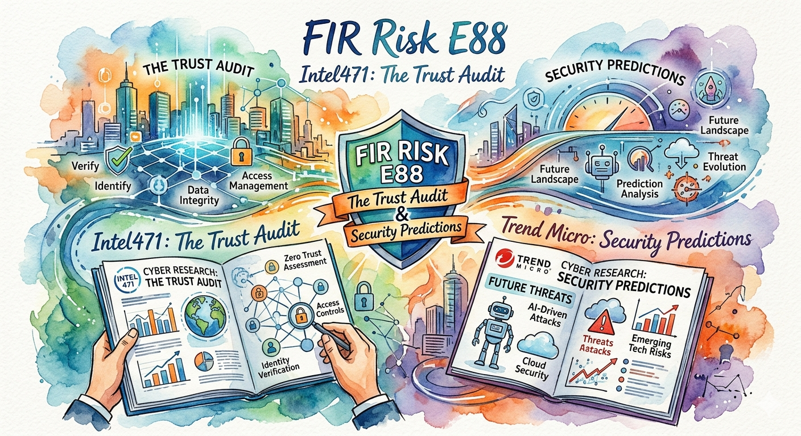

# FIR Risk Tuesday E88

**Publish Date:** April 21, 2026
**Source:** [Intel 471 2026 Cyber Threat Trends & Outlook](https://intel471.com/resources/reports/2026-cyber-threat-trends-outlook-report) & [Trend Micro 2026 Security Predictions: The AI-fication of Cyberthreats](https://www.trendmicro.com/vinfo/us/security/research-and-analysis/predictions/2026)
**Analysis:** FIR Risk Platform

---

# FIR Risk E88 — The Trust Audit



FIR Risk Advisory | Enterprise Risk Intelligence

*Why 2026's biggest cyber story isn't AI — it's your vendor list.*

---

## Bottom Line

Two landmark 2026 threat reports arrived in the same week. Intel 471 draws from hard telemetry and underground-forum engagement. Trend Micro reads the AI horizon. One is refreshingly skeptical about AI-driven attacks. One is bullish. Both arrive at the same conclusion: the attacks that hurt most in 2025 didn't rely on clever new weapons. They rode in through relationships your organization had already decided to trust.

Extortion had its biggest year ever — Intel 471 logged **over 6,800 breach events in 2025, a ~63% increase over 2024**. But the delivery mechanism shifted. The costliest campaigns came through trusted software (Oracle EBS, Cleo MFT, Salesloft → Salesforce) and user-driven execution ("ClickFix"), not zero-day heroics. AI is real — but as a force multiplier, not the core weapon. Intel 471 calls it *"influential, not revolutionary."* Trend Micro calls it *"industrialized."* Both agree: profit-driven attackers stick with whatever works cheapest.

The winning defenders in 2025 weren't the ones with the most tools. They were the ones who engineered verification into every seam where trust used to be assumed.

---

## The One Sentence Your Board Needs

> **"Attackers are no longer breaking in. They're logging in — as someone, or something, you already trust."**

---

## Where the Two Reports Disagree — and What to Do About It

Trend Micro paints a vivid 2026: agentic AI running end-to-end ransomware operations, deepfake-assisted "synthetic insiders" embedded in org charts, and hallucination loops cascading through automated workflows before any human sees them. The report notes that roughly **45% of AI-generated "vibe" code ships with security defects** — a stat that should sit on every engineering leader's dashboard.

Intel 471, working from underground-forum telemetry, pushes back. "AI malware" remains largely marketing. Financially motivated actors haven't abandoned what works. They use AI where the ROI is obvious: fluent phishing in seven languages, cloned voices for executive fraud, synthetic media for influence operations — not to rewrite their core playbook.

**The executive read: both are right.** AI is cheap enhancement today; it will be something more in 24–36 months. Don't budget as though autonomous AI adversaries have arrived. Budget as though the humans got dramatically better at impersonating you — because they have.

> **INTEL [GLOBAL] [TREND]:** The two most data-driven 2026 outlooks disagree on AI's role in active attacks but agree on AI's role in enablement: fluent multilingual phishing, voice cloning for executive fraud, and deepfake-assisted social engineering are the current deployed use cases. Autonomous AI-driven malware remains largely marketing in 2026 — but trajectory suggests that window narrows.

---

## The Real Story: 2025 Was the Year Trust Got Weaponized

Four patterns stand out in the Intel 471 data, and each has the same shape — a trusted relationship becomes an attack vector.

**Supply chain compromise went mainstream.** CLOP ran two supply-chain campaigns back to back: Cleo MFT at the end of 2024 and an Oracle EBS zero-day beginning October 2025 — claiming **115 victims** through the Oracle campaign alone. The Salesloft compromise cascaded through a trusted chatbot integration to **700+ downstream Salesforce customers**. Qilin's "Korean Leak" hit **20+ South Korean financial and asset-management firms through a single upstream IT service provider**. One point of trust. Outsized blast radius. Pattern-matching across the year, the target set is clear: zero-day exploitation of enterprise control-plane tools (Cleo MFT, Oracle EBS, SimpleHelp, BeyondTrust, Fortinet appliances, Apache Tomcat) became a primary 2025 access path — the tools inside your security perimeter are the ones adversaries are racing to weaponize.

**The developer became a target.** The npm worm "Shai-Hulud" trojanized over 650 packages in its September 2025 wave, then returned November 24 with a second wave that **reached about 26,000 GitHub repositories** — and deployed a **destructive fallback that deletes and overwrites user home directories if it loses authenticated access**. Your build pipeline is now an attack surface, and the failure mode isn't just data theft. It's data destruction.

**ClickFix industrialized the user as the exploit.** Attackers stopped fighting your email filters. They talk users into pasting a pre-staged command — typically Win+R → Ctrl+V → Enter. Intel 471 names ClickFix the **malware proliferation method of choice in 2025**. Full ClickFix phishing kits now trade for **$1,500–$2,000 per page** on underground markets. Traditional awareness training — "spot the typo" — no longer applies.

**Professional extortion scaled.** The Qilin ransomware-as-a-service program claimed **~18% of all extortion victims in 2025** and peaked at **212 reported breaches in October alone**. Qilin built a multilingual negotiation service and a data-analysis audit capability that scans stolen data to find the most regulator-sensitive leverage. Extortion is now a product with a roadmap.

**Synthetic insiders showed up in real hiring pipelines.** Trend Micro flags the convergence of supply chain and insider threats: nation-state operatives are using **deepfake-assisted interviews and AI-generated personas** to be hired as remote IT workers, then turning legitimate access into espionage or extortion. Your HR and identity verification process is now a cyber control.

**Underneath all five patterns is the credential reality.** FIR Risk Platform analysis confirms that credential-based intrusions still account for roughly **half of all successful initial access**, with exposed remote-access portals and RDP exploitation each representing roughly a third of breaches. Zero-day exploitation of enterprise tools — **SimpleHelp, BeyondTrust, Fortinet, Cleo, Apache Tomcat** — is the sharp edge of the same dynamic. Whether the entry is a supply-chain cascade, a ClickFix paste, or a synthetic hire, once inside, the attack looks like a valid login. *Logging in, not breaking in* — in every dimension.

> **INTEL [GLOBAL] [TECHNIQUE]:** ClickFix is the dominant malware delivery method of 2025 — turning user-driven command execution into a commodity phishing product priced $1,500–$2,000 per kit. Because the payload lands via legitimate user action inside the user's own session, email filters, URL reputation, and most attachment sandboxing never see it. The defensive pivot is behavioral: detect unexpected clipboard→terminal patterns and train the one-line rule: "no legitimate site ever asks you to paste a command into Run or PowerShell."

---

## What's Going Right

FIR's mandate is positive-minded intelligence, and 2025 actually handed defenders several wins worth naming in the boardroom.

**Law enforcement had a real year.** Operation Endgame disrupted the Rhadamanthys info-stealer, VenomRAT, and the Elysium botnet environment in November 2025. Lumma infrastructure was seized earlier in the year. BreachForums — the primary underground marketplace for breached data — closed for good. The criminal supply chain is feeling coordinated pressure for the first time in years.

**Ransom payments are trending down.** Black Basta's own leaked internal Matrix chats in February showed operators frustrated at how few victims were paying. Mandatory-reporting laws in the UK and Australia are reshaping the economics of extortion in defenders' favor.

**The initial-access market is disrupted — but not dead.** Intel 471 reported over 3,200 access claims from initial access brokers in 2025 — a **~27% decrease year over year**. But the market isn't dying, it's churning: **81% of access brokers operating in 2025 were new entrants**, suggesting that Operation Endgame and the BreachForums closure are forcing the criminal supply chain to rebuild from scratch. Less inventory. More turnover. A pressed, less-trusted adversary. Defenders should press the advantage.

**The defender playbook is clarifying.** Zero-trust for machine identities, continuous verification, behavior-over-signature detection — these aren't buzzwords anymore. They have battle data behind them, and the reference architectures are converging.

> **INTEL [GLOBAL] [DEFENDER TAILWIND]:** The ransomware ecosystem is destabilizing itself — Black Basta chat leaks, DragonForce hostile takeovers of rival programs, and anonymous vigilantes defacing leak sites (with the note *"Don't do crime. CRIME IS BAD. xoxo from Prague"*). Group-name attribution is less reliable when brands rebrand weekly. The tactical response: lead detection playbooks with TTPs, not IoCs, and retest extortion response while the adversary's trust network is in crisis.

---

## Four Questions for Your Next Board Meeting

**1. Concentration risk.** What percentage of our critical business workflows depend on a single third party — and what's our blast radius if that partner is breached tomorrow morning?

**2. Identity posture.** Do we verify sender identity architecturally, or do we still rely on employees noticing "weird phrasing" in emails and voice calls? Deepfake voice is now cheaper than a team lunch.

**3. Machine identity.** How many AI agents and service accounts hold standing credentials in our environment, and who audits them with the same rigor as human users?

**4. Resilience, not payment.** If ransom payments became illegal or impractical tomorrow — which is where UK and Australian legislation is trending — would our recovery playbook actually get us back online?

---

## Five Concrete Moves for CISO and Fraud/Risk Leaders This Quarter

**1. Map the trust graph.** Every vendor integration is shared attack surface. Reconcile your critical-vendor map like a balance sheet — quarterly. The Qilin Korean Leak, Salesloft/Salesforce cascade, and CLOP Oracle EBS campaigns all share the same shape: one trusted link, many downstream victims.

**2. Retire standing secrets.** Kill standing credentials for agents and service accounts. Issue short-lived, scoped tokens. Log every delegation. Agents are identities now — treat them like employees, not plumbing.

**3. Retrain for the new phish.** Ship a ClickFix-specific employee briefing this quarter. The old phishing tells (typos, odd tone) are gone. Teach one line: *"No legitimate website ever asks me to paste a command into Run or my terminal."*

**4. Out-of-band everything that moves money.** Require out-of-band verification for any financial move, privileged change, or unusual request — regardless of how familiar the voice or video sounds. Your CFO's voice is not a credential.

**5. Rehearse recovery, not payment.** Tabletop the recovery playbook against a supply-chain compromise and a destructive worm (Shai-Hulud's fallback wipes developer home directories), not just encryption-based ransomware. If recovery only works on paper, it doesn't work.

---

## The Frame: From "AI Everything" to Verification

Last year's story was *"AI everything."* It sold briefings, and to be fair, it named a real trend. This year's story is less exciting and more useful: **verification.**

2026 will reward organizations that replaced *"I trust this vendor," "I trust this email,"* and *"I trust this AI agent"* with systems that check — every time, at machine speed. Trust is no longer a policy statement. It's an architecture choice, and it's one executives get to make deliberately.

And the board-level question shifts with it. The honest one isn't *"did our prevention work this quarter?"* It's *"can we operate at full capacity while under attack?"* Verification-as-architecture is what makes the second question answerable.

Stay forward. Stay positive. Stay verified.

— The FIR Risk Intelligence team

---

## MITRE ATT&CK

**Techniques Most Relevant to the 2025 Trust-Weaponization Pattern:**

- **T1195.002 — Supply Chain Compromise: Compromise Software Supply Chain:** CLOP's Cleo MFT and Oracle EBS campaigns, Salesloft/Salesforce cascade, Qilin Korean Leak via upstream MSP — one trusted vendor, many downstream victims
- **T1199 — Trusted Relationship:** MSP and SaaS vendor integrations exploited as authenticated pathways inside downstream environments
- **T1078 — Valid Accounts:** Credentials harvested via info-stealers (Lumma, Rhadamanthys, Stealc) and reused across supply-chain intrusions
- **T1204.004 — User Execution: Malicious Copy and Paste:** ClickFix — user is socially engineered into executing attacker-staged commands in Run or terminal
- **T1059 — Command and Scripting Interpreter:** PowerShell and cmd.exe execution flowing from clipboard paste events — the new phishing payload path
- **T1036 — Masquerading:** Synthetic-identity and deepfake-assisted hiring of remote IT workers — insider access obtained through fabricated personas
- **T1133 — External Remote Services:** Exposed remote-access portals and RDP exploitation account for roughly a third of breaches each — the dominant "logging in" pathway once credentials are harvested
- **T1566.004 — Phishing: Voice Phishing:** Cloned executive voices used to authorize fraudulent payments and privileged changes
- **T1491.002 — Defacement / T1485 — Data Destruction:** Shai-Hulud npm worm's destructive fallback that deletes and overwrites user home directories when authenticated access is lost

**Connection to E81–E87 series:** The trust-weaponization pattern documented here is the attacker-side counterpart to the agent-identity risk surface we analyzed in E87. The same trusted-relationship techniques (T1199, T1195) that carried CLOP, Qilin, and Salesloft in 2025 are the techniques that will carry AI agent compromise in 2026–2027. Verification is the common defense.

---

## Learn More

- [Intel 471 — 2026 Cyber Threat Trends & Outlook Report](https://intel471.com/resources/reports/2026-cyber-threat-trends-outlook-report) — Primary source
- [Trend Micro — 2026 Security Predictions: The AI-fication of Cyberthreats](https://www.trendmicro.com/vinfo/us/security/research-and-analysis/predictions/2026) — Primary source
- [FIR Risk Tuesday E87 — The Agents Have Keys](/tuesday/e87-the-agents-have-keys/) — Anthropic 2026 Agentic Coding + State of AI Agents
- [FIR Risk Tuesday E86 — Castles on Quicksand](/tuesday/e86-castles-on-quicksand/) — IBM X-Force + Red Canary convergence
- [FIR Risk Tuesday E85 — The Responder's Report](/tuesday/e85-responders-report/) — Mandiant M-Trends 2026
- [FIR Risk Intelligence](https://github.com/stikman28/fir-risk-intelligence) — Source prompts, methodology, and all published INTEL

---

*Powered by [FIR Risk Platform](https://firrisk.ai/platform/) — AI-driven threat intelligence for enterprise risk leaders.*

---

## LINKEDIN POST

```
2025's biggest cyber story isn't AI.

It's your vendor list.

Two landmark 2026 threat reports just landed — Intel 471's Cyber Threat Trends & Outlook, and Trend Micro's Security Predictions. One refreshingly skeptical about AI-driven attacks. One bullish. Both arrive at the same uncomfortable conclusion: the attacks that hurt most in 2025 didn't rely on clever new weapons. They rode in through relationships your organization had already decided to trust.

The data is striking. Extortion had its biggest year ever — over 6,800 breach events in 2025, up ~63% year over year. But the delivery mechanism shifted. The costliest campaigns came through trusted software and user-driven execution, not zero-day heroics.

CLOP ran two back-to-back supply chain campaigns — Cleo MFT and an Oracle EBS zero-day that claimed 115 victims. The Salesloft compromise cascaded through a trusted chatbot integration to 700+ downstream Salesforce customers. Qilin's "Korean Leak" hit 20+ financial institutions through a single upstream IT provider. One point of trust. Outsized blast radius.

ClickFix became the dominant malware delivery method of 2025 — attackers stopped fighting email filters and started talking users into pasting pre-staged commands into Run or terminal. Full ClickFix phishing kits now trade for $1,500–$2,000 per page. Traditional awareness training ("spot the typo") no longer applies.

AI? It's real, but it's a force multiplier — not the core weapon. Intel 471 calls it "influential, not revolutionary." Trend Micro calls it "industrialized." Both agree profit-driven attackers stick with whatever works cheapest. Fluent multilingual phishing. Cloned executive voices. Deepfake interviews for fraudulent remote hires. Budget accordingly.

Here's the part that should hit the boardroom:

"Attackers are no longer breaking in. They're logging in — as someone, or something, you already trust."

And here's what's going right — because 2025 also handed defenders real wins. Operation Endgame disrupted Rhadamanthys, VenomRAT, and the Elysium botnet. Lumma infrastructure was seized. BreachForums closed for good. Initial-access-broker activity dropped ~27% year over year — and 81% of brokers operating in 2025 were new entrants, meaning the criminal supply chain is rebuilding from scratch rather than growing. Less inventory. More turnover. Black Basta's own leaked chats showed operators frustrated at how few victims were paying. Mandatory-reporting laws in the UK and Australia are reshaping extortion economics in defenders' favor.

The winning defenders in 2025 weren't the ones with the most tools. They were the ones who engineered verification into every seam where trust used to be assumed.

Four questions for your next board meeting:

→ Concentration risk. What percentage of our critical workflows depend on a single third party?
→ Identity posture. Do we verify sender identity architecturally, or rely on employees noticing "weird phrasing"?
→ Machine identity. How many AI agents and service accounts hold standing credentials — and who audits them like human users?
→ Resilience, not payment. If ransom payments became illegal tomorrow, would our recovery playbook actually get us back online?

Last year's story was "AI everything." This year's story is less exciting and more useful: verification. 2026 will reward organizations that replaced "I trust this vendor" with systems that check — every time, at machine speed.

And the board-level question shifts too. The honest one isn't "did our prevention work this quarter?" It's "can we operate at full capacity while under attack?" Verification-as-architecture is what makes the second question answerable.

Stay forward. Stay positive. Stay verified.

Full analysis — FIR Risk Tuesday E88: The Trust Audit.

#cybersecurity #riskmanagement #CISO #supplychain #threatintelligence #infosec #boardgovernance #extortion
```

---

## X POST

2025's biggest cyber story isn't AI.

It's your vendor list.

Two landmark 2026 threat reports just landed — Intel 471's Cyber Threat Trends & Outlook, and Trend Micro's Security Predictions. One refreshingly skeptical about AI. One bullish. Both arrive at the same conclusion: the attacks that hurt most in 2025 rode in through relationships your organization had already decided to trust.

Extortion had its biggest year ever — over 6,800 breach events in 2025, up ~63% year over year (Intel 471). But the delivery mechanism shifted. The costliest campaigns came through trusted software and user-driven execution, not zero-day heroics.

Supply chain went mainstream. CLOP ran two back-to-back supply chain campaigns — Cleo MFT and an Oracle EBS zero-day that claimed 115 victims. The Salesloft compromise cascaded to 700+ downstream Salesforce customers via one trusted chatbot integration. Qilin's "Korean Leak" hit 20+ South Korean financial institutions through a single upstream IT provider. One point of trust. Outsized blast radius.

The developer became a target. The npm worm "Shai-Hulud" trojanized over 650 packages in September, then returned November 24 with a second wave that reached ~26,000 GitHub repositories — and deployed a destructive fallback that wipes developer home directories if it loses authenticated access. Your build pipeline is now an attack surface. The failure mode isn't just data theft. It's data destruction.

ClickFix industrialized the user as the exploit. Attackers stopped fighting email filters. They talk users into pasting a pre-staged command — Win+R → Ctrl+V → Enter. Intel 471 calls ClickFix the malware proliferation method of choice in 2025. Full phishing kits trade for $1,500–$2,000 per page. Teach this one line: "No legitimate website ever asks me to paste a command into Run or my terminal."

Professional extortion scaled. The Qilin ransomware-as-a-service program claimed ~18% of all extortion victims in 2025 and peaked at 212 reported breaches in October. Qilin built a multilingual negotiation service and a data-analysis audit that scans stolen data for maximum regulator-sensitive leverage. Extortion is a product with a roadmap.

Synthetic insiders showed up in real hiring pipelines. Trend Micro flags deepfake-assisted interviews and AI-generated personas for fraudulent remote IT worker hires. Your HR and identity verification process is now a cyber control.

AI? It's real, but it's a force multiplier — not the core weapon. Intel 471 calls it "influential, not revolutionary." Trend Micro calls it "industrialized." Fluent multilingual phishing. Cloned executive voices. Synthetic media for influence operations. Don't budget as though autonomous AI adversaries have arrived. Budget as though humans got dramatically better at impersonating you.

The line your board needs:

"Attackers are no longer breaking in. They're logging in — as someone, or something, you already trust."

And — because FIR's mandate is positive-minded intelligence — here's what's going right. Operation Endgame disrupted Rhadamanthys, VenomRAT, and the Elysium botnet. Lumma was seized. BreachForums closed. Initial-access-broker activity dropped ~27% year over year — and 81% of brokers operating in 2025 were new entrants. The criminal supply chain is rebuilding, not growing. Black Basta's leaked chats showed operators frustrated at payment rates. UK and Australian mandatory-reporting laws are tightening the screws.

The ransomware ecosystem is also destabilizing itself. DragonForce hostile takeovers. Anonymous vigilantes defacing leak sites ("Don't do crime. CRIME IS BAD. xoxo from Prague"). Group-name attribution is less reliable when brands rebrand weekly. Lead detection playbooks with TTPs, not IoCs.

Five concrete moves for this quarter:

1. Map the trust graph. Every vendor integration is shared attack surface. Reconcile your critical-vendor map like a balance sheet — quarterly.

2. Retire standing secrets. Kill standing credentials for agents and service accounts. Short-lived scoped tokens. Log every delegation.

3. Retrain for the new phish. Ship a ClickFix-specific briefing. Teach one line.

4. Out-of-band everything that moves money. Your CFO's voice is not a credential.

5. Rehearse recovery against a destructive worm (Shai-Hulud), not just encryption ransomware.

Last year's story was "AI everything." This year's story is less exciting and more useful: verification.

And the board-level question shifts too. It's no longer "did our prevention work this quarter?" It's "can we operate at full capacity while under attack?" Verification-as-architecture is what makes the second answerable.

Stay forward. Stay positive. Stay verified.

Full E88 — The Trust Audit — linked below.

#cybersecurity #verification

---

## SOURCE DATA

**Platform Queries:**
1. "Two 2026 threat reports just landed on the same week — Intel 471's Cyber Threat Trends & Outlook Report and Trend Micro's Security Predictions. Intel 471 is hard telemetry and underground-forum engagement; Trend Micro is AI-centric horizon scanning. Before getting into specific findings, tell me: where do these two reports disagree, where do they converge, and what's the single most important finding for a risk leader reading them together?"
2. "Both reports describe 2025 as the year trust got weaponized — but they use different vocabularies. Intel 471 points to supply chain campaigns (CLOP/Cleo, CLOP/Oracle EBS, Salesloft, Qilin Korean Leak), developer-pipeline attacks (Shai-Hulud), and ClickFix as the dominant delivery method. Trend Micro points to synthetic insiders, deepfake-assisted hiring, and hallucination cascades in agentic workflows. Build the unified executive narrative — what's the shape of the threat, and what are the four or five patterns that matter?"
3. "The defender tailwinds are underreported. Walk through Operation Endgame (Rhadamanthys/VenomRAT/Elysium), Lumma seizure, BreachForums closure, the ~27% decrease in initial-access-broker activity, the ransomware ecosystem destabilizing itself (DragonForce takeovers, Black Basta chat leaks, anonymous vigilantes), and mandatory-reporting legislation in UK and Australia. What's the honest case for defender optimism in 2026, without overstating it?"
4. "If you're a CISO or Fraud/Risk leader reading both reports together and connecting them to our E81–E87 series, what are the four board-level questions that should come out of this, and what are the five concrete moves this quarter? Keep it actionable — verification as architecture, not policy."

**KB Sources:**
- Intel 471 — 2026 Cyber Threat Trends & Outlook Report (data window: Jan 1 – Dec 15, 2025)
- Trend Micro — The AI-fication of Cyberthreats: Security Predictions for 2026
- FIR Risk Tuesday E81–E87 (series convergence context)

**Fact-Check Notes (verified against source PDFs):**
- CONFIRMED (Intel 471): 6,800+ breach events in 2025, ~63% YoY increase; 3,200+ IAB claims, ~27% YoY decrease; Qilin ~18% of extortion victims, peaked 212 in October
- CONFIRMED (Intel 471): CLOP Cleo MFT campaign late 2024–early 2025; CLOP Oracle EBS zero-day Oct 1, 2025 claiming 115 victims
- CONFIRMED (Intel 471): Salesloft compromise via GitHub breach March 2025 cascading to 700+ Salesforce customers
- CONFIRMED (Intel 471): Qilin "Korean Leak" September 2025 via single upstream MSP, at least 20 South Korean financial/asset-management firms
- CONFIRMED (Intel 471): Shai-Hulud wave 1 (September 2025) exceeded 650 packages; wave 2 (November 24, 2025) reached ~26,000 GitHub repositories; destructive fallback deletes/overwrites home directories
- CONFIRMED (Intel 471): ClickFix named malware proliferation method of choice in 2025; kit pricing $1,500–$2,000 per page on underground markets
- CONFIRMED (Intel 471): Operation Endgame disrupted Rhadamanthys, VenomRAT, Elysium botnet environment (November 2025); Lumma seized earlier; BreachForums closed
- CONFIRMED (Intel 471): Black Basta internal Matrix chat leaks (mid-February 2025) showed operator frustration with payment rates
- CONFIRMED (Intel 471): Leak-site defacement quote: "Don't do crime. CRIME IS BAD xoxo from Prague"
- CONFIRMED (Trend Micro): 45% of AI-generated "vibe" code introduces security defects
- CONFIRMED (Trend Micro): Synthetic insider pattern — forged identities, deepfake-assisted interviews, AI-generated personas for fraudulent remote IT worker hires
- CONFIRMED (Trend Micro): Agentic AI autonomy + A2A hallucination cascades as emerging attack surface
- NOTE: Intel 471 report is gated behind a download form; Trend Micro report available at trendmicro.com/vinfo predictions landing page

**FIR Risk Platform Agent Analysis (supplemental):**
- Agent query 1: "Drawing on Intel 471's 2026 Cyber Threat Trends & Outlook Report and Trend Micro's 2026 Security Predictions — alongside your broader knowledge base — how is initial access to enterprise environments being obtained today, and how has that shifted? What does the change signal for defenders?"
- Key findings incorporated from agent response: credential-based intrusions remain roughly half of all successful initial access; exposed remote-access portals and RDP exploitation each ~33% of breaches; zero-day exploitation concentrated in enterprise tools (SimpleHelp, BeyondTrust, Fortinet, Cleo, Apache Tomcat); 81% of access brokers operating in 2025 were new entrants — market disruption (Operation Endgame, BreachForums closure) is forcing the criminal supply chain to rebuild from scratch rather than killing it outright; strategic shift from "breaking in" to "blending in" via platform abuse (Microsoft Teams impersonation, GitHub/Discord malvertising, rogue QEMU virtual machines evading EDR)
- Agent query 2: "Considering Intel 471's 2026 Cyber Threat Trends & Outlook Report and Trend Micro's 2026 Security Predictions alongside your broader knowledge base — what's the most consequential shift in enterprise cyber risk over the past 12 months, and where is executive-level reporting commonly getting the framing wrong?"
- Key finding incorporated from agent response: the board-level metric is shifting from prevention success ("did our controls block X attacks?") to operational resilience under active attack ("can we maintain business velocity during an incident?"). This reframe is now reflected in the closing verification section.
- Agent framings set aside as outside FIR voice or unverifiable: parallel-attack velocity statistics ("10 simultaneous attacks," "milliseconds define outcomes"); security-as-business-enabler / competitive-differentiator framing; aggressive "industrialization" narrative that would undercut the deliberately balanced Intel 471 vs Trend Micro framing that gives E88 its credibility
- Agent classification: Both reports classified as `cybersecurity / threat_report` with high confidence. Intel 471 chunks: 77; Trend Micro chunks: 68. FIR Risk adds the board-level synthesis layer — connecting threat telemetry to executive governance decisions.
