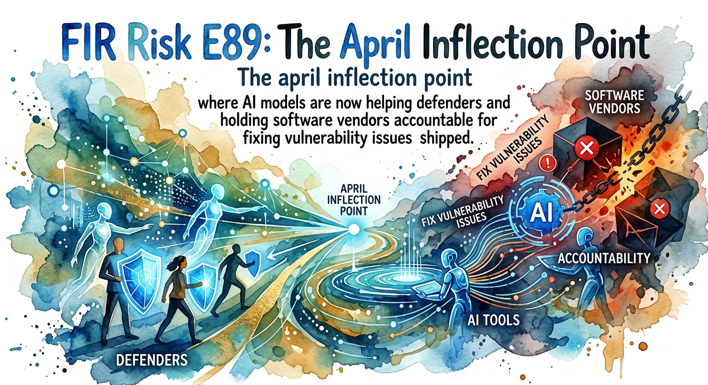

# FIR Risk Tuesday E89

**Publish Date:** April 28, 2026
**Source:** [Anthropic Project Glasswing](https://www.anthropic.com/glasswing) & [Claude Opus 4.7](https://www.anthropic.com/news/claude-opus-4-7) (April 16, 2026), [OpenAI GPT-5.5](https://openai.com/index/introducing-gpt-5-5/) & [Trusted Access for Cyber](https://openai.com/index/scaling-trusted-access-for-cyber-defense/) (April 23, 2026), read against the FIR Risk corpus October 2025 – April 2026 (E72–E88, INTEL-1 through INTEL-19)
**Analysis:** FIR Risk Platform

---

# FIR Risk E89 — The April Inflection



FIR Risk Advisory | Enterprise Risk Intelligence

*What two AI labs decided in seven days — and what it means if you're not on the launch list.*

---

## Bottom Line

Twelve days ago, Anthropic launched **Project Glasswing** alongside Claude Opus 4.7 and a coalition that includes AWS, Apple, Broadcom, Cisco, CrowdStrike, Google, JPMorgan Chase, the Linux Foundation, Microsoft, NVIDIA, and Palo Alto Networks. Five days ago, OpenAI launched **GPT-5.5** alongside its **Trusted Access for Cyber** program, scaling defensive deployment to "thousands of verified individual defenders and hundreds of teams responsible for defending critical software."

Two competing frontier-model labs converged on the same architectural answer in the same week. It is not surprising that US-based AI labs would lean defensive — that posture has been signaled for over a year. What is surprising is the *operational deployment vehicles* — verified-access programs, fine-tuned defender variants, deliberate offensive-capability differentiation in the consumer model — arriving simultaneously and at scale.

Read against the prior six months of FIR Risk corpus, this is the inflection point the data has been pointing at: **AI is finally good enough to be the defender's tool of choice.** Not in 24 months. Now.

The path of least resistance for attackers — exploit the technical debt vendors have been shipping for decades, faster than they can patch it — starts closing this quarter.

---

## The One Sentence Your Board Needs

> **"AI just became a defender's tool — and the path of least resistance for attackers starts closing this quarter."**

---

## The April 16–23 Window

Both labs did the same four things in seven days.

**Consumer model with reduced offensive cyber.** Anthropic's Claude Opus 4.7 was trained with explicit "efforts to differentially reduce these capabilities." OpenAI's GPT-5.5 is rated *"High capability in the Cybersecurity domain, but below Critical"* — explicitly unable to autonomously develop functional zero-days against hardened systems.

**Verified-access defensive program.** Anthropic launched the Cyber Verification Program for legitimate vulnerability research, penetration testing, and red-teaming. OpenAI launched Trusted Access for Cyber (TAC), scaling defensive deployment to *"thousands of verified individual defenders and hundreds of teams responsible for defending critical software."*

**Frontier defender variant.** Anthropic's defender-tier model is Claude Mythos Preview. OpenAI's is GPT-5.4-Cyber — explicitly *"fine-tuned to be cyber-permissive"* for verified defensive use.

**Scaled deployment vehicle.** Anthropic launched Project Glasswing with AWS, Apple, Broadcom, Cisco, CrowdStrike, Google, JPMorgan Chase, the Linux Foundation, Microsoft, NVIDIA, and Palo Alto Networks — backed by $100M in usage credits and $4M in donations to open-source security organizations. OpenAI's TAC program scales to thousands of verified individual defenders and hundreds of teams responsible for critical software defense.

The capability evidence is concrete — and ego-killing for the "AI is just hype" camp. **Mythos has already found thousands of high-severity vulnerabilities, including in every major operating system and web browser** — a 27-year-old OpenBSD remote-crash flaw, a 16-year-old FFmpeg vulnerability that automated tools missed across **5 million test iterations**, multiple Linux kernel chains. Benchmarks confirm the leap: **CyberGym 83.1% (Mythos) vs. 66.6% (Opus 4.6); SWE-bench Pro 77.8% vs. 53.4%; Terminal-Bench 2.0 82.0% vs. 65.4%.** Third-party validation: **XBOW autonomous penetration testing scored 98.5% vs. 54.5% for Opus 4.6** — a 1.8x defender uplift, measured.

Two labs. Same architecture. Same week. That is the inflection.

> **INTEL [GLOBAL] [DEFENDER TAILWIND]:** Two competing US frontier-model labs simultaneously launched verified-access defensive cyber programs in a seven-day window (Anthropic April 16, OpenAI April 23). Both pulled offensive cyber capability *out* of the consumer model and concentrated frontier defender capability into verified-access programs with companion fine-tuned variants. The asymmetry — discovery is now cheap, leaving issues unpatched is increasingly costly — closes the historical attacker advantage of exploiting decades-old technical debt faster than vendors can patch it.

---

## The Six Months That Set Up This Moment

The April inflection did not arrive in a vacuum. The prior six months of FIR Risk coverage — sixteen of the seventeen major industry reports, with Verizon DBIR still pending — documented four converging defender tailwinds that no individual report headlined.

**Disruption operations finally landed at scale.** Operation Endgame disrupted Rhadamanthys, VenomRAT, and the Elysium botnet in November 2025. Lumma infrastructure seized. BreachForums closed for good. **Initial-access-broker activity dropped ~27% year over year, and 81% of brokers operating in 2025 were new entrants** (Intel 471) — the criminal supply chain is rebuilding from scratch, not growing.

**The ransomware ecosystem is destabilizing itself.** Black Basta's internal Matrix chats leaked in February 2025. DragonForce executed hostile takeovers of rival programs. Anonymous vigilantes defaced leak sites. **Median ransom demand collapsed from $9.9M to $3M** (GuidePoint); **average ransom demand dropped 80.6% year over year** (CrowdStrike). Volume up, leverage down.

**Regulation moved from policy to economics.** Australia's mandatory ransomware-payment reporting has been live since May 2025; UK advancing. The legislative environment is tilting the pay/no-pay calculus in defenders' favor for the first time.

**The basics still work where applied.** MFA blocks 99% of account compromise (Microsoft, 100T signals/day). 90% of breaches were preventable with controls already on the market (Unit 42). 80% of small organizations added security controls solely to qualify for cyber insurance coverage (CLTC). Underwriting is now one of the most effective security levers in the market.

The April inflection lands into a defender market that was already winning at the margins, not losing. The AI uplift compounds the prior wins; it does not substitute for them.

---

## What Actually Changes for Defenders — Three Economic Shifts

**1. Software vendors finally have to fix what they shipped.** Mythos finding a 27-year-old OpenBSD flaw and a 16-year-old FFmpeg flaw automated tools couldn't find is a verdict on decades of carried technical debt. As frontier models — and their successors — make discovery cheap at scale, vendors that have been shipping known-fragile software face a flipped economic asymmetry: discovery is now cheap, leaving the issues unpatched is reputationally and legally expensive. The path of least resistance for attackers — exploit known-fragile software before vendors patch it — narrows when patch pressure goes industrial.

**2. AI is now the defender's primary tool, not a research curiosity.** XBOW 98.5% vs 54.5% on penetration testing. CodeRabbit +10% recall on bug detection. CyberGym 66.6% → 83.1%. These are shipped, measured, third-party-validated. The work for risk and security leaders is to integrate AI into the **core defense program** — identity management, vulnerability triage, log and alert analysis, code review, threat hunting — and **train cyber and risk teams to operate with AI as a peer**, not a novelty.

**3. The cyber vendor market is under continuous upgrade pressure.** Defenders just received a meaningful frontier-AI upgrade. More upgrades are almost certainly coming — on a cadence no one can predict. The next release could land in weeks. Or longer. The point is the cadence itself: cyber vendors selling multi-year contracts on the assumption today's differentiation will hold are pricing against an upgrade rhythm that no longer cooperates. For buyers, that strengthens the case for **shorter contract terms, capability-uplift commitments at every renewal, and exit clauses tied to defender-tool generations** — keeping leverage with the side that captures each new release.

> **INTEL [GLOBAL] [MARKET SHIFT]:** The April inflection is good news for defenders and structurally challenging for cyber vendors selling multi-year contracts on existing differentiation. Frontier defender-tool upgrades just arrived from both major US AI labs in a seven-day window — and more upgrades are almost certainly coming on a cadence no one can predict. Buyers structuring shorter contract terms, capability-uplift commitments at every renewal, and exit clauses tied to defender-tool generations capture the upgrade rhythm. Buyers locked into multi-year contracts on pre-inflection terms pay for capability the next release could supersede.

---

## What This Means If You're Not on the Launch List

Most enterprises will not be in the Glasswing coalition or in the TAC verified-access tier. Outsiders are still beneficiaries — through three downstream channels.

**1. The vendor channel.** Your existing security stack *is* the coalition. CrowdStrike, Microsoft, Palo Alto, Google, AWS, Cisco — all Glasswing partners. If you license Defender, Falcon, Cortex, Chronicle, Security Hub, or Cisco Security, you have already paid for seats at the table. The honest action is *press your security vendors on the timeline for Glasswing-derived AI defensive capability appearing in the products you already license.* That is a board-level vendor-management question, and it is the question vendors least want asked.

**2. The patch channel.** Mythos has found thousands of high-severity vulnerabilities — those flow through upstream patches in Linux, OpenBSD, FFmpeg, browsers, and operating systems. Every enterprise gets the fix. The bottleneck for outsiders is **patch deployment velocity** — coalition discovery is only an uplift if you actually deploy patches before adversaries weaponize them. Mean-time-to-patch is the work.

**3. The upgrade-cadence channel.** Frontier defender-tool capability just shipped — and the next release could land in weeks, or months, or longer. No one can predict the cadence. The outsider question is not "how do I get in" — it is *"am I building AI-fluent security operations now, so each new release is an uplift I can actually use?"* Organizations building AI-defender workflows from this week forward compound advantage with every release. Those waiting for "the right moment" find themselves catching up against peers who treated the upgrades as continuous from the start.

---

## The Counterweight: Recognition Is Not Action

The April inflection is acceleration, not absolution. The known defender gaps documented across the same corpus still close one at a time — Glasswing does not fix your cloud configuration, TAC does not govern your AI agents, GPT-5.5 does not replace your identity program.

- **56%** of CISOs say cloud security spend is insufficient *and aren't fixing it* (Wiz, E77)
- **87%** of executives recognize AI as a top risk; **<1%** have operationalized AI governance (WEF, E80)
- **15%** of organizations are confident in non-human identity governance — even as **57%** deploy multi-stage AI agents with production credentials (Anthropic, E87)
- **58%** of organizations run **25+ security tools** — the meta-risk is unmanaged sprawl, not underinvestment (Wiz, E77)
- **60%** of attacks exploit **cloud misconfigurations** defenders already know about (Fortinet, E75)

The April inflection compounds with closure of these gaps. It gets wasted without it. The 850% year-over-year identity-attack surge (Red Canary) does not slow because frontier AI labs released defensive variants — it slows because defenders deploy AI *into* identity programs, machine-identity governance, and the cloud-config queue.

> **INTEL [GLOBAL] [GOVERNANCE]:** The April inflection raises the cost of leaving known defender gaps unclosed. Recognition without action is now visibly more expensive — peer organizations operating with AI-fluent security teams will close gaps faster than peers without. Boards that move identity management, AI governance, and AI-team training to top-quartile investment posture this quarter operate ahead of the inflection; boards that wait pay the differential at every renewal cycle.

---

## Three Questions for Your Next Board Meeting

**1. Are we sticking to the core defense program?** Identity management, AI for defense, and team training on AI fluency are the three investments the April inflection makes most leveraged. Identity is still the dominant attack vector across six independent reports. AI is now a deployable defender. Trained teams operate the combined stack. Are we investing in all three — or hoping a vendor will ship a feature that solves it for us?

**2. Are we capturing the downstream coalition uplift?** Vendor pressure (when does Glasswing-derived capability ship in our license?), patching velocity (mean-time-to-patch as a board metric), and AI-team fluency (how many security and risk staff are working with AI weekly?) — what's our 90-day plan on each?

**3. Are we structuring cyber-vendor contracts for an upgrade cadence we cannot predict?** Shorter contract terms, capability-uplift commitments at every renewal, AI-derived-capability roadmap, exit clauses tied to defender-tool generations — these are the levers buyers have *now,* and the levers that protect us when the next frontier release lands in weeks rather than months.

---

## What's Next: The FIR Risk 2026 Report

E89 plants the flag. The full work comes next.

Verizon DBIR — the seventeenth and last major industry report of the 2026 cycle — is expected within weeks. Once it lands, the **FIR Risk 2026 Report** will publish: a complete year-in-review drawing on every major source we tracked between April 2025 and the DBIR release, organized around three high-confidence convergences (where the corpus agrees), three sharp disagreements (where vendors fight), a predictions scorecard grading the major 2026 outlooks against what actually happened, and the April inflection developed in full — with the year of corpus that pointed at it.

Read independently. With no vendor relationship to any source. With no incentive to sell anyone fear.

Stay forward. Stay positive. Stay verified.

— The FIR Risk Intelligence team

---

## MITRE ATT&CK

**Defender techniques and the controls the April inflection accelerates:**

- **T1078 — Valid Accounts:** Identity remains the dominant 2025 attack vector across six reports; AI-assisted behavioral detection of post-authentication anomalies is the corresponding control most uplifted by the inflection
- **T1190 — Exploit Public-Facing Application:** Coalition vulnerability discovery (Mythos) directly compresses the window between disclosure and exploitation; patch deployment velocity is the corresponding defender control
- **T1199 — Trusted Relationship:** Supply-chain and SaaS vendor cascades remain the highest-blast-radius access path; AI-fluent vendor risk programs and quarterly trust-graph reconciliation are the corresponding controls
- **T1486 — Data Encrypted for Impact:** Down ~38% YoY (Picus) — the encryption-blast model is fading as recovery-denial replaces it
- **T1562 — Impair Defenses / T1490 — Inhibit System Recovery:** Recovery denial is the new ransomware operational model (Mandiant); rehearsed recovery against backup-destruction is the corresponding control
- **T1204.004 — User Execution: Malicious Copy and Paste:** ClickFix industrialized the user as the exploit; behavioral detection of clipboard→Run patterns is the corresponding control, and AI-assisted endpoint analytics is the operational uplift
- **T1566.004 — Phishing: Voice Phishing:** Voice channel rose to 23% in cloud breaches (Mandiant); out-of-band verification is the corresponding control
- **T1036 — Masquerading:** Synthetic-insider hiring; live identity verification at hire is the corresponding control

**Connection to the corpus:** The defensive techniques the April inflection most accelerates — behavior-based detection, identity governance, vulnerability triage, trust-graph reconciliation, code review — are not new. They are the controls every report has been recommending. What changes is *who can deploy them at what cost.* AI-fluent security operations close the deployment gap.

---

## Learn More

- [Anthropic — Project Glasswing](https://www.anthropic.com/glasswing) — Primary source
- [Anthropic — Introducing Claude Opus 4.7](https://www.anthropic.com/news/claude-opus-4-7) — Primary source
- [OpenAI — Introducing GPT-5.5](https://openai.com/index/introducing-gpt-5-5/) — Primary source
- [OpenAI — Trusted Access for Cyber Defense](https://openai.com/index/scaling-trusted-access-for-cyber-defense/) — Primary source
- [OpenAI — Accelerating the Cyber Defense Ecosystem](https://openai.com/index/accelerating-cyber-defense-ecosystem/) — Primary source
- [FIR Risk Tuesday E88 — The Trust Audit](/tuesday/e88-the-trust-audit/) — Intel 471 + Trend Micro
- [FIR Risk Tuesday E87 — The Agents Have Keys](/tuesday/e87-the-agents-have-keys/) — Anthropic + agent-identity governance
- [FIR Risk Tuesday E86 — Castles on Quicksand](/tuesday/e86-castles-on-quicksand/) — IBM X-Force + Red Canary convergence
- [FIR Risk Tuesday E85 — The Responder's Report](/tuesday/e85-responders-report/) — Mandiant M-Trends 2026
- [FIR Risk Intelligence](https://github.com/stikman28/fir-risk-intelligence) — Source prompts, methodology, all published INTEL

---

*Powered by [FIR Risk Platform](https://firrisk.ai/platform/) — AI-driven threat intelligence for enterprise risk leaders.*

---

## LINKEDIN POST

```
Twelve days ago, Anthropic launched Project Glasswing.
Five days ago, OpenAI launched GPT-5.5 and Trusted Access for Cyber.

Two competing frontier-model labs converged on the same architectural answer in seven days. It is not surprising US-based AI labs would lean defensive. What is surprising is the operational deployment vehicles — verified-access programs, fine-tuned defender variants, deliberate offensive-capability differentiation in the consumer model — arriving simultaneously and at scale.

Read against the prior six months of major industry reports — Microsoft, Mandiant, CrowdStrike, IBM X-Force, Red Canary, Cloudflare, Unit 42, Picus, Wiz, Intel 471, Trend Micro and the rest — this is the inflection point the data has been pointing at.

AI is finally good enough to be the defender's tool of choice. Not in 24 months. Now.

The capability evidence is concrete. Anthropic's Claude Mythos Preview has found thousands of high-severity vulnerabilities — including a 27-year-old OpenBSD flaw and a 16-year-old FFmpeg vulnerability that automated tools missed across 5 million test iterations. Linux kernel chains. Vulnerabilities in every major OS and browser. CyberGym scores jumped from 66.6% (Opus 4.6) to 83.1% (Mythos). XBOW autonomous penetration testing — 98.5% on Opus 4.7 vs 54.5% on Opus 4.6. CodeRabbit recall on bug detection up 10%+.

What actually changes for defenders — three economic shifts:

→ Software vendors finally have to fix what they shipped. A 27-year-old flaw being discovered now is a verdict on decades of carried technical debt. As frontier models make discovery cheap, vendors face flipped economics — discovery is cheap, leaving issues unpatched is reputationally and legally expensive. The path of least resistance for attackers narrows.

→ AI is now the defender's primary tool, not a research curiosity. The work for risk and security leaders is to integrate AI into the core defense program — identity management, vulnerability triage, log analysis, code review, threat hunting — and train cyber and risk teams to operate with AI as a peer.

→ The cyber vendor market is under continuous upgrade pressure. More frontier-AI defender upgrades are almost certainly coming — on a cadence no one can predict. The next release could land in weeks. Or longer. Cyber vendors selling multi-year contracts on the assumption today's differentiation will hold are pricing against an upgrade rhythm that no longer cooperates. The buyer move: shorter contract terms, capability-uplift commitments at every renewal, exit clauses tied to defender-tool generations.

What this means if you are not on the launch list — three downstream channels:

1. The vendor channel. Your existing security stack IS the coalition — CrowdStrike, Microsoft, Palo Alto, Google, AWS, Cisco are all Glasswing partners. Press your vendors on Glasswing-derived capability arriving in your existing licenses.

2. The patch channel. Coalition vulnerability discovery flows through upstream patches. Mean-time-to-patch is the bottleneck that turns coalition discovery into your security uplift.

3. The upgrade-cadence channel. The next frontier defender release could land in weeks, or longer — no one knows. Build AI-fluent security operations now so each new release is an uplift you can actually use.

The honest counterweight: 87% of executives recognize AI as a top risk and less than 1% have operationalized AI governance (WEF). 56% of CISOs say cloud spend is insufficient and aren't fixing it (Wiz). 60% of attacks exploit cloud misconfigurations defenders already know about (Fortinet). The April inflection compounds with closure of these gaps. It gets wasted without it.

The line your board needs:

"AI just became a defender's tool — and the path of least resistance for attackers starts closing this quarter."

Three questions for your next board meeting:

1. Are we sticking to the core defense program — identity management, AI for defense, team training on AI fluency?

2. Are we capturing the downstream coalition uplift — vendor pressure, patching velocity, AI-team fluency?

3. Are we structuring cyber-vendor contracts for an upgrade cadence we cannot predict — shorter terms, uplift commitments at renewal, exit clauses tied to defender-tool generations?

What's next: Verizon DBIR, the last major 2026 report, lands within weeks. Once it does, the FIR Risk 2026 Report will publish — a full year-in-review with the convergences, the disagreements, a predictions scorecard, and the April inflection developed in detail.

Read independently. No vendor relationship to any source. No incentive to sell anyone fear.

Stay forward. Stay positive. Stay verified.

Full E89 — The April Inflection.

#cybersecurity #riskmanagement #CISO #AIsecurity #threatintelligence #boardgovernance #infosec #cyberresilience
```

---

## X POST

Twelve days ago, Anthropic launched Project Glasswing.
Five days ago, OpenAI launched GPT-5.5 and Trusted Access for Cyber.

Two competing frontier-model labs converged on the same architectural answer in seven days. It's not surprising US-based AI labs would lean defensive. What's surprising is the operational deployment vehicles — verified-access programs, fine-tuned defender variants, deliberate offensive-capability differentiation in the consumer model — arriving simultaneously and at scale.

Read against the prior six months of major industry reports — Microsoft, Mandiant, CrowdStrike, IBM X-Force, Red Canary, Cloudflare, Unit 42, Picus, Wiz, Intel 471, Trend Micro and the rest — this is the inflection point the data has been pointing at.

AI is finally good enough to be the defender's tool of choice. Not in 24 months. Now.

The April 16-23 window — both labs did the same four things:

Anthropic (April 16): Claude Opus 4.7 with reduced offensive cyber. Cyber Verification Program for verified defensive access. Claude Mythos Preview as the frontier defender variant. Project Glasswing coalition with AWS, Apple, Broadcom, Cisco, CrowdStrike, Google, JPMorganChase, Linux Foundation, Microsoft, NVIDIA, Palo Alto Networks. $100M in usage credits, $4M to OSS security.

OpenAI (April 23): GPT-5.5 — "High capability in the Cybersecurity domain, but below Critical." Trusted Access for Cyber program scaling to "thousands of verified individual defenders and hundreds of teams responsible for defending critical software." GPT-5.4-Cyber as the fine-tuned defender variant — explicitly "cyber-permissive."

The capability evidence is concrete. Mythos found thousands of high-severity vulnerabilities — including a 27-year-old OpenBSD flaw and a 16-year-old FFmpeg vulnerability that automated tools missed across 5 million test iterations. Linux kernel chains. Every major OS and browser. CyberGym 83.1% vs 66.6%. XBOW autonomous penetration testing on Opus 4.7 — 98.5% vs 54.5%. CodeRabbit bug detection recall up 10%+.

What actually changes for defenders — three economic shifts:

Software vendors finally have to fix what they shipped. A 27-year-old flaw discovered now is a verdict on decades of carried technical debt. As discovery moves at machine speed, vendors face flipped economics — discovery is cheap, leaving issues unpatched is expensive. The path of least resistance for attackers narrows.

AI is now the defender's primary tool, not a research curiosity. Integrate AI into the core defense program — identity management, vulnerability triage, log analysis, code review, threat hunting. Train cyber and risk teams to operate with AI as a peer.

The cyber vendor market is under continuous upgrade pressure. More frontier-AI defender upgrades are almost certainly coming — on a cadence no one can predict. The next release could land in weeks. Or longer. Cyber vendors selling multi-year contracts on the assumption today's differentiation will hold are pricing against an upgrade rhythm that no longer cooperates. The buyer move: shorter contract terms, capability-uplift commitments at every renewal, exit clauses tied to defender-tool generations.

If you're not on the launch list — three downstream channels:

The vendor channel. Your existing security stack IS the coalition — CrowdStrike, Microsoft, Palo Alto, Google, AWS, Cisco. Press your vendors on Glasswing-derived capability arriving in your existing licenses.

The patch channel. Coalition vulnerability discovery flows through upstream patches. Mean-time-to-patch is the bottleneck.

The upgrade-cadence channel. The next frontier defender release could land in weeks, or longer — no one knows. Build AI-fluent security operations now so each new release is an uplift you can actually use.

The honest counterweight — recognition is not action. 87% recognize AI as top risk, less than 1% govern it (WEF). 56% of CISOs say cloud spend insufficient and aren't fixing it (Wiz). 60% of attacks exploit cloud misconfigurations defenders already know about (Fortinet). The April inflection compounds with closure of these gaps. It gets wasted without it.

The line your board needs:

"AI just became a defender's tool — and the path of least resistance for attackers starts closing this quarter."

Three questions for your next board meeting:

1. Are we sticking to the core defense program — identity management, AI for defense, team training on AI fluency?

2. Are we capturing the downstream coalition uplift — vendor pressure, patching velocity, AI-team fluency?

3. Are we structuring cyber-vendor contracts for an upgrade cadence we cannot predict — shorter terms, uplift commitments at renewal, exit clauses tied to defender-tool generations?

What's next: Verizon DBIR lands within weeks. The FIR Risk 2026 Report ships shortly after — full year-in-review, convergences, disagreements, predictions scorecard, and the April inflection developed in full.

Read independently. No vendor relationship. No incentive to sell anyone fear.

Stay forward. Stay positive. Stay verified.

Full E89 — The April Inflection — linked below.

#cybersecurity #AIdefense

---

## SOURCE DATA

**Editorial Frame:**
E89 is the lead-in to the forthcoming FIR Risk 2026 Report. The thesis — that the seven-day window of April 16–23, 2026 is the AI-defender inflection point the prior six months of corpus had been pointing toward — synthesizes two primary-source frontier-AI announcements (Anthropic Glasswing/Opus 4.7; OpenAI GPT-5.5/TAC) with the FIR Risk corpus from October 2025 through April 2026 (E72–E88, INTEL-1 through INTEL-19, sixteen of seventeen major industry reports of 2026). The editorial value is the cross-source reading; no individual primary source produces it.

**Primary Sources (April 2026 announcements):**
- Anthropic — Project Glasswing (April 16, 2026): https://www.anthropic.com/glasswing
- Anthropic — Introducing Claude Opus 4.7 (April 16, 2026): https://www.anthropic.com/news/claude-opus-4-7
- OpenAI — Introducing GPT-5.5 (April 23, 2026): https://openai.com/index/introducing-gpt-5-5/
- OpenAI — Trusted access for the next era of cyber defense: https://openai.com/index/scaling-trusted-access-for-cyber-defense/
- OpenAI — Accelerating the cyber defense ecosystem: https://openai.com/index/accelerating-cyber-defense-ecosystem/
- OpenAI — GPT-5.5 System Card: https://openai.com/index/gpt-5-5-system-card/

**Corpus Read for E89 (16 reports across 6 months):**
E72 (Oct 29) — CLTC Cyber Insurance Underwriting · E73 (Nov 11) — Microsoft Digital Defense Report · E74 (Jan 2) — Google Cybersecurity Forecast 2026 · E75 (Jan 27) — Fortinet 2026 Predictions · E76 (Jan 30) — GuidePoint Ransomware Trends · E77 (Feb 3) — Wiz CISO Budget Survey · E78 (Feb 10) — CERT-EU Cyber Brief · E79 (Feb 17) — GTIG AI Threat Tracker · E80 (Feb 24) — WEF Global Cybersecurity Outlook 2026 · E81 (Mar 3) — Unit 42 Incident Response Debrief · E82 (Mar 9) — Cloudflare Threat Landscape · E83 (Mar 13) — CrowdStrike Global Threat Report · E84 (Mar 17) — Picus Red Report · E85 (Mar 24) — Mandiant M-Trends 2026 · E86 (Mar 31) — IBM X-Force + Red Canary · E87 (Apr 7) — Anthropic Agentic Coding · E88 (Apr 21) — Intel 471 + Trend Micro

**INTEL Reads Incorporated:** INTEL-1 through INTEL-19 (Jan 29 – Apr 24, 2026)

**Platform Queries:**
1. "Synthesize the Anthropic Project Glasswing + Opus 4.7 announcement (April 16) and the OpenAI GPT-5.5 + Trusted Access for Cyber announcement (April 23) as a single industry inflection. What is the parallel architecture both labs converged on? Quote exact phrases from each source."
2. "Read the April 16-23 window against the prior six months of FIR Risk corpus. Which of the corpus tailwinds (disruption operations, regulatory leverage, ecosystem destabilization, basics-still-working) does the AI defender uplift most compound, and how?"
3. "What are the three economic shifts the inflection produces — for software vendors carrying technical debt, for defender operations, and for cyber-vendor contract markets? Lead with named announcement evidence; back with corpus stats."
4. "Most enterprises will not be in Glasswing or TAC verified-access tier. Frame the three downstream channels — vendor channel, patch channel, upgrade-cadence channel — through which outsiders capture the inflection's benefits."
5. "Maintain the honest counterweight from the corpus governance data (WEF AI governance, Wiz cloud spend, Anthropic non-human identity, Fortinet cloud misconfiguration). The inflection accelerates closure of known gaps; it does not close them automatically."

**Fact-Check Notes (verified against primary sources April 16 / April 23, 2026):**
- CONFIRMED (Anthropic Glasswing): Coalition includes AWS, Apple, Broadcom, Cisco, CrowdStrike, Google, JPMorganChase, Linux Foundation, Microsoft, NVIDIA, Palo Alto Networks
- CONFIRMED (Anthropic Glasswing): $100M in usage credits + $4M in donations to open-source security organizations
- CONFIRMED (Anthropic Glasswing): Claude Mythos Preview "found thousands of high-severity vulnerabilities, including some in every major operating system and web browser"
- CONFIRMED (Anthropic Glasswing): 27-year-old OpenBSD remote-crash flaw; 16-year-old FFmpeg vulnerability undetected by automated tools across 5 million test iterations; multiple Linux kernel vulnerability chains
- CONFIRMED (Anthropic Glasswing): CyberGym 83.1% (Mythos) vs 66.6% (Opus 4.6); SWE-bench Pro 77.8% vs 53.4%; Terminal-Bench 2.0 82.0% vs 65.4%
- CONFIRMED (Anthropic Opus 4.7): Released April 16, 2026; "during its training we experimented with efforts to differentially reduce these capabilities" (re: cyber); Cyber Verification Program for vulnerability research, penetration testing, red-teaming
- CONFIRMED (Anthropic Opus 4.7): XBOW autonomous penetration testing 98.5% (Opus 4.7) vs 54.5% (Opus 4.6) on visual-acuity benchmark; CodeRabbit recall improved by over 10% on bug detection
- CONFIRMED (OpenAI GPT-5.5): Released April 23, 2026; "High capability in the Cybersecurity domain, but below Critical"; cannot autonomously develop functional zero-day exploits
- CONFIRMED (OpenAI TAC): Trusted Access for Cyber program "scaling to thousands of verified individual defenders and hundreds of teams responsible for defending critical software"
- CONFIRMED (OpenAI GPT-5.4-Cyber): Companion variant "fine-tuned to be cyber-permissive" for verified defensive use
- CONFIRMED (corpus): All defender-tailwind statistics traceable to specific FIR Risk newsletters (E72 CLTC, E73 Microsoft, E76 GuidePoint, E83 CrowdStrike, E84 Picus, E85 Mandiant, E86 IBM/Red Canary, E88 Intel 471) — see Fact-Check section of each prior edition

**FIR Risk Editorial Position:**
- Title "The April Inflection" anchors on the verifiable seven-day window April 16–23, not on a "best year in a decade" superlative the corpus does not support
- Defender-positive thesis is honest and explicitly counterweighted with the WEF/Wiz/Anthropic/Fortinet known-gaps data
- "AI labs picking defense" is acknowledged as unsurprising; the editorial substance is the operational deployment architecture (verified-access programs, fine-tuned defender variants, consumer-model differentiation) arriving simultaneously
- Three downstream channels (vendor, patch, commoditization) explicitly address the audience asymmetry — most readers are not on the launch list but ARE beneficiaries
- Cyber-vendor contract recommendations are framed around an unpredictable defender-tool upgrade cadence — no specific timeline claimed. The editorial position is that frontier-AI defender uplift just arrived, more is likely coming, and the next release could land in weeks or longer; vendor-contract structure should be designed for that reality
- Tables removed from main body in favor of prose to keep the briefing structure consistently usable across LinkedIn, X, and the Hugo-rendered website edition (per FIR Risk house style: no tables in social posts)
- Voice maintained: declarative, board-readable, "Stay forward. Stay positive. Stay verified." sign-off
