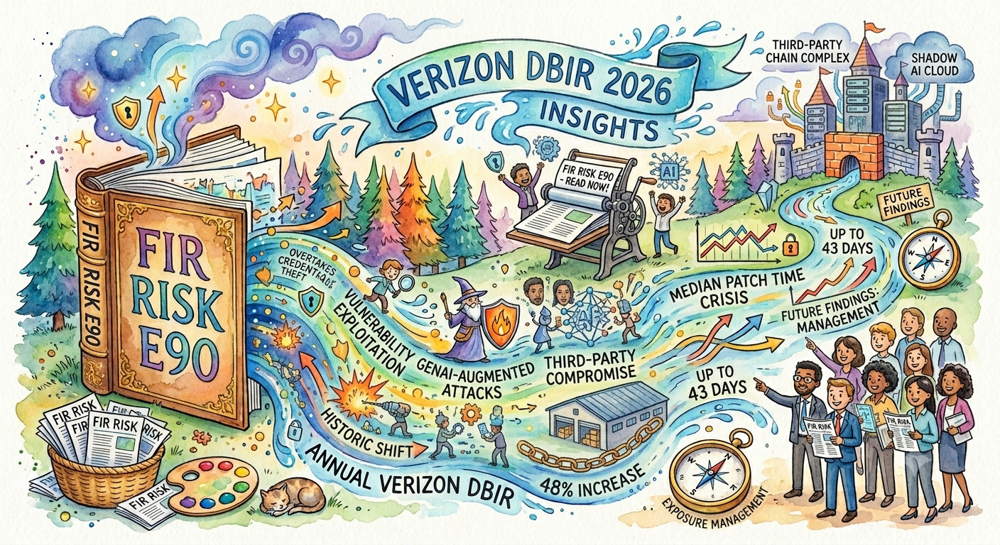

# FIR Risk Tuesday E90

**Publish Date:** June 23, 2026
**Source:** [2026 Verizon Data Breach Investigations Report](https://www.verizon.com/business/resources/reports/dbir/) (May 2026) — 19th edition; 31,000+ incidents and 22,000+ confirmed breaches across 145 countries; dataset window November 1, 2024 – October 31, 2025
**Analysis:** FIR Risk Platform

---

# FIR Risk E90 — Refinement, Not Revolution



FIR Risk Advisory | Enterprise Risk Intelligence

*The 2026 Verizon DBIR runs 121 pages of alarming headlines. The breaches underneath them are still about fundamentals — and that is the most useful thing in the report.*

---

## We didn't go quiet. We went to work.

It's been about six weeks since the last FIR Risk Tuesday. There's no drama behind the gap — just a decision, and we'd rather be straight with you about it.

Two things shaped the timing.

The first was the calendar. We build our mid-year flagship around the Verizon Data Breach Investigations Report, and for good reason. Nineteen editions in, it remains the longest-running and most-cited breach dataset in the industry, and it was the last major report to land in the first half of 2026 — arriving, as it does each year, in early May. Building this edition around a report that didn't yet exist would have meant filler or guesswork. We don't publish either. So we waited for the source worth building on.

The second was a project we couldn't do halfway. We had an opportunity to take an online ecommerce specialty retailer off an expensive, vendor-dependent technology stack — and to eliminate both the third-party dependency and the recurring cost that comes with it — by rebuilding the business on a fully custom, AI-designed platform it now owns outright. That work was time-bound and unforgiving, and it required our full attention for the better part of two months.

We made a deliberate choice to put it first. That isn't an excuse — it's the discipline. You cannot mitigate every risk or pursue every priority at once; you rank them honestly, commit, and go to work. We did, and the work is done.

It also turned out to be this week's thesis. One of the 2026 DBIR's loudest findings is that breaches involving third parties rose **60%** and now sit behind **nearly half of all breaches**. We didn't read that as a statistic — we'd just spent two months reducing one organization's third-party exposure by hand. Owning your stack isn't a technology preference. It's a security control.

That is the quiet message running through the entire 2026 DBIR, the one printed on its cover: **refinement, not revolution.** This year's headlines are vulnerabilities, AI and social engineering. The breaches, however, still come down to fundamentals — patching, third parties, identity and response. We didn't step away from the work. We went and lived it.

The break is over. Now, the report.

— Bruce, FIR Risk Advisory

---

## Bottom Line

Strip away the marketing and the 2026 DBIR is a report about a dangerous illusion: the industry is spending its attention on the shiny new threats — AI, zero-days, exotic exploits — while it keeps getting breached through the boring, fixable fundamentals.

Verizon proves it in section after section. Of 793 real threat actors caught using AI, **fewer than 1% reached high or critical capability** — AI mass-produces *known* techniques, not novel ones. **83% of privilege-escalation incidents involved no vulnerability at all** — escalation is an identity-and-permissions problem, not a patching one. And the single most common way attackers get in is to simply *log in* with valid credentials.

But this is not a "just patch your stuff" story, because the fundamentals are getting harder and faster, not easier. Vulnerability exploitation **doubled in a single year** to become the number-one way in. Known-exploited-vulnerability remediation got **worse**. And **29% of known-exploited vulnerabilities were weaponized before a patch even existed.**

The translation for a risk leader: you don't need to chase every AI headline. You need to do the fundamentals better, and faster, than you did last year. Refinement — under fire.

---

## The One Sentence Your Board Needs

> **"Everyone will tell you 2026 was the year AI changed everything for attackers. The breach data says the opposite — and that is the most useful finding in the report, because fundamentals are fixable."**

---

## The headline everyone will get wrong

Open any vendor's DBIR write-up this month and the lead will be AI. It will be wrong — or at least badly incomplete — and Verizon's own data is the rebuttal.

Working with Anthropic, the DBIR studied **793 unique threat actors** observed using AI between March 2025 and February 2026. The finding that almost nobody will quote: **fewer than 1% of them rose to a high or critical capability tier.** The median attacker leaned on AI across roughly **15 well-documented attack techniques**, each backed by a median of **55 already-known malware examples.** Fewer than 2.5% of the techniques observed were genuinely rare.

In Verizon's own words, AI's impact today is *operational* — "automating and scaling techniques defenders already know how to detect." It is breadth, not depth. It is making mediocre attackers faster and more numerous; it is not, yet, conjuring attacks your controls have never seen.

The most quietly devastating data point is about phishing. AI-generated text in malicious emails *doubled* year over year — and phishing as an initial-access vector "barely moved." The machine wrote better lures; the lures didn't work meaningfully better. AI lifts a non-native speaker to a fluent baseline. It does not, on this evidence, lift them above it.

None of this means AI is harmless. The DBIR's year-in-review names **PromptLock**, "the first AI-powered ransomware," and **VoidLink**, a malware framework "written in six days by an AI agent," which it calls "a point of no return for automated threat development." The U.S. Secret Service, writing in the report's appendix, warns of the "autonomous adversary" — agentic AI that can "automate every stage of cybercrime," collapsing the skill barrier so that "even unskilled criminals can launch sophisticated campaigns with just a few queries."

So take AI seriously as a *scaling* force — more attempts, more reach, a lower bar to entry. Just don't let it pull your budget away from the controls that actually stop the breaches in this report.

> **INTEL [GLOBAL] [AI THREAT]:** The most defensible read of the 2026 DBIR's AI data is that generative AI is currently a breadth multiplier, not a depth multiplier. Of 793 AI-abusing threat actors studied with Anthropic, fewer than 1% reached high/critical capability; the median actor used AI for ~15 well-documented techniques. AI-assisted phishing text doubled year over year while phishing success rates barely moved. The board implication: resource AI defense for *volume and velocity* of known attacks, and do not let AI-hype budgeting displace the fundamentals (patching, identity, third-party governance) that the same report shows are doing the actual damage.

---

## Vulnerabilities: the boring thing that's breaking everyone

For the first time in the report's history, **exploitation of vulnerabilities is the single most common way attackers break in** — 31% of breaches with a known initial access vector, up from 20% a year ago, a **55% jump**. As a raw attack action it **doubled**, to 32% of breaches. It has now passed credential abuse (down to 13%) and phishing (16%).

Here is the part that should worry every risk committee: defenders are losing this race *while patching harder than ever.* In 2025, organizations remediated only **26% of the critical, known-exploited vulnerabilities** on the CISA KEV list — down from 38% the year before. The median time to fully resolve one rose to **43 days**, almost two weeks longer. The typical organization had **50% more** critical vulnerabilities to patch than the year prior. Defenders pushed out **63.7 million** vulnerability fixes — a 30% increase — and still fell behind, because the volume flowing in overwhelmed the system. Verizon's image for it is a "treadmill picking up speed."

And the strategy most organizations quietly rely on — patch it once there's a patch — is already obsolete. Per the DBIR's year-in-review, **29% of known-exploited vulnerabilities were attacked before they were publicly disclosed.** Nearly a third were live zero-days before a CVE or a fix existed. "Patch on disclosure" is, increasingly, "patch after the breach."

The honest takeaway is not "patch faster" — you're already at the wall. It's "shrink the surface and prioritize ruthlessly": fewer internet-facing systems, edge devices first, exposure management ahead of the queue, and an assumption that some critical bugs will be exploited before you ever hear about them.

---

## The escalation engine nobody budgets for

If vulnerabilities are how attackers get in, how do they take over? The DBIR devoted a featured deep-dive to exactly this — and the answer overturns the industry's patch-centric reflex.

**83% of privilege-escalation incidents involved no vulnerability exploit at all.** Only about **10%** of escalation techniques are mitigated by patching. The single largest lever — mitigating **65%** of them — is *privilege management*: the unglamorous discipline of who-can-do-what, almost nobody's line item.

The mechanics are mundane and, once you see them, obvious. The most common technique in real-world breaches is "valid accounts" — attackers don't break in, they **log in**, using credentials bought from infostealer markets or reused from a prior leak. (Half of ransomware victims had a credential leak within 95 days before the attack.) Once on a machine, they harvest more credentials from memory. Then they walk to domain admin not through an exploit but by **chaining Active Directory permissions** — rewriting access rights, step by step, up the tier.

The scariest single number in the report lives here: in **16% of organizations, an attacker with *any* initial foothold had roughly an 80% chance of reaching a critical administrative account** — purely by following misconfigured permission paths.

There's a pointed lesson for anyone who runs red-team exercises. Red teams overwhelmingly demonstrate flashy identity attacks — ticket forging, token manipulation, Kerberoasting — that barely register in real incident data. Real adversaries use valid accounts and dump credentials. **If you only defend against what your pentest showed you, you are defending against the wrong attacker.**

> **INTEL [GLOBAL] [IDENTITY]:** The 2026 DBIR's privilege-escalation analysis found 83% of escalation incidents used no vulnerability exploit; 65% of escalation techniques are mitigated by privilege management versus ~10% by patching. In 16% of organizations, any initial foothold conferred an ~80% chance of compromising a key administrative account via chained Active Directory permission abuse — not exploits. The control investments that move this needle are privileged access management, Active Directory tier hygiene, removal of standing/transitory permissions, and MFA on every remote and edge pathway — not more vulnerability scanning.

---

## Third parties: the through-line

If the report has one structural story, it is concentration risk. Breaches involving a third party **rose 60% and now sit behind 48% of all breaches.** Every organization you rely on for software, services or access is now part of your attack surface — and most have not earned that trust by securing it. Among third parties with cloud exposure, only a minority had remediated missing or improperly secured multi-factor authentication.

This is no longer abstract. Verizon's own year-in-review reads like a ledger of supply-chain damage. The **Jaguar Land Rover** ransomware attack halted production for five weeks, caused an estimated **£1.9 billion** in damages, rippled across roughly **5,000 downstream entities**, and shaved an estimated **0.1% off U.K. GDP** — "the costliest cyber event in U.K. history" for the industrial sector. **Marks & Spencer** lost an estimated **£300 million.** The **Co-op** breach exposed **6.5 million** members. A compromise at **Qantas** exposed more than **5 million** customers — through a third-party platform.

And third-party risk cascades sideways. A single zero-day in **Oracle's E-Business Suite**, weaponized by the Cl0p crew, produced breaches across both Education and Healthcare — two sectors with nothing in common except a shared piece of enterprise software. Shared software is now a cross-sector single point of failure.

The sector that should be reading this twice is **manufacturing**, which carries both the highest third-party exposure in the report (**61%** of its breaches) and an elevated espionage motive (15%) — supply-chain attack surface meeting intellectual-property theft.

> **INTEL [GLOBAL] [THIRD-PARTY RISK]:** Third-party-involved breaches grew 60% year over year to 48% of all breaches in the 2026 DBIR. A single Oracle E-Business Suite zero-day (Cl0p) cascaded across Education and Healthcare; the Jaguar Land Rover incident (~£1.9B, five-week shutdown, ~5,000 downstream entities) is the new benchmark for supply-chain blast radius. The defensive posture: a maintained inventory of third parties with access, contractual security and MFA requirements, continuous (not annual) vendor reconciliation, and — where the economics allow — *reducing* third-party dependency outright. Owning the stack is a control.

---

## The rare good news: the ransom economy is cracking

For once, a trendline is moving in the defender's favor. Ransomware was present in 48% of breaches — up slightly — but the business model behind it is visibly under strain.

**69% of ransomware victims did not pay** — up from 65% the prior year, and from 51% four years ago. The median ransom *paid* **fell to $139,875**, down from $150,000. And a striking cross-reference of leak-site "victims" against actual cryptocurrency payments suggests that **only about 9% of publicly named victims actually pay** — meaning the intimidating victim lists these gangs publish are, in significant part, fabricated to manufacture menace.

Less leverage, less money, more victims refusing to engage, and mandatory-reporting regimes tightening the screws. The encryption-extortion model isn't dead — but it is, on this data, in margin compression. The defensive corollary is unchanged and validated: tested, isolated backups and a rehearsed recovery plan turn the average ransomware event from a crisis into an inconvenience.

---

## The human shift — from theft to convenience to shadow AI

The human element was present in **62% of breaches**, and social engineering remains the third most common breach pattern. But the texture of the human risk is changing in a way the headlines miss.

First, it's moving off email and onto the phone. Simulated phishing on mobile, voice and text channels succeeds at a rate roughly **40% higher** than email. A newer technique, **ClickFix** — a fake CAPTCHA that instructs the user to paste a command into their own terminal — has emerged as a way to turn the victim into the malware-delivery mechanism.

Second, and more quietly, the *insider* story has flipped. The dominant motive in privilege-misuse cases is no longer financial gain — it's **convenience (60%), ahead of financial (33%).** The defining insider of 2026 isn't a thief; it's an employee emailing data to a personal account, or pasting source code into an unsanctioned AI tool, to keep working. Most breach-causing internal errors are now plain carelessness — in government, **91%** of internal errors were exactly that: misdelivered information, not malice.

Which leads to the fastest-rising insider exposure in the report: **shadow AI.** Regular AI use on corporate devices **tripled to 45%** of employees; **67% access AI tools on non-corporate accounts**; and the **single most common data type leaving the organization for an unsanctioned AI service is source code (28%)** — the crown jewels, walking out through a browser tab.

> **INTEL [GLOBAL] [INSIDER & IDENTITY VERIFICATION]:** The 2026 DBIR reframes insider risk from malicious theft to careless convenience — privilege-misuse motive is now 60% convenience, and shadow AI is a top insider data-loss channel with source code the leading exfiltrated data type. The same theme extends to hiring: the report documents fraudulent IT-worker schemes that infiltrate organizations through the *recruiting pipeline* using stolen identities (one large employer reported thwarting 1,800+ such attempts, in one case flagged by a 110-millisecond keystroke lag). The control is the same fundamental in both cases — verify identity at multiple touchpoints, govern AI use with sanctioned tooling, and treat HR/recruiting as part of the attack surface.

---

## How to actually use this report (the part nobody reads)

Tucked into an appendix is the most valuable page in the DBIR, and it reframes everything above. Its warning: **"Mistaking the statistic for probability is a common mistake."**

When the report says "ransomware was present in 48% of breaches," that does **not** mean your organization has a 48% chance of a ransomware event. Every headline figure is conditional on an organization *already* having been breached, having detected it, and having reported it. The DBIR doesn't tell you your odds of being breached. It tells you what an attack on you would *look like* — which controls failed, which vulnerabilities got used, which doors were open.

So the report is a benchmark, not a forecast, and you use it by asking one question of every pattern in it: **"Are we better prepared than this baseline, worse, or about the same?"**

Then you weight your *own* evidence, strongest first: your incident history, your pen-test and red-team results, the gap between the controls that failed in these breaches (no MFA, unpatched edge devices, weak passwords) and the controls you actually have, and your ability to detect a problem at all. The report's own worked example makes it concrete: a hospital that found it lacked MFA on its VPN and had a 28% phishing-click rate fixed exactly those fundamentals — extended MFA, continuous training, monthly simulations — and drove its click rate to **8% in six months.** It changed its risk because it changed its controls.

That is the whole report in one motion. Not revolution. Refinement — deliberately chosen, ruthlessly prioritized, and then executed.

---

## The Refinement Checklist

The fundamentals the 2026 data says actually move the needle — in priority order:

1. **MFA everywhere it isn't yet** — especially VPN, remote access and every edge pathway. The recurring failure mode in the breaches is a remote door without it.
2. **Edge-device and exposure management first** — exploitation is now the #1 way in; assume some critical bugs are exploited before disclosure, and shrink the internet-facing surface.
3. **Privileged access management and Active Directory hygiene** — remove standing and transitory permissions; this is the 83%-of-escalations lever, not patching.
4. **Third-party and vendor governance** — inventory who has access, demand MFA and security terms contractually, reconcile continuously, and reduce dependency where you can.
5. **Tested, isolated backups and a rehearsed recovery plan** — the reason 69% of victims can now say no.
6. **Continuous phishing simulation and identity verification** — quarterly-or-better, across voice and text, extended into the hiring pipeline.
7. **Sanctioned AI tooling and shadow-AI visibility** — give people an approved path before source code leaves through an unapproved one.

---

## MITRE ATT&CK

**The techniques the 2026 DBIR puts at the center — and the controls that answer them:**

- **T1190 — Exploit Public-Facing Application:** Now the #1 initial-access vector (31% of breaches); the corresponding controls are exposure management and edge-device patch velocity, under an assume-pre-disclosure-exploitation posture.
- **T1078 — Valid Accounts:** The single most common technique in real breaches — attackers log in with legitimate credentials; the controls are MFA everywhere, credential-leak monitoring, and dormant-account disablement.
- **T1003 — OS Credential Dumping (incl. T1003.001 LSASS):** The dominant post-foothold move; controls are endpoint detection, credential-guard protections and least-privilege on endpoints.
- **T1098 / T1484 — Account & Permission Manipulation:** The Active Directory permission-chaining that produces the ~80% escalation exposure; the control is privileged access management and tier-0 isolation.
- **T1199 — Trusted Relationship:** Third-party access driving 48% of breaches; controls are vendor inventory, contractual MFA/security terms and continuous trust-graph reconciliation.
- **T1486 — Data Encrypted for Impact:** Ransomware in 48% of breaches; the control is tested, isolated backups and rehearsed recovery — the reason most victims now refuse to pay.
- **T1566.004 — Phishing: Voice / Mobile-Centric Social Engineering:** ~40% higher success than email; the control is out-of-band verification and phone/text-aware awareness training.
- **T1204.004 — User Execution: Malicious Copy and Paste (ClickFix):** The user turned into the delivery mechanism; the control is behavioral detection of clipboard-to-terminal patterns.
- **T1656 — Impersonation (fraudulent-worker / hiring-pipeline infiltration):** Stolen-identity insiders entering through recruiting; the control is live identity verification at multiple hiring touchpoints.

**Connection to the data:** none of these are new techniques, and that is the entire point. The 2026 DBIR is a verdict on the fundamentals — the controls every report has been recommending for years. What changed isn't the attack. It's the speed and scale at which the known attacks now arrive, and the cost of leaving the known doors open.

---

## Learn More

- [2026 Verizon Data Breach Investigations Report](https://www.verizon.com/business/resources/reports/dbir/) — Primary source
- [CISA Known Exploited Vulnerabilities Catalog](https://www.cisa.gov/known-exploited-vulnerabilities-catalog) — The KEV list at the center of the vulnerability findings
- [CIS Critical Security Controls](https://www.cisecurity.org/controls) — The control framework the DBIR maps each pattern to
- [FIR Risk Tuesday E89 — The April Inflection](/tuesday/e89-the-april-inflection/) — The AI-defender inflection this edition's data sits against
- [FIR Risk Tuesday E86 — Castles on Quicksand](/tuesday/e86-castles-on-quicksand/) — IBM X-Force + Red Canary convergence
- [FIR Risk Tuesday E85 — The Responder's Report](/tuesday/e85-responders-report/) — Mandiant M-Trends 2026
- [FIR Risk Intelligence](https://github.com/stikman28/fir-risk-intelligence) — Source prompts, methodology, all published INTEL

---

*Powered by [FIR Risk Platform](https://firrisk.ai/platform/) — AI-driven threat intelligence for enterprise risk leaders.*

---

## LINKEDIN POST

```
Six weeks ago, FIR Risk Tuesday paused. No drama — a prioritization call. And it turned out to be this week's whole point.

We had an opportunity to take an online ecommerce specialty retailer off an expensive, vendor-dependent technology stack — eliminating both the third-party dependency and the recurring cost that comes with it — by rebuilding the business on a fully custom, AI-built platform it now owns outright. The work was time-bound and demanded our full attention for two months.

We chose to put it first. That's not an excuse; it's the discipline. You can't mitigate every risk or chase every priority at once — you rank them, commit, and execute.

Then the 2026 Verizon DBIR landed — nineteen editions in, still the industry's most-cited breach dataset — and one finding stood out:

→ Third-party breaches are up 60%, now behind nearly half of all breaches.

We'd just spent two months reducing one company's third-party exposure by hand. The data wasn't abstract. Owning your stack isn't a technology preference — it's a security control.

That's the quiet thesis of the entire 2026 DBIR, printed on its cover: refinement, not revolution. The headlines are AI, vulnerabilities and social engineering. The breaches are still fundamentals — patching, third parties, identity, response.

A few findings worth your time:

→ AI is breadth, not depth. Of 793 real threat actors caught using AI, fewer than 1% reached high or critical capability. AI mass-produces known attacks; it isn't conjuring new ones. AI-generated phishing text doubled — and phishing success barely moved.

→ Vulnerability exploitation is now the #1 way in, and defenders are losing while patching harder than ever. Only 26% of critical known-exploited vulnerabilities were fully remediated (down from 38%), and 29% were attacked before a patch even existed. "Patch on disclosure" is now too late.

→ 83% of privilege-escalation incidents used no vulnerability at all. Attackers log in with valid credentials and walk to domain admin through misconfigured permissions. In 16% of organizations, any foothold meant an ~80% chance of reaching a critical admin account.

→ The rare good news: 69% of ransomware victims didn't pay, the median ransom fell, and roughly 9% of publicized victims actually pay — the leak-site lists are partly fabricated.

The line your board needs:

"Everyone will tell you 2026 was the year AI changed everything for attackers. The breach data says the opposite — and that's the most useful finding in the report, because fundamentals are fixable."

The fundamentals that move the needle: MFA everywhere (especially VPN/edge), exposure management ahead of the patch queue, privileged-access and Active Directory hygiene, third-party governance, tested backups, continuous phishing simulation, and sanctioned AI tooling before source code leaves through a browser tab.

Read independently. No vendor relationship to the source. No incentive to sell anyone fear.

Stay forward. Stay positive. Stay verified.

Full E90 — Refinement, Not Revolution — linked below.

#cybersecurity #riskmanagement #CISO #DBIR #thirdpartyrisk #fraudprevention #threatintelligence #infosec
```

---

## X POST

Six weeks ago, FIR Risk Tuesday paused. No drama — a prioritization call. And it turned out to be this week's whole point.

We spent two months doing the exact thing we counsel clients through: taking an online ecommerce specialty retailer off an expensive, vendor-dependent tech stack and rebuilding it on a fully custom, AI-built platform the business now owns outright — eliminating the third-party dependency and the recurring cost with it.

Then the 2026 Verizon DBIR landed — nineteen editions in, still the most-cited breach dataset in the industry — and one finding stood out:

Third-party breaches are up 60%, now behind nearly half of all breaches.

We'd just spent two months reducing one company's third-party exposure by hand. Owning your stack isn't a tech preference — it's a security control. And it's the quiet thesis printed on the report's cover: refinement, not revolution.

The headlines this year are AI, vulnerabilities and social engineering. The breaches are still fundamentals.

AI is breadth, not depth. Of 793 threat actors caught using AI, fewer than 1% reached high or critical capability. AI mass-produces known attacks; it isn't conjuring new ones. AI-generated phishing text doubled — phishing success barely moved.

Vulnerability exploitation is now the #1 way in, and defenders are losing while patching harder than ever. Only 26% of critical known-exploited vulnerabilities were fully remediated, down from 38%. And 29% were attacked before a patch existed. "Patch on disclosure" is too late.

83% of privilege-escalation incidents used no vulnerability at all. Attackers log in with valid credentials and walk to domain admin through misconfigured permissions. In 16% of organizations, any foothold meant an ~80% chance of reaching a critical admin account. If you only defend against what your red team showed you, you're defending against the wrong attacker.

The rare good news: 69% of ransomware victims didn't pay, the median ransom fell, and only ~9% of publicized victims actually pay — the leak-site "victim" lists are partly fabricated to manufacture menace.

The line your board needs:

"Everyone will tell you 2026 was the year AI changed everything for attackers. The breach data says the opposite — and that's the most useful finding in the report, because fundamentals are fixable."

The fundamentals that move the needle: MFA everywhere (especially VPN/edge), exposure management ahead of the patch queue, privileged-access and Active Directory hygiene, third-party governance, tested backups, continuous phishing simulation, and sanctioned AI tooling before source code leaves through a browser tab.

Read independently. No vendor relationship to the source. No incentive to sell anyone fear.

Stay forward. Stay positive. Stay verified.

Full E90 — Refinement, Not Revolution — linked below.

#cybersecurity #DBIR

---

## SOURCE DATA

**Editorial Frame:**
E90 is the FIR Risk reading of the 2026 Verizon Data Breach Investigations Report — the last major industry report of the first half of 2026, teed up in E89 as the payoff to the 2026 cycle. The thesis follows Verizon's own cover framing ("refinement, not revolution"): the year's attention-grabbing headlines (AI, vulnerability exploitation, social engineering) sit atop breaches still driven by fundamentals (patching, third-party trust, identity and response). The editorial value is the second-order reading — the buried findings most coverage will skip — and the translation into a prioritized, board-readable action set. The opening note is a deliberate framing of the six-week publication gap as a prioritization decision (a parallel to risk management itself), not an apology.

**Primary Source:**
- Verizon — 2026 Data Breach Investigations Report (May 2026): https://www.verizon.com/business/resources/reports/dbir/
  - 19th edition; 31,000+ analyzed security incidents; 22,000+ confirmed data breaches; 145 countries
  - Incident dataset window: November 1, 2024 – October 31, 2025

**Methodology (this edition):**
Drafted directly from the primary-source PDF rather than via platform agent queries, to eliminate hallucination risk on a statistics-dense report (per the E86 fact-checking lesson). The full report was read across its structure — Key Findings, Results & Analysis (VERIS Actors/Actions/Assets/Attributes), the Incident Classification Patterns (System Intrusion, Social Engineering, Basic Web Application Attacks, Miscellaneous Errors, Privilege Misuse, Denial of Service), the privilege-escalation deep-dive, Industries, Regions, the Year in Review, and the appendices (U.S. Secret Service; "Using the DBIR for Security Risk Decisions"). Every statistic in this edition was transcribed against a specific page and cross-checked before drafting.

**Fact-Check Notes (verified against the 2026 DBIR PDF; page citations):**
- CONFIRMED: "Refinement, not revolution" — verbatim from the cover (p. 2). 19th edition (p. 5).
- CONFIRMED: Third-party-involved breaches up 60%, reaching 48% of all breaches (p. 11).
- CONFIRMED: Exploitation of vulnerabilities = #1 initial access vector, 31%, up from 20% (a 55% increase) (p. 10); doubled to 32% of breaches as an action variety (p. 29). Credential abuse 13%, phishing 16% (p. 10).
- CONFIRMED: CISA KEV — 26% fully remediated in 2025, down from 38%; median 43 days to full remediation, up from 32; ~50% more KEVs to patch (median 16 vs 11) (p. 17). 63.7M vulnerability instances patched, +30% YoY (p. 18).
- CONFIRMED: "29% of KEV vulnerabilities were attacked before public disclosure this year" (Year in Review, p. 109).
- CONFIRMED: Anthropic collaboration — 793 unique threat actors studied (Mar 2025–Feb 2026); fewer than 1% reached High/Critical (p. 25–26); median ~15 ATT&CK techniques, median 55 known-malware-examples per technique, <2.5% rare techniques (p. 26–27); AI's impact "operational… automating and scaling techniques defenders already know how to detect" (p. 28). AI-assisted phishing text doubled YoY while phishing initial-access "barely moved" (p. 26).
- CONFIRMED: PromptLock ("first AI-powered ransomware") and VoidLink ("written in six days by an AI agent… point of no return") (p. 109). U.S. Secret Service "autonomous adversary" / "even unskilled criminals… with just a few queries" (Appendix B, p. 113).
- CONFIRMED: Privilege escalation — 83% of incidents involved no exploit (p. 70); ~10% of techniques mitigated by patches, 65% by privilege management (p. 68); "valid accounts" top technique 39% (p. 69); 16% of orgs at ~80% attack-graph exposure (p. 71). Red-team over-indexing on Kerberoasting/token-manipulation vs near-zero in incidents (p. 69).
- CONFIRMED: Ransomware in 48% of breaches (p. 11); 69% did not pay (p. 42–43); median ransom paid $139,875, down from $150,000 (p. 11, 42); ~9% of publicized victims actually pay per crypto-wallet cross-reference (p. 43). 50% of ransomware victims had a credential leak within 95 days prior (p. 44).
- CONFIRMED: Human element in 62% of breaches (p. 12); mobile/voice/text phishing ~40% higher success than email (p. 50); ClickFix (p. 51–52). Privilege-misuse motive Convenience 60% > Financial 33% (p. 58). Public-administration internal errors 91% carelessness (p. 93). Shadow AI: 45% regular AI users (up from 15%), 67% non-corporate accounts, source code #1 data type to untrusted GenAI at 28% (p. 13, 60).
- CONFIRMED: Jaguar Land Rover ~£1.9B, five-week shutdown, ~5,000 downstream entities, ~0.1% of U.K. GDP (p. 105, 109); Marks & Spencer ~£300M (p. 35); Co-op 6.5M members (p. 108); Qantas 5M+ via third party (p. 101). Oracle E-Business Suite (Cl0p) cascade across Education and Healthcare (p. 83, 87). Manufacturing third-party 61% + espionage 15% (p. 88).
- CONFIRMED: Appendix C ("Using the DBIR for Security Risk Decisions," Tony Martin-Vegue) — "Mistaking the statistic for probability is a common mistake" (p. 114); benchmark question "are we better prepared than this baseline, worse, or about the same?" (p. 116); hospital worked example, phishing click 28% → 8% in six months (p. 116).
- CONFIRMED: Fraudulent IT-worker scheme — ~15,000 stolen identities, 3–5 per worker (p. 73–74); one large employer thwarted 1,800+ infiltration attempts, one flagged by a 110ms keystroke lag (p. 109).
- HANDLED WITH CARE (cited around, not featured): the report's Availability (53%) and Network-asset (5%) figures are partly driven by VERIS coding changes, not pure threat shifts, and Verizon discloses this (p. 33, 35); the M&S figure is a single named incident and is presented as an illustrative example, not a trend. Confidentiality appears as 82% (prose) and 83% (chart) (p. 35–36) and was not relied upon as a headline number. We describe the report as the "19th edition" (p. 5), not "20 years."

**FIR Risk Editorial Position:**
- Title "Refinement, Not Revolution" anchors on Verizon's own verbatim cover framing and the report's strongest defensible through-line.
- The AI section deliberately runs counter to the herd: the editorial position is that the 2026 DBIR data supports AI as a current *breadth* multiplier (volume/velocity of known attacks), not a *depth* multiplier (novel attack surface) — while still crediting the operational weaponization the report documents.
- The North Korean / fraudulent-IT-worker story is intentionally demoted from a feature to a single INTEL callout and reframed as an identity-verification and hiring-pipeline fundamental, given the topic's heavy coverage over the prior year.
- The six-week gap is addressed openly as a prioritization decision, framed through the discipline of risk management; the AvidMax client engagement is referenced generically as "an online ecommerce specialty retailer."
- Statistics handled with documented caveats (coding-change-driven figures, single-incident drivers, prose-vs-chart discrepancies) are flagged above and either steered around or explicitly qualified in the body.
- Voice maintained: declarative, board-readable, "Stay forward. Stay positive. Stay verified." sign-off.
