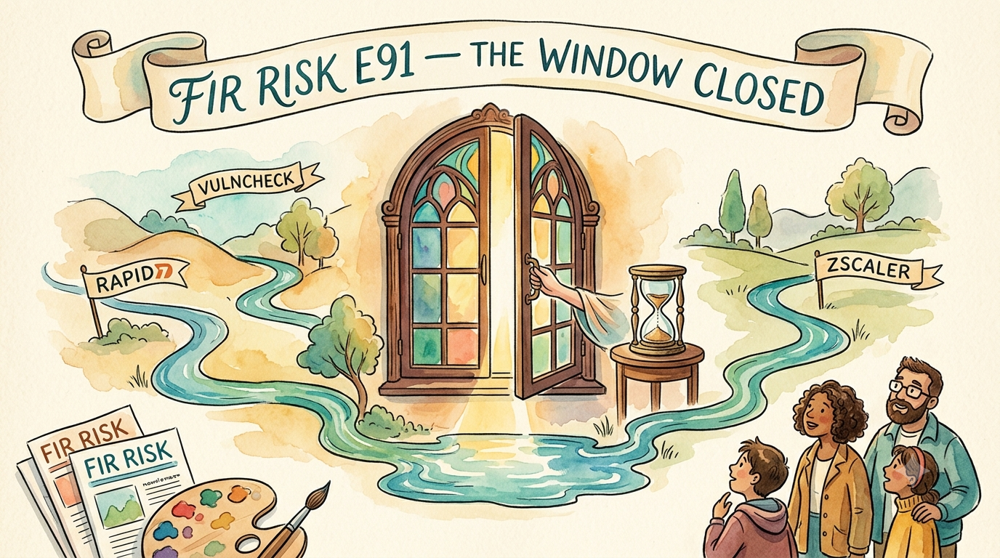

# FIR Risk Tuesday E91

**Publish Date:** July 14, 2026
**Sources:** [Rapid7 2026 Global Threat Landscape Report](https://www.rapid7.com/) · [VulnCheck 2026 Exploit Intelligence Report](https://vulncheck.com/) · [Zscaler ThreatLabz 2026 AI Security Report](https://www.zscaler.com/threatlabz) (ANZ Executive Perspective) · corroborating: Verizon 2026 DBIR (see FIR E90)
**Analysis:** FIR Risk Platform

---

# FIR Risk E91 — The Window Closed

FIR Risk Advisory | Enterprise Risk Intelligence

*Three 2026 threat reports, from three different corners of the industry, arrive at the same uncomfortable conclusion: the time you had to react is gone. The convergence — not any single report — is the story.*

---

## One report is a claim. Three is a pattern.

[SUGGESTED OPENER — Bruce to personalize/replace]

Any single vendor threat report is easy to discount. The company publishing it sells the cure for the disease it diagnoses, and it has every reason to make the disease sound terminal. We read them anyway — carefully, and against each other — because when reports that share nothing but a publication quarter start telling the same story from opposite ends of the industry, the story stops being marketing and starts being signal.

That is what happened this quarter. Three reports landed — Rapid7 from the threat-intelligence world, VulnCheck from the vulnerability-intelligence world, Zscaler from the AI-security world. Different companies, different datasets, different attack surfaces. And underneath the three different vocabularies is one identical finding: **the window between when a threat appears and when it hurts you has collapsed.** Not narrowed. Collapsed.

This edition is the FIR reading of all three at once — what each one actually proves, why the agreement matters more than the individual claims, and the one test we ran to make sure we weren't just echoing three sales pitches.

— Bruce, FIR Risk Advisory

---

## Bottom Line

For a decade, security strategy rested on a comfortable assumption: that between the moment a threat appeared and the moment it reached you, there was *time* — to detect, to triage, to patch. Every dollar spent on faster response was a bet that speed could offset exposure.

Three 2026 reports say that bet no longer pays, and they say it from three unrelated vantage points. VulnCheck measures the collapse: nearly three in ten actively-exploited vulnerabilities were being weaponized **on or before the day they were disclosed** — there was no window to be fast inside of. Rapid7 explains the collapse: initial access has been **industrialized into a product**, bought pre-packaged from brokers, so the attacker's preparation happens upstream and off your clock. Zscaler shows the collapse reaching even the newest surface: **100% of the AI systems it red-teamed contained critical vulnerabilities.**

The translation for a risk leader: you will not out-*detect* a threat that arrives before the patch exists, purchased ready-made, moving at machine speed. The strategy every one of these reports points toward — and the neutral breach data supports — is a shift from **reacting faster to being exposed less.**

---

## The One Sentence Your Board Needs

> **"Three independent 2026 threat reports, none of which cites the others, all reached the same conclusion: the era where speed of response could offset exposure is over. The winning move in 2026 is not faster reaction — it is less to react to."**

---

## 1. The exploit now arrives before the fix

Start with the hardest number of the three. VulnCheck's 2026 Exploit Intelligence Report found that **28.96% of the vulnerabilities added to CISA's Known Exploited Vulnerabilities catalog in 2025 were exploited on or before the day their CVE was published** — up from 23.6% the year before. Nearly three in ten. For those, "patch faster" was never an option; exploitation *preceded* disclosure. (Verizon's DBIR, working from a completely separate dataset, put the same figure at 29% — two independent sources landing on the same fraction, which is exactly the kind of agreement worth trusting.)

The case study that makes it visceral is Microsoft SharePoint's "ToolShell." Microsoft patched two flaws on July 8, 2025. Eleven days later it disclosed that those patches were **incomplete** — and that attackers were already exploiting the bypass, a critical unauthenticated remote-code-execution flaw, *before the complete fix existed.* Within days, three China-nexus actors were named; one was running Warlock ransomware. By year-end that single flaw had drawn ten distinct threat actors and multiple ransomware families. VulnCheck ranked it the #2 most-exploited vulnerability of the year.

And attackers didn't only chase the new: 884 CVEs picked up first-time exploitation evidence in 2025, and more than 160 of them dated from 2024 — old, unpatched flaws, revisited. The catalog everyone treats as the definitive list of what's being exploited is, in VulnCheck's framing, a starting point, not the whole map.

> **INTEL [GLOBAL] [FINDING]:** Per VulnCheck's 2026 Exploit Intelligence Report, 28.96% of 2025 CISA KEV entries were exploited on or before their CVE publication date, up from 23.6% in 2024 — independently corroborated by the 2026 Verizon DBIR at 29%. The SharePoint "ToolShell" chain (CVE-2025-49704/49706 → the CVE-2025-53770/53771 patch bypass) demonstrates the mechanism: an 11-day incomplete-patch window with active pre-fix exploitation, escalating to 10+ threat actors and multiple ransomware families within months. The board implication: for internet-facing systems, plan as if the patch window is zero.

---

## 2. Access has become a product

If VulnCheck explains *how fast*, Rapid7's 2026 Global Threat Landscape Report explains *why so fast.* Its through-line, chapter by chapter — "The Disappearance of Predictive Lead Time," "The Industrialization of Access," "Ransomware as a Downstream Income" — is that intrusion has been broken into an assembly line. Initial Access Brokers and specialized collectives now remove the operational friction that used to slow attackers down. Access to a target is a **pre-packaged product**, bought and sold, feeding a separate downstream stage where ransomware operators do the monetizing.

That decomposition is the whole point. When access is something an attacker has to *build* against your specific environment, you have time inside their effort — reconnaissance is noisy, tooling takes work, and a good defender can intervene mid-campaign. When access is something an attacker *buys*, that time is already gone. The preparation happened upstream, by someone else, sold as a commodity, before your name ever entered the picture. Rapid7's framing of ransomware as "downstream income" rather than a start-to-finish operation is the market-structure explanation for the collapsed window VulnCheck measures.

> **INTEL [GLOBAL] [TREND]:** Rapid7's 2026 report frames initial access as a commoditized product — Initial Access Brokers sell entry; ransomware operators monetize downstream as a separate market stage. This two-stage structure compresses defender reaction time because the compromise work is completed upstream, before the victim is targeted. Corroborating signal: the 2026 DBIR's finding that third-party involvement in breaches rose 60% year-over-year to 48% of all breaches — the same industrialized-supply-chain dynamic, measured from the victim's side.

---

## 3. Even the newest surface fails at machine speed

The third report looks somewhere neither of the others does: enterprise AI systems. Zscaler's ThreatLabz 2026 AI Security research ran authorized red-team simulations — ethical hackers emulating real-world adversaries — against live AI deployments, and found **critical vulnerabilities in 100% of the AI systems tested.** Not a sampled estimate. Every system evaluated.

For our purposes the AI angle is almost beside the point. What matters is that a **brand-new attack surface**, tested independently by a third company with a third methodology, exhibits the identical pattern the other two describe on older ground: compromise happening faster than human-paced security operations can intervene. "Failure" here means a red team found an exploitable critical flaw — not a confirmed breach — and that distinction is worth stating plainly. But the direction is unambiguous. Detect-triage-respond cycles built around human clock speed are structurally too slow when the flaw is found in minutes, on a surface most organizations deployed faster than they secured.

> **INTEL [EMERGING RISK]:** Zscaler ThreatLabz 2026 red-team testing found critical vulnerabilities in 100% of enterprise AI systems evaluated — a new, largely-ungoverned attack surface exhibiting the same machine-speed compromise pattern seen in exploitation and access-broker data. "Failure" is defined as red-team discovery of an exploitable critical flaw, not a confirmed breach. The governance implication: AI moving into core workflows must inherit the same access controls, visibility, and board-level oversight as any other critical system — before, not after, deployment.

---

## The test we ran before we believed any of it

Here is the fair objection, and you should raise it in your own boardroom before a skeptic does: **all three of these companies sell the cure for the disease they diagnose.** Rapid7 sells exposure management. VulnCheck sells exploit intelligence. Zscaler sells Zero Trust. Three vendors who profit from alarm, all sounding the alarm, is not by itself proof of anything.

So we tested the thesis against the one dataset in this space with no product to move: **the Verizon DBIR** — the neutral, incident-based breach data we covered in E90. It points the same direction, from forensics rather than a sales deck. Third-party involvement in breaches rose 60% year-over-year to nearly half of all breaches. Organizations took a median of roughly **eight months** to remediate half of the password and permission weaknesses sitting in their vendors' cloud environments. And that independent 29% pre-disclosure-exploitation figure lines up almost exactly with VulnCheck's 28.96%.

The vendors have every reason to sound the alarm. The breach data has none. They agree anyway — and where the vendor claim and the neutral data disagree or can't be checked, we left it out of this edition entirely. *That* is why we're calling this a pattern and not a marketing cycle.

> **INTEL [GLOBAL] [PATTERN]:** Three 2026 threat reports across distinct vendor categories — Rapid7 (threat intel), VulnCheck (vulnerability intel), Zscaler (AI security) — independently converge on a "collapsed detection-response window" thesis via different mechanisms: commoditized access-broker economy, pre-disclosure exploitation (28.96% of 2025 KEV entries), and 100%-failure-rate AI red-teaming. Each vendor sells a mitigation for the problem it describes; the convergence survives that incentive check because the neutral Verizon DBIR data (48% third-party breach involvement, ~8-month vendor-cloud remediation lag, 29% pre-disclosure exploitation) points the same direction. Machine- and market-speed compromise is the dominant 2026 threat narrative — and the supporting data holds up when you remove the sellers from the room.

---

## So What Should Organizations Actually Do?

This part doesn't need theatrics — only clarity. You cannot out-detect a threat that arrives before the patch, bought pre-packaged, moving at machine speed. So stop optimizing the reaction and start shrinking the target.

1. **Assume the patch window is zero for anything internet-facing.** Prioritize *exposure reduction* — take unpatchable edge devices off the open internet, decommission what you don't need, shrink the attack surface — over patch speed alone. You cannot win the patch race; the smart move is to stop entering it.
2. **Treat your vendors' access as your own.** The breach data now puts third-party involvement behind roughly half of all breaches, with remediation of vendor weaknesses dragging for months. Make mandatory MFA and credential hygiene a *contract term* with critical vendors — not a polite request.
3. **Govern AI before it governs your risk.** As AI moves into core workflows it becomes core infrastructure — and, on this evidence, an untested one. Put AI usage under the same access controls, visibility, and board-level oversight you'd demand of any other critical system.
4. **Re-baseline the board conversation around exposure, not speed.** The metric that mattered last year — mean time to respond — assumes a window that no longer reliably exists. Ask instead: how much of our surface is exposed, to whom, and for how long?

And finally: the reports disagree on the mechanism and agree on the conclusion. The organizations that come through 2026 well won't be the ones that reacted fastest. They'll be the ones that made sure there was less to react to.

---

Stay forward. Stay positive. Stay verified.

— FIR Risk Advisory

Find all editions on our Blog: https://firriskadvisory.com/blog/

---

## SOURCE DATA

**Editorial Frame:**
E91 is a three-report synthesis rather than a single-source reading — a deliberate structural choice. The editorial value is the *convergence*: three vendors from unrelated corners of the industry (threat intelligence, vulnerability intelligence, AI security), using unrelated datasets and methodologies, independently arriving at one thesis (the collapse of the detection-response window). The piece is explicitly incentive-aware — it names the commercial conflict (each vendor sells a mitigation for the problem it describes) and resolves it by testing the thesis against the neutral Verizon DBIR breach data (covered in E90). The DBIR appears only as a control group, not a fourth source, since E90 already covered it in full.

**Primary Sources:**
- Rapid7 — 2026 Global Threat Landscape Report ("Decoding the Accelerated Cyber Attack Cycle")
- VulnCheck — 2026 Exploit Intelligence Report
- Zscaler ThreatLabz — 2026 AI Security Report (ANZ Executive Perspective)
- Corroborating (neutral control): Verizon — 2026 DBIR (see FIR E90)

**Methodology (this edition):**
Every statistic was verified against the source PDF text ingested into the FIR Risk Platform knowledge base, cross-checked chunk-by-chunk before drafting (per the E86/E90 fact-checking discipline). Where a figure was retrievable and unambiguous, it was used; where a claim could not be confirmed against source text, or where a source's own layout made a value ambiguous, it was excluded from the body. Several plausible-but-unverifiable claims surfaced during platform-agent review and were deliberately cut (see Fact-Check Notes) — a reminder that agent synthesis accelerates the work but does not replace source verification.

**Fact-Check Notes (verified against source PDFs):**
- CONFIRMED (VulnCheck): 28.96% of 2025 KEV entries exploited on/before CVE publication date, up from 23.6% in 2024. 884 CVEs with first-time 2025 exploitation evidence; 160+ from CVE-2024. ToolShell timeline (CVE-2025-49704/49706 patched July 8, 2025; CVE-2025-53770/53771 incomplete-patch bypass disclosed July 19; Violet Typhoon / Linen Typhoon / Storm-2603; Warlock, Qilin, 4L4MD4R; Khoa Dinh at Pwn2Own Berlin; ranked #2 exploited vuln of 2025).
- CONFIRMED (Rapid7): chapter structure and the Initial-Access-Broker / "ransomware as downstream income" framing verbatim.
- CONFIRMED (Zscaler): critical vulnerabilities in 100% of AI systems red-tested; authorized adversarial-simulation methodology; "failure" = red-team discovery of an exploitable critical flaw. ANZ transaction volumes (Australia 15B / #7 global; New Zealand 2.5B / #30 global; Jun–Dec 2025).
- CONFIRMED (DBIR, cross-referenced from E90): 48% third-party breach involvement, up 60% YoY; ~8-month median remediation of vendor password/permission weaknesses; 29% of KEVs attacked before public disclosure (independently matching VulnCheck's 28.96%).
- EXCLUDED — could not verify, deliberately cut: (1) a "CISA KEV captures only 27% of exploited CVEs / 73% blind spot" claim — the source's 27% figure is a CNA-source distribution statistic, not a KEV-coverage rate; the 73% complement was not in the report. (2) Two vendor quotes ("the gap that once allowed for detection and response has collapsed"; "a floor, not a ceiling") — the underlying concepts are real, the verbatim quotes were not found in source text, so they were paraphrased rather than quoted. (3) A specific "16-minute median time-to-failure" Zscaler figure — the ANZ executive brief's infographic lists three timing labels but yields only two extractable values (1h27m and 16m01s), leaving the median-vs-fastest binding unconfirmable; only the rock-solid "100% of tested systems" figure was used. Recommend pulling the full global ThreatLabz flagship report to lock the timing figures before any future use.

**FIR Risk Editorial Position:**
- Title "The Window Closed" anchors on the single through-line all three reports share (the collapse of detection-response lead time), stated more plainly than any one vendor states it.
- The piece leads with its own strongest objection (vendor incentive) and resolves it with neutral data — a deliberate trust move, and the differentiator of FIR synthesis over vendor-report echo.
- Zscaler is intentionally the shortest of the three sections: it is the loosest fit (AI surface vs exploitation/access), the thinnest source (a regional executive brief), and the least verifiable — but it earns inclusion precisely because a *different* surface showing the *same* pattern strengthens the convergence claim.
- The AI-security surface and the Zscaler flagship report are deferred to E92, threading to E87 ("The Agents Have Keys").
- Voice maintained: declarative, board-readable, incentive-aware, "Stay forward. Stay positive. Stay verified." sign-off.
