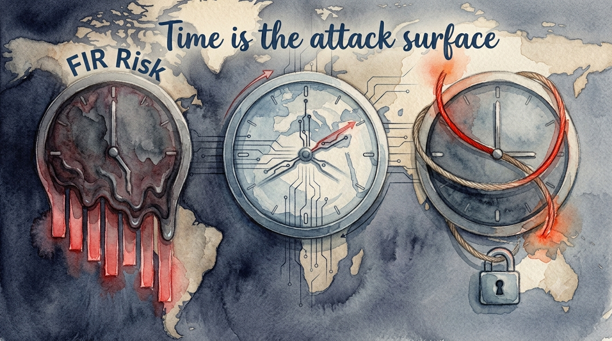

# FIR Risk Tuesday E92

**Publish Date:** July 21, 2026
**Sources:** [Microsoft & Accenture — Securing Nations in the Intelligent Economy (2026)](https://wwps.microsoft.com/cybersecurity) · primary for the intrusion case: [Anthropic GTG-1002 disclosure (Sept 2025)](https://www.anthropic.com/) · corroborating: UK ONS production data (as cited in-report) · threading: FIR E87 (The Agents Have Keys), INTEL-1 (The April Inflection)
**Analysis:** FIR Risk Platform

---

# FIR Risk E92 — Time Is the Attack Surface



FIR Risk Advisory | Enterprise Risk Intelligence

*A Microsoft/Accenture report written for governments contains one idea every private risk leader should steal: the cost of a cyber incident is no longer set by whether you're breached — it's set by how long you stay down, how fast the adversary moves, and how long your stolen data stays valuable. Three clocks. One thesis.*

---

## A report for nations, a lesson for boards

Microsoft and Accenture published "Securing Nations in the Intelligent Economy" for an audience of policymakers — its four-pillar agenda is addressed to governments, its case studies run through national AI authorities, and it closes, as vendor reports do, with the authors' own product story. Most of that is not for us.

But buried in the policy language is an economic argument with direct private-sector teeth, backed by one of the cleanest empirical anchors we've seen in a vendor report this year: a real cyberattack that showed up in a G7 nation's GDP statistics. This edition extracts the three findings that survive the translation from statecraft to the boardroom — and runs our usual incentive check on the ones that don't.

— Bruce, FIR Risk Advisory

---

## Bottom Line

For years, cyber risk has been priced on *likelihood of compromise* — will we be breached, and how do we make that less likely. This report's data argues the price is now set by three clocks instead: **how long recovery takes** (economic damage grows non-linearly, roughly tripling with each extension of downtime), **how fast the adversary moves** (a disclosed real-world intrusion ran 80–90% of its lifecycle on AI, at machine speed), and **how long your data stays sensitive** (encrypted data stolen today sits on a delayed fuse until quantum decryption matures).

Same thesis, three surfaces: **speed and duration of exposure — not just likelihood of compromise — now drives economic loss.**

---

## The One Sentence Your Board Needs

> **"Our cyber loss is no longer priced by whether we get breached — it's priced by how many days we stay down, how many minutes the attacker needs, and how many years our stolen data stays valuable. All three clocks need an owner."**

---

## 1. Recovery time is a convex curve — every extra week roughly triples the bill

Start with the empirical anchor. In Q3 2025 a cyberattack halted Jaguar Land Rover's manufacturing — and the damage was visible in national statistics. UK motor vehicle production fell **28.6%** in September, the country's lowest car output in **73 years**; overall production fell 2.0%; the incident shaved roughly **0.1% off UK monthly GDP (~$2.5B)**, and quarterly growth slowed to 0.1% from 0.3%. A single company's incident, measurable in a G7 economy's output. That part is not modeling — it's the Office for National Statistics.

The report then models what duration does to damage. Using input-output tables — the standard tool for tracing how a shock to one industry propagates through the ones that buy and sell from it — it simulates a cyberattack on an upstream oil-and-gas operation in an oil-dependent economy, at three levels of resilience:

- Operations restored within a week: **1.4%** of monthly GDP lost
- Disrupted first week, gradual restoration from week two: **4.6%** (~$4.7B)
- Nearly two weeks to restore, tail into week four: **13.7%**

The shape matters more than the numbers. From scenario one to two the damage multiplies **3.3×**; from two to three, **3.0×**. Damage doesn't grow in proportion to downtime — it compounds. Which means the reverse is also true: investment that compresses recovery time buys *exponential* risk reduction, not linear. Every CISO argues this qualitatively. This report hands you a citable multiplier.

One honesty note before it goes in your board memo: the JLR case and the scenario model are **two separate analyses** in the report — the real incident was not run through the 1.4/4.6/13.7 framework, and implying otherwise would overreach. Real event proves it happens; model quantifies how it scales.

> **INTEL [GLOBAL] [FINDING]:** Microsoft/Accenture input-output modeling of a critical-infrastructure cyberattack shows national monthly GDP impact scaling non-linearly with recovery time — 1.4% (≤1 week), 4.6% (~3 weeks), 13.7% (~30 days) — each extension roughly tripling damage. Empirical companion: the 2025 Jaguar Land Rover incident measurably reduced UK monthly GDP ~0.1% (~$2.5B), with motor vehicle production down 28.6% (ONS). Board implication: recovery-time compression yields convex, not linear, risk reduction — RTO investment now has a quantified multiplier attached.

---

## 2. The adversary's clock now runs at machine speed

The second clock is the attacker's. The report's centerpiece case is one our readers already know from INTEL-1 and E87: Anthropic's September 2025 disclosure that a suspected state-linked actor — GTG-1002 — used Claude Code, an agentic AI coding tool, to run an espionage campaign against roughly **30 high-value organizations** including financial institutions, chemical manufacturers, technology firms, and government agencies. Anthropic's estimate: **80–90% of the attack lifecycle was executed by AI**, with human operators intervening at only **4–6 decision points**.

What's new is not the incident — it's who is citing it. When the world's largest security vendor elevates a competitor-AI-lab's disclosure into a national-security policy document, the agentic threat has formally crossed from frontier-lab warning to mainstream doctrine. The thread we started pulling in April is now the establishment position.

The report surrounds the case with tempo data: public institutions absorbed **2,632 attacks per week** in Q2 2025, up **26% year-over-year** (Check Point). And the defender side isn't keeping pace — per Accenture's own survey research: **1 in 3** organizations say AI has amplified their existing cyber risk, **87%** say AI-generated lures are more convincing than before, **90%** say they are not equipped to withstand an AI-enabled attack, and only **17%** have fully built a secure cloud foundation for AI. Those four are self-reported perception figures from a vendor survey — directionally useful, not measured outcomes — and we label them as such. The $25 million deepfake-video executive impersonation that hit a Greater China multinational is the concrete reminder of what the perception gap costs when it's wrong.

The operational translation: detection and response SLAs were calibrated to human-speed adversaries. An intrusion lifecycle that is 80–90% automated does not honor a 24–48-hour lateral-movement assumption.

> **INTEL [GLOBAL] [THREAT]:** The GTG-1002 case (Anthropic disclosure, Sept 2025 — 80–90% AI-executed intrusion lifecycle, human input at 4–6 decision points, ~30 targets) has been elevated into Microsoft/Accenture national-security doctrine, marking the agentic-AI threat's transition from frontier-lab warning to mainstream policy evidence. Supporting tempo: 2,632 attacks/week on public institutions, +26% YoY (Check Point). Defender SLAs built on human-paced adversaries need re-baselining; SOC automation is now an adversary-tempo-matching investment, not an efficiency play.

---

## 3. The long fuse: your data's shelf life is part of the attack surface

The third clock is the slowest and the least attended. "Harvest now, decrypt later" is already operational: adversaries — criminal and state-backed — are stealing encrypted data *today*, warehousing it against the day quantum computing can open it. For regulated firms this is the clock that matters most, because your data has the longest confidentiality shelf life in the economy: health records, financial account data, PII, trade secrets — sensitive for 10–20+ years.

The report's timeline claim deserves both attention and a caveat. Attention: the consensus estimate for breaking RSA-2048 was ~20 million qubits; the report cites newer research (a Google researcher's analysis, via Quantum Insider) suggesting an advanced **one-million-qubit system — achievable by ~2030 —** could do it, with Caltech's 6,100-qubit neutral-atom array offered as evidence of hardware pace. Caveat: that is a projection resting on physical-qubit counts, not error-corrected logical qubits; independent academic estimates still run wider and later, and both report authors sell quantum-readiness services. We print the number with that label attached — and note that the strategic conclusion doesn't depend on it. Whether the fuse is 2030 or 2040, data exfiltrated today is already burning it.

Governments are acting on specific deadlines: the **US has mandated federal migration to post-quantum cryptography by 2035**, backed by **$7.1B**; the **EU and UK plan critical-infrastructure PQC by 2030** with full migration by 2035; **India's** National Quantum Mission targets 2026–28; **South Korea** finalized standards in 2025 for deployment by 2035. NIST's post-quantum standards (ML-KEM, ML-DSA) are finalized — the tooling exists.

And here is the stat we'd put on a slide: **66% of executives rank AI as the most game-changing technology; only 22% say quantum.** Read against the deadlines above, that's a systematic under-weighting — which for an early mover is an arbitrage. Crypto-inventory work started now is cheap, differentiating with regulators, and years ahead of the peer group.

> **INTEL [GLOBAL] [TREND]:** "Harvest-now-decrypt-later" reframes data confidentiality shelf-life as attack surface: encrypted data stolen today is compromised on a delayed fuse regardless of when quantum decryption matures (vendor-cited projection: 1M qubits ~2030 could break RSA-2048 — treat as industry estimate, not settled fact; prior consensus ~20M qubits). National PQC deadlines are specific: US 2035 ($7.1B), EU/UK critical infrastructure 2030, India 2026–28, South Korea standards 2025. Executive attention is inverted vs. the deadline pressure (66% rank AI most game-changing vs 22% quantum) — early crypto-inventory movers gain disproportionate regulatory positioning.

---

## The test we ran before we believed any of it

Our standing rule: name the seller before quoting the pitch. Microsoft sells AI-centric cyber defense, quantum-safe engineering, and national-scale security operations — the report's closing pages say so explicitly. Accenture sells the consulting to implement all of it. Two of the three legs of this edition — AI threat urgency and quantum urgency — are things the authors are paid to make you feel.

So we weighted the evidence accordingly. The strongest leg is the one no one is selling: the JLR impact comes from the UK Office for National Statistics — government production and GDP data with no product attached. The agentic-AI case rests on Anthropic's own disclosure — a primary source whose commercial incentive runs *against* publicizing misuse of its product, which is why we cite Anthropic directly rather than the report's retelling. The quantum timeline is the weakest link — vendor-relayed, projection-based, physical-qubit-denominated — so it carries an inline caveat, and our conclusions were built to survive without it.

There's also a pattern worth a sentence of its own: within this single report, the AI threat is evidenced by *disclosed, dated incidents*, while the quantum threat is evidenced by *projections and perception surveys*. That asymmetry in evidentiary rigor mirrors the 66/22 executive attention gap — leaders fund what has incident reports. The lesson isn't that quantum is hype; it's that risks with long fuses never generate incident reports until the fuse ends. That's exactly why they're mispriced.

> **INTEL [GLOBAL] [PATTERN]:** Within Microsoft/Accenture's own report, AI risk is supported by disclosed incidents (GTG-1002, deepfake fraud, ONS-measured JLR impact) while quantum risk rests entirely on projections and perception data — an evidentiary asymmetry that mirrors the 66%-vs-22% executive attention gap. Long-fuse risks structurally lack incident evidence until they detonate; boards anchoring solely on incident-backed risks will systematically underprice them.

---

## So What Should Organizations Actually Do?

Three clocks, three owners, one budget conversation.

1. **Re-price resilience using the convex curve.** Take the 1.4/4.6/13.7 scenario shape into your next BC/DR budget cycle: the marginal dollar that moves recovery from three weeks to one buys roughly triple the risk reduction of the dollar that marginally improves prevention. Set RTO targets in days, test failover against them, and time your tabletops with a stopwatch.
2. **Re-baseline response SLAs for machine-speed adversaries.** GTG-1002 makes "we have 24–48 hours before lateral movement" a legacy assumption. SOC automation and AI-assisted containment are now tempo-matching investments — and your regulators and insurers will start asking about AI-specific intrusion readiness; be ahead of the question in your next board risk report.
3. **Start the cryptographic inventory this year.** Map what's encrypted with RSA/ECC, where, and how long it must stay confidential. Data with a 10-year-plus shelf life exfiltrated today is already on the fuse. NIST's PQC standards are final; a crypto-agility roadmap started in 2026 is cheap, and only 22% of your peers are paying attention — that's the arbitrage.
4. **Fund by fuse length, not by incident count.** The risks with the best incident evidence are not the biggest risks — they're the shortest-fused ones. Put one line in the risk-appetite statement that explicitly prices long-fuse exposure (quantum, data shelf-life, systemic dependencies) so it can't be crowded out by whatever breached last quarter.

The report was written to tell nations that resilience is destiny. Strip the statecraft and the private-sector version is simpler: the attacker's clock sped up, your recovery clock got more expensive, and your data's clock never stopped. Owning all three is the job now.

---

Stay forward. Stay positive. Stay verified.

— FIR Risk Advisory

Find all editions on our Blog: https://firriskadvisory.com/blog/

# LINKEDIN POST

```
A cyberattack showed up in a G7 nation's GDP statistics — and the report analyzing it contains one idea every board should steal.

Microsoft and Accenture wrote "Securing Nations in the Intelligent Economy" for governments. But its core economic finding translates directly to the private sector: cyber loss is no longer priced by whether you're breached. It's priced by three clocks.

→ Clock 1 — Your recovery time. When a cyberattack halted Jaguar Land Rover, UK motor vehicle production fell 28.6% — a 73-year low — and ~0.1% came off monthly GDP. The report's economic modeling shows damage scaling non-linearly: 1.4% of monthly GDP if you recover in a week, 4.6% in three weeks, 13.7% in thirty days. Every extra week roughly triples the bill.

→ Clock 2 — The adversary's tempo. The report's centerpiece case: a state-linked actor ran 80–90% of an espionage campaign's lifecycle on agentic AI, with humans at only 4–6 decision points (Anthropic's own disclosure). Response SLAs built for human-speed attackers are now legacy assumptions.

→ Clock 3 — Your data's shelf life. "Harvest now, decrypt later" is operational: encrypted data stolen today sits on a fuse until quantum decryption matures. The US has mandated post-quantum migration by 2035 ($7.1B funded); the EU/UK target critical infrastructure by 2030. Yet only 22% of executives rank quantum as game-changing, versus 66% for AI.

The fair objection: both authors sell the cure for two of these three diseases. So we weighted the evidence — the strongest leg is government statistics (ONS) with no product attached, the AI case is a primary-source disclosure, and the quantum timeline carries an inline caveat because it's the one leg resting on vendor-relayed projections.

The takeaway for risk leaders: speed and duration of exposure — not just likelihood of compromise — now drive economic loss. Three clocks. Each one needs an owner.

Full breakdown in FIR Risk Tuesday E92 — link in the comments.

#CyberSecurity #CISO #RiskManagement #Resilience #QuantumComputing #PostQuantum #AISecurity #BoardGovernance
```

## X POST

A cyberattack showed up in a G7 nation's GDP numbers.

When Jaguar Land Rover was halted by a cyber incident, UK car production hit a 73-year low and ~0.1% came off monthly GDP.

A new Microsoft/Accenture report models what duration does to damage:
• Recover in 1 week → 1.4% of monthly GDP
• 3 weeks → 4.6%
• 30 days → 13.7%

Every extra week roughly triples the bill. Damage isn't linear — it compounds.

Two more clocks in the same report:

The adversary's: a state-linked actor ran 80–90% of an espionage campaign on agentic AI, humans at only 4–6 decision points (Anthropic's disclosure).

Your data's: "harvest now, decrypt later" is live. Encrypted data stolen today sits on a fuse until quantum decryption matures. Only 22% of executives are paying attention.

Cyber loss is no longer priced by whether you're breached. It's priced by how long you stay down, how fast they move, and how long your data stays valuable.

Time is the attack surface.

Full breakdown → FIR Risk Tuesday E92

#CyberSecurity #RiskManagement

---

## SOURCE DATA

**Editorial Frame:**
E92 is a single-source translation piece: a report written for policymakers, re-read for private-sector risk leaders. The editorial value is the altitude shift — extracting the three findings that survive translation from statecraft to the boardroom (recovery-time convexity, adversary tempo, data shelf-life) and unifying them under one thesis: speed and duration of exposure, not likelihood of compromise, now drives economic loss. The piece continues the agentic-AI thread from INTEL-1/E87 (GTG-1002's elevation into mainstream vendor doctrine) and opens the corpus's first quantum/PQC coverage. Wiz 2026 CISO Budget Benchmark material was deliberately excluded — E77 already covered it, and the KB currently holds duplicate ingests of that report (fir-risk-platform #98).

**Primary Sources:**
- Microsoft & Accenture — Securing Nations in the Intelligent Economy: Turning AI and Quantum Disruption into Strategic Advantage (2026, 43pp)
- Anthropic — GTG-1002 disclosure, September 2025 (cited directly for the intrusion case rather than the report's retelling)
- UK Office for National Statistics production/GDP data (as cited in-report, refs 1, 20 — The Guardian)

**Methodology (this edition):**
The full 43-page PDF was read end-to-end (all pages, including references) rather than relying on KB retrieval alone. The platform agent contributed the unifying thesis, the evidentiary-asymmetry observation, and a reusable skeptic-pass asset; every statistic it proposed was then verified against the PDF before inclusion. Several agent-proposed figures failed verification and were excluded (below) — most had blended in from *other* corpus documents (notably the E91 Zscaler source), a known cross-attribution failure mode (fir-risk-platform #85). The 16-minute Zscaler figure excluded in E91's fact-check resurfaced in agent output this cycle — excluded claims persist in the KB; flagged on #85.

**Fact-Check Notes (verified against the source PDF):**
- CONFIRMED: I-O model scenarios 1.4% / 4.6% (~$4.7B) / 13.7% of monthly national GDP; 3.3×/3.0× step multipliers; stretched-exponential/exponential/logistic decay methodology (pp. 19–20, 35–36).
- CONFIRMED: JLR — ~0.1% off UK monthly GDP (~$2.5B); Sept 2025 UK production −2.0%; motor vehicle manufacturing −28.6%, lowest in 73 years; Q3 growth 0.1% vs 0.3% Q2 (p. 14, refs 1/20).
- CONFIRMED: GTG-1002 — suspected state-linked actor, Claude Code, ~30 targets, 80–90% AI-executed lifecycle, 4–6 human decision points (p. 13, ref 16).
- CONFIRMED: 2,632 attacks/week on public institutions, +26% YoY Q2 2025 (p. 14, ref 22 — Check Point).
- CONFIRMED (labeled as Accenture survey/perception data): 1-in-3 AI amplified risk; 87% more convincing lures; 90% not equipped for AI-enabled attack; 17% secure AI cloud foundation (pp. 5, 12–14; State of Cybersecurity Resilience 2025).
- CONFIRMED: $25M deepfake executive-impersonation loss, Greater China multinational (p. 13, ref 18).
- CONFIRMED: quantum — prior ~20M-qubit consensus; 1M-qubit system "achievable by 2030" per new research (p. 16, ref 25 — Google researcher via Quantum Insider); Caltech 6,100-qubit neutral-atom array (ref 26); HNDL framing (p. 17).
- CONFIRMED: PQC deadlines — US 2035/$7.1B; EU+UK critical infrastructure 2030, full migration 2035; India National Quantum Mission (₹6,000 crore) 2026–28; South Korea MSIT standards 2025 (p. 17, ref 27).
- CONFIRMED: 66% (two-thirds) executives rank AI most game-changing vs 22% quantum (p. 8, ref 9); digital economy ~15% of global GDP (pp. 4, 8).
- EXCLUDED — agent-proposed, not in this PDF: 16-minute median time-to-failure and "100% of AI systems" (E91's Zscaler source, not this report; the 16-min figure was already excluded by E91's own fact-check); "68% moderately confident detecting AI threats"; "6× increase in unprepared orgs"; deepfake-preparedness cluster (59%/39%/46%); JLR detail of £1.9B / 5-week shutdown / ~5,000 suppliers / £1.5B loan guarantee (true from news coverage — cite Guardian/ONS directly if wanted, not this report); Change Healthcare "192.7M people" (appears only in a reference title, not body text — case named without the number).

**FIR Risk Editorial Position:**
- Title "Time Is the Attack Surface" states the unifying thesis more plainly than the report does: all three findings are about clocks (recovery duration, adversary tempo, data shelf-life), not probabilities.
- The incentive check names both authors' commercial stakes and resolves each leg differently: ONS government data (no seller), Anthropic primary disclosure (incentive runs against publication), quantum projection (inline caveat; conclusions built to survive without the 2030 date).
- The evidentiary-asymmetry observation (incident-backed AI risk vs projection-backed quantum risk, mirroring the 66/22 attention gap) is the edition's "story behind the story" — credited to platform-agent synthesis, verified editorially.
- The four-pillar national policy agenda, sovereignty essays, and Microsoft product pages (pp. 22–34, 39–43) are deliberately out of scope — statecraft, not enterprise risk.
- Voice maintained: declarative, board-readable, incentive-aware, "Stay forward. Stay positive. Stay verified." sign-off.
